```{r setup, include=FALSE}
options(htmltools.dir.version = FALSE)

library(tidyverse)
library(kableExtra)
library(ggplot2)
library(plotly)
library(htmlwidgets)
library(MASS)
library(ggpubr)
library(xaringanthemer)
library(xaringanExtra)

style_duo_accent(
  primary_color = "#621C37",
  secondary_color = "#EE0071",
  background_image = "blank.png"
)

xaringanExtra::use_xaringan_extra(c("tile_view"))

use_scribble(
  pen_color = "#EE0071",
  pen_size = 4
  )

knitr::opts_chunk$set(
  fig.retina = TRUE,
  warning = FALSE,
  message = FALSE
)
```

name: Title slide
class: middle, left
<br><br><br><br><br><br><br>
# Wissenschaftliches Arbeiten und Forschungsmethoden
***
### Einheit 2: Zusatzmaterial: Literaturrecherche, Bewertung von Forschungsfragen und Referenzen
##### `r format(as.Date(data.frame(readxl::read_excel("WAF_SS24_Termine.xlsx"))$Datum), "%d.%m.%Y")[2]` | Prof. Dr. Stephan Goerigk

---
class: top, left
name: links

### Literaturrecherche

#### Nützliche Links zur Literaturrecherche

<small>

<small>

[**DBIS -Datenbankinfosystem **](https://dbis.ur.de/dbinfo/fachliste.php?bib_id=eff&colors=7&ocolors=40&lett=l)
Sammlung von frei zugänglichen und lizenzpflichtigen Fachdatenbanken nach Fachgebieten

[**EZB - Elektronische Zeitschriftenbibliothek**](http://ezb.ur.de/ezeit/index.phtml?bibid=EFF&colors=7&lang=de)
Umfangreichste Sammlung elektronischer Zeitschriften aller Fachgebiete in Deutschland (als Volltext verfügbar!)

[**Bielefeld Academic Search Engine (BASE)**](https://www.base-search.net)
BASE ist eine der weltweit größten Suchmaschinen für wissenschaftliche Open-Access-Dokumente.

[**Hogrefe eContent **](https://econtent.hogrefe.com)
Volltextdatenbank der Hogrefe-Verlagsgruppe mit Zeitschriften aus den Bereichen Psychologie, Psychiatrie, Medizin und Pflege

[**PsycARTICLES**](https://www.apa.org/pubs/databases/psycarticles)
Zeitschriften-Volltextdatenbank der American Psychological Association (APA) mit Beiträgen aus allen Gebieten der Psychologie 

[**PubMed**](https://pubmed.ncbi.nlm.nih.gov)
Bibliografische Datenbank zur Medizin und angrenzender Wissenschaften

[**SpringerLink**](https://link.springer.com)
Online-Bibliothek der Springer-Verlagsgruppe

[**Thieme eJournals **](https://www.thieme-connect.de/products/all/home.html)
Stellt Inhalte von rund 130 medizinischen und wissenschaftlichen Fachzeitschriften zur Verfügung

[**Wiley Online Library **](https://onlinelibrary.wiley.com)
Fächerübergreifendes Verlagsportal, das eine Vielzahl von Primärquellen unter einer Oberfläche anbietet.

[**Bayerische Staatsbibliothek**](www.bsb-muenchen.de)

</small>

---
class: top, left

### Literaturrecherche

#### Recherchemethoden

* **Wissenschaftssprache ist Englisch!** $\rightarrow$ Suchen Sie nach englischen Schlagwörtern

* "Boolean Operators": schlau suchen = bessere Ergebnisse
  - Anführungzeichen "SUCHE", z.B. "effects of computer games": Worte werden nur gruppiert gesucht, in der angegeben Reihenfolge
  - AND oder +, z.B games AND well-being: Jeder Suchbegriff soll vorkommen, nur die Suchergebnisse werden angezeigt, die beide Worte beinhalten.
  - NOT oder -, z.B. games NOT depression: Der erste Begriff wird gesucht und alles andere ausgeschlossen.
  - OR, z.B. games OR computer OR media: Sucht nach allen Begriffen gleichzeitig

* Suchmaschinen wie Google suchen oft nach genauer Zeichenfolge
  - Singular/Plural, Wortzusammensetzungen, synonyme, ähnliche Begriffe berücksichtigen 
  - Trunkieren
    + ?: Platzhalter für genau ein Zeichen
    + \*: Platzhalter für beliebig viele Zeichen

---
class: top, left

### Literaturrecherche

#### Recherchemethoden

##### Systematische Recherche

* Konkrete Recherche mittels Suchmaschinen, Fachdatenbanken, Portalen etc.

.center[
```{r eval = TRUE, echo = F, out.width = "600px"}
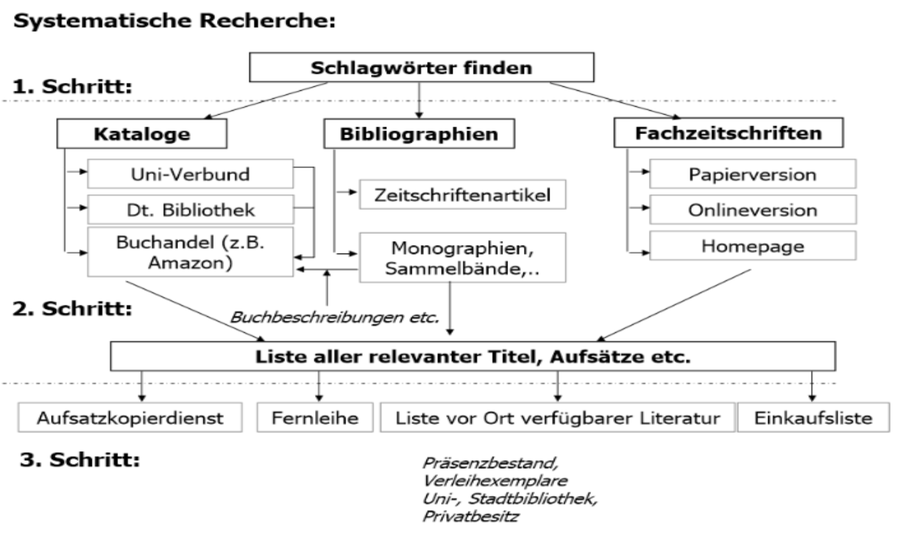
```
]

---
class: top, left

### Literaturrecherche

#### Recherchemethoden

##### Schneeballprinzip

* man beginnt mit einer zuverlässigen Quelle
* im Literaturverzeichnis: Weitere Veröffentlichungen zu diesem Thema 
* in jeder dieser Veröffentlichungen finden sich weitere Quellen

.center[
```{r eval = TRUE, echo = F, out.width = "550px"}
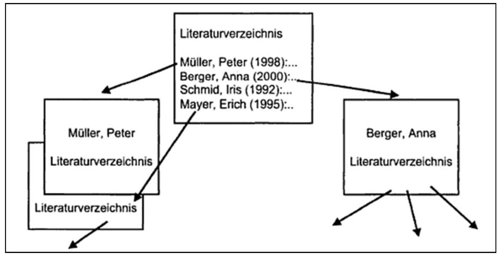
```
]

---
class: top, left

### Literaturrecherche

#### Recherchemethoden

##### Systematische Recherche vs. Schneeballprinzip

.pull-left[
**Systematische Recherche**
* Lohnt sich für Einblick ohne besonderes Vorwissen (wenige bzw. keine weiteren Literaturhinweise)
* Sehr umfassende Literaturrecherche
* Wenn es wirklich umfassend gemacht wird
bedarf es einem hohem Zeitaufwands
* Zu allgemeine Suchanfrage sehr große Treffermenge
* Bedarf einiges an Übung um gezielt zu Recherchieren
]

.pull-right[
**Schneeballprinzip**
* Bietet sich an, wenn Sie bereits einen guten Ausgangspunkt für Ihr Thema haben
* Besonders gut für die Recherche nach Grundlagenliteratur oder nach sehr aktueller Literatur bei sehr konkretem Thema geeignet
* Hohe Recherchegeschwindigkeit
* Vorsicht: möglicherweise einseitige Betrachtung
eines Themas
* Unvollständige Suche
]

$\rightarrow$ Kombination beider Methoden!

---
class: top, left

### Literaturrecherche

#### Literaturverwaltung

.pull-left[
* Viele verschiedene Softwarelösungen, probieren Sie aus was Sie effektiv unterstützt!
* Ein mächtiges Tool ist Zotero: https://www.zotero.org/
* Auch für Zusammenarbeit in Gruppen nützlich (geteilte Literaturordner)

* Vergleiche: 
  - https://nbn-resolving.org/urn:nbn:de:bsz:14-qucosa2-762961
  - https://mediatum.ub.tum.de/doc/1316333/1316333.pdf
]

.pull-right[
```{r eval = TRUE, echo = F, fig.show='hold',fig.align='center'}
knitr::include_graphics("bilder/zotero.png")
```
]

---
class: top, left
### Literaturrecherche

#### Bewertungsschema

.center[
```{r eval = TRUE, echo = F}
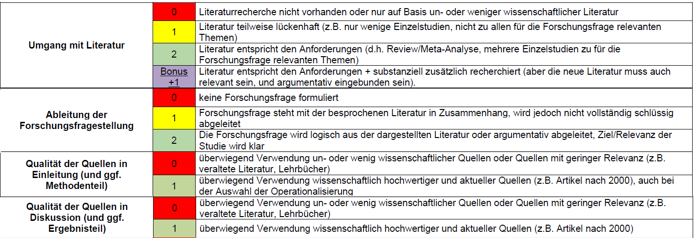
```

```{r eval = TRUE, echo = F}
knitr::include_graphics("bilder/bewertung_forschungsfrage.png")
```
]


---
class: top, left
### Literaturrecherche

#### Präregistrierung

.center[
```{r eval = TRUE, echo = F, out.width = "60%"}
knitr::include_graphics("bilder/prereg_template_forschungsfrage.png")
```
]

---
class: top, left
name: lesen

### Literaturrecherche

#### Lesetechniken

.center[
"*Die guten Leutchen wissen nicht, was es einen für Zeit und Mühe kostet, um Lesen zu lernen.  Ich habe achtzig Jahre dazu gebraucht und kann jetzt noch nicht sagen, dass ich am Ziele wäre!*"

(Johann Wolfgang Goethe)
]

.pull-left[
**3 Schritte**:

* Vorbereitung
* Das eigentliche Lesen
* Gelesenes festhalten
]

.pull-right[
```{r eval = TRUE, echo = F, out.width = "50%", fig.show='hold',fig.align='center'}
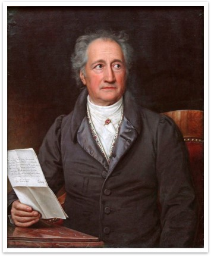
```
]

---
class: top, left

### Literaturrecherche

#### Lesetechniken

##### Vorbereitung

**1. Leseziel bestimmen**

* Was will ich durch das Lesen der Information erreichen? 
  * Neue Ideen
  * Prüfungsvorbereitung
  * Referat
  * Forschung

* Muss ich den ganzen Text lesen?

* Nur einen bestimmten Abschnitt und welchen?

* Nur wichtige Details?

$\rightarrow$ Davon hängt die Art des Lesens ab und wie Sie das Gelesene festhalten!


---
class: top, left

### Literaturrecherche

#### Lesetechniken

##### Vorbereitung

**2. Überblick verschaffen**

* Auskunft über den Verfasser

* Publikationsart

* Erscheinungsjahr

* Vorwort, Abstract

* Einführung

* Anhang, Diskussion

---
class: top, left

### Literaturrecherche

#### Lesetechniken

##### Vorbereitung

**3. Fragen an sich selbst stellen**

* Weiß ich etwas über den Stoff? 

* Was weiß ich noch nicht?

* In welchem Zusammenhang habe ich schon davon gehört?

* Welche Definitionen, Begriffe, Fachausdrücke werden herangezogen?

* Welche Relevanz hat das Thema für mich?


---
class: top, left

### Literaturrecherche

#### Lesetechniken

##### Vorbereitung

**4. Planen**

.pull-left[
* **Abschätzen des Arbeitsaufwands**
  * Wie viel Zeit habe ich? 
  * Schwierigkeit des Texts? 
  * Wie viel Zeit werde ich benötigen?
  * Zeitplan erstellen, inklusive Pausen und Wiederholungen
]

.pull-right[
* **Abschätzen möglicher Schwierigkeiten bei der Textverarbeitung**
  * Hindernisse (Lärm, Zeitmangel, Konzentrationsschwierigkeiten, etc.)
  * Besondere Schwierigkeiten des Textes (Fremdsprache, Fachsprache…)
  * Geeigneten Rahmen schaffen
]

* **Lernaktivitäten**
  * Anzahl der Lesedurchgänge festlegen
  * Lesepausen
  * Wiederholung 
  * Verständnis prüfen


---
class: top, left

### Literaturrecherche

#### Lesetechniken

##### Das eigentliche Lesen

<small>

* **Kursorisches Lesen**: 
  * Überfliegen des Textes zu Überblick und Orientierung
  * z.B. Ist der Text für mich verständlich geschrieben? 
  * Ist er für mich interessant und verwendbar?

* **Selektives Lesen**: 
  * Konzentration auf interessante Aspekte
  * Fragen vor dem Lesen: Was weiß ich schon? Was suche ich genau?
  * Fragen während des Lesens: Wovon handelt der Text? Entspricht er den Suchkriterien? Was sagt der Text über das Gesuchte aus? Welche Absicht verfolgt der Text?

* **Studierendes Lesen**: 
  * systematische und vertiefte Analyse
  * PQ4R-Methode: **P**review, **Q**uestion, **R**ead, **R**eflect, **R**ecite, **R**eview


---
class: top, left

### Literaturrecherche

#### Lesetechniken

##### Das eigentliche Lesen

<small>

**PQR4**

**P**review
* Überfliegen aller Kapitel, um das allgemeine Thema zu begreifen.
* Identifizieren der Abschnitte, die als Einheit zu lesen sind.
* Überschriften für die einzelnen Abschnitte finden.

**Q**uestion
* Formulieren von Fragen zu den Abschnitten.
* Oftmals genügt eine Umformulierung der Abschnittsüberschriften, um eine angemessene Frage zu stellen.

**R**ead
* Sorgfältiges Lesen des Abschnitts, indem man versucht, die Fragen zu beantworten, die man dazu gestellt hat.
* *Wichtige* Textpassagen markieren und Schlüsselbegriffe festhalten.

---
class: top, left

### Literaturrecherche

#### Lesetechniken

##### Das eigentliche Lesen

<small>

**PQR4**

.pull-left[
**R**eflect (während des Lesens)
* Aktiv darüber nachdenken
* Versuchen, Information zu verinnerlichen
* Beispiele finden
* Text in Bezug zum eigenen Vorwissen setzen
]

.pull-right[
**R**ecite
* Nachdem man einen Abschnitt fertig bearbeitet hat, versucht man sich an die darin enthaltenen Informationen zu erinnern.
* Man versucht, die Fragen zu beantworten, die man zu diesem Abschnitt formuliert hat.
]

**R**eview
* Nachdem man den ganzen Text durchgearbeitet hat, geht man ihn nochmals in Gedanken durch und ruft sich die wichtigsten Punkte ins Gedächtnis.
* Man versucht, die Fragen zu beantworten, die man gestellt hat.

---
class: top, left
<div class="footer"><span>Rayner, K., Schotter, E. R., Masson, M. E., Potter, M. C., & Treiman, R. (2016). So much to read, so little time: How do we read, and can speed reading help? Psychological Science in the Public Interest, 17(1), 4-34.</span></div>

### Literaturrecherche

#### Lesetechniken

##### Das eigentliche Lesen

.center[
```{r, echo=FALSE,out.width="60%",fig.show='hold',fig.align='center'}
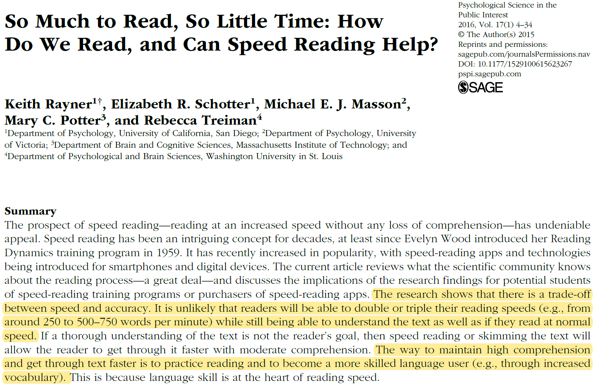
``` 
]

---
class: top, left
<div class="footer"><span>http://www.quickmeme.com/meme/3t52vi</span></div>

### Literaturrecherche

#### Lesetechniken

##### Umgang mit dem Text

<small>

.pull-left[
**Zusammenfassung**
* Aktive Form der Textaneignung
* Man ist gezwungen „eng“ am Text zu arbeiten
* Komprimierter Wissensspeicher, auf den man zurückgreifen kann

**Unterstreichen**
* Wichtige Stichwörter und Textstellen
* Wenig zeitaufwendig, überall durchführbar
* Erst beim zweiten Durchgang unterstreichen
* Verschiedene Farben für Definitionen, Beispiele usw.
* Immer dasselbe Markierungssystem verwenden
]

.pull-right[
```{r, echo=FALSE,fig.show='hold',fig.align='center'}
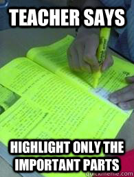
``` 
]

---
class: top, left

### Literaturrecherche

#### Lesetechniken

##### Umgang mit dem Text

.pull-left[
**Randbemerkungen und Markierungssymbole**
* Inhalt des Textes wird mit eigenem Wissen verbunden. Der Leser fügt dem Text etwas hinzu, was nicht explizit drin steht.
* Elaboration fördert das Behalten von aufgenommenen Informationen
* Systematische Vorgehensweise
* Immer das gleiche System verwenden!
]

.pull-right[
```{r, echo=FALSE,fig.show='hold',fig.align='center', out.width="70%"}
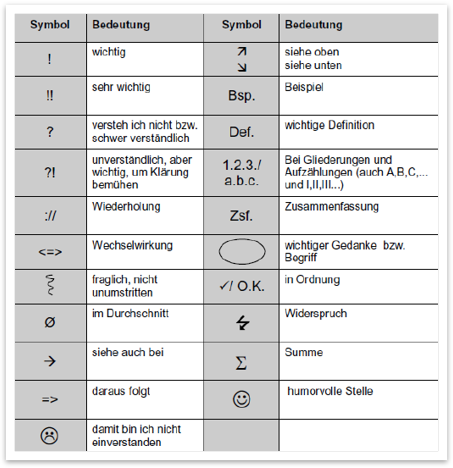
``` 
]

---
class: top, left

### Literaturrecherche

#### Lesetechniken

##### Umgang mit dem Text

**Exzerpieren**
* lat. „excerpere“ = herausnehmen: auszugsweise Wiedergabe des Textes
* Dinge auf den Punkt bringen und Wesentliches kurz und knapp zusammenschreiben.
* Zu empfehlen: 
  * Karteikarten (oder Literaturverwaltungsprogramme!)
  * Standortstellen und Signatur der Publikation notieren
  * Knapp formulieren, jedoch so, dass der gedankliche Zusammenhang später nachvollziehbar ist
  * Breiter Rand für Zusätze und Kommentare
  * Bilder/Grafische Darstellungen
* Nicht zu empfehlen
  * Lesenotizen auf lose Blätter schreiben
  * Zu knapp
    
**Visualisierung (z.B. Mindmaps)**


---
class: top, left

### Quellen & Referenzen

#### Zitationssysteme

In unserem Studium ist die in der Psychologie übliche Zitierweise der Deutschen Gesellschaft für Psychologie (DGPs) und der American Psychological Association (APA) verpflichtend:


.center[
```{r eval = TRUE, echo = F, out.width="20%"}
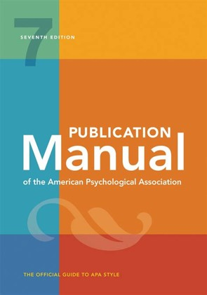
```
]

[**Link zum vollständigen APA-Style guide**](https://apastyle.apa.org)

[**Link zum kostenfreien Nachlesen vom APA-Style guide der Purdue University**](https://owl.purdue.edu/owl/research_and_citation/apa_style/apa_formatting_and_style_guide/in_text_citations_author_authors.html)

---
class: top, left

### Quellen & Referenzen

#### Zitationssysteme

* Gekürzte Quellenangaben im Haupttext:
  * „Direkte Zitate“: Autorenname(n), Erscheinungsjahr, Seitenangabe 
  * Indirekte Zitate: Autorenname(n), Erscheinungsjahr

* Zitationen können, müssen aber nicht im Fließtext eingebettet werden:
  * Im Fließtext: 
      - 2 Autoren: Wie Müller und Huber (2000) zeigen ...
      - Mehr als 2 Autoren: Wie Müller et al. (2000) zeigen ...
  * Nicht im Fließtext: 
      - 2 Autoren: Folgendes konnte gezeigt werden ... (Müller & Huber, 2000).
      - Mehr als 2 Autoren: Folgendes konnte gezeigt werden ... (Müller et al., 2000).
  
* Ausnahme zur "et al."-Regel: Führt dies zu Mehrdeutigkeit (z.B. zwei Quellen mit dem-/derselben ErstautorIn aus demselben Jahr), werden so viele Namen aufgelistet, wie zur Unterscheidung beider Quellen erforderlich ist.

---
class: top, left
name: zitate

### Quellen & Referenzen

#### Indirekte vs. Direkte Zitate

Indirekte Zitate (in Wissenschaft mit Abstand am häufigsten verwendet)

* Gedankengänge anderer Autoren werden sinngemäß übernommen

* Werden regelmäßig eingesetzt

* Stehen ohne Anführungszeichen

* Inhalte bleiben trotz Umformulierung identisch

* Quellenbeleg: Autor und Erscheinungsjahr

---
class: top, left
### Quellen & Referenzen

#### Indirekte vs. Direkte Zitate

Indirekte Zitate – Beispiel:

Im Alltag müssen wir oft überprüfen, ob beispielsweise ein bestimmtes Objekt einer bestimmten Gruppe zugeordnet werden kann **(Daschmann, 2001)**. Um dieses Urteil fällen zu können, vergleichen wir das Objekt mit dem Prototyp einer Kategorie, mit welchem es die meiste Ähnlichkeit aufweist. Andere validere Informationen werden dabei vernachlässigt **(Werth & Mayer, 2008)**. Dadurch kann es zu Fehlurteilen kommen. Hierzu gehören, dass die summarische Realitätsbeschreibung ignoriert wird, Stichprobengrößen nicht zur Kenntnis genommen und Zufallsverteilungen falsch eingeschätzt werden **(Daschmann, 2001)**. **Kahneman und Tversky (1973)** konnten diese Phänomene nachweisen.

---
class: top, left
### Quellen & Referenzen

#### Indirekte vs. Direkte Zitate


Direkte Zitate

* Wortwörtliche Übernahme

* Sparsame Verwendung (sonst ist es nur abschreiben)

* Stehen (meist) in Anführungszeichen

* Quellenbeleg: Autor, Erscheinungsjahr und Seitenzahl der übernommen Stelle

---
class: top, left
### Quellen & Referenzen

#### Indirekte vs. Direkte Zitate

Direkte Zitate - Beispiel 

<small>

* Ein Satz

„Ein Experiment beginnt – wie andere wissenschaftliche Untersuchungen auch – im Allgemeinen mit einer Fragestellung“ **(Beck, 2009, S. 81)**.

* Einleitung durch einen Doppelpunkt

**Beck (2009)** meint dazu: „Ein Experiment beginnt – wie andere wissenschaftliche
Untersuchungen auch – im allgemeinen mit einer Fragestellung“ **(S. 81)**. 

* Syntaktische Verschmelzung mit einem Satz

Bezüglich eines Experiments stellt **Beck (2009)** fest, dass es „(...) im allgemeinen mit einer Fragestellung [beginnt]“ **(S. 81)**.

* Auf englisch "p." (für *page*) statt "S."

---
class: top, left
name: mehrere-quellen

### Quellen & Referenzen

#### Mehrere Quellen für die selbe Aussage

Mehrere Quellen werden durch Strichpunkt getrennt (für jede Quelle muss ein Eintrag im Literaturverzeichnis vorhanden sein!)

* Z.B. wenn man zum Ausdruck bringen möchte, dass ein Befund gut belegt ist:

Conscientiousness was also found to be inversely associated with impulsiveness **(Mowen, 2000; Rocas, Sagiv, Schwartz, & Knafo, 2002)**


#### Mehrere Quellen des selben Autors

Hat ein Autor mehrere Quellen in einem Jahr veröffentlicht, unterscheidet man die Quellen durch den Zusatz von „a“, „b“, ...bei der Jahresangabe

**(Müller, 2000a, S. 5.; Müller, 2000b, S. 25)**. -> Gilt bei direkten und indirekten Zitaten

* Die Reihenfolge der Nummerierung richten sich alphabetisch nach dem Titel der Quelle.

---
class: top, left
name: mehrere-quellen

### Quellen & Referenzen

#### Autoren mit dem gleichen Familiennamen

Der Anfangsbuchstabe des Vornamen wird vorangestellt: z.B. In einigen Studien (J. Müller, 2010; K. Müller, 2009) ...

#### Weitere Besonderheiten (z.B. sehr lange direkte Zitate)

Im Zweifelsfall im APA-Manual nachschauen!

---
class: top, left
name: lit-verzeichnis

### Quellen & Referenzen

#### Literaturverzeichnis

Das Literaturverzeichnis....
* Folgt in der Regel unmittelbar auf den Textteil einer Arbeit

* Alle im Fließtext verwendeten Quellen müssen hier lückenlos dokumentiert werden (und auch nur diese!)

* Reihenfolge: Alphabetisch nach Nachname des (Erst-) Autors, dann nach Jahreszahl (frühere Artikel desselben Autors vor späteren Artikeln, aber "nothing precedes something", d.h. Artikel mit weniger Co-Autoren vor Artikeln mit mehr Co-Autoren)

* Arten von Quellen werden im Literaturverzeichnis *nicht* anhand unterschiedlicher Abschnitte differenziert (also nicht alle Journalartikel aufführen, dann alle Internetquellen, dann alle Fachbücher)

* Akademische Grade und berufliche Titel der Autoren werden nicht angegeben

* Angabe der Auflage: Erst ab 2. Auflage in runden Klammern hinter dem Titel (nicht kursiv)

* "hängend" formatieren (Einrückung in der zweiten Zeile)

---
class: top, left
### Quellen & Referenzen

#### Literaturverzeichnis

Allgemeine Inhalte der Quellenangabe im Literaturverzeichnis

* Vorname (Initiale) und Zuname des Autors / der Autoren (i.d.R. werden hier alle angegeben, außer es sind mehr als 20)

* Erscheinungsjahr

* Titel der Quelle

* Ggf. Auflage (erst ab der 2. Auflage)

* Angaben zur eindeutigen Identifikation der Quelle je nach Art der Quelle (Zeitschriftenname / URL / ...) $\rightarrow$ Hier unterscheiden sich die Angaben je nach Literaturgattung (also Paper, Monographien, Sammelbänder, etc.)

---
class: top, left
### Quellen & Referenzen

#### Literaturverzeichnis

.center[
```{r eval = TRUE, echo = F, out.width = "800px"}
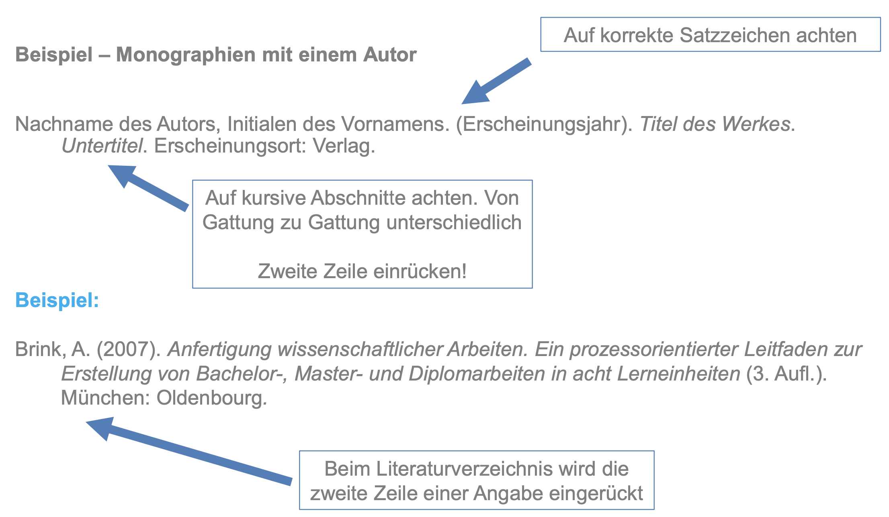
```
]

---
class: top, left
### Quellen & Referenzen

#### Literaturverzeichnis

.center[
```{r eval = TRUE, echo = F, out.width = "900px"}
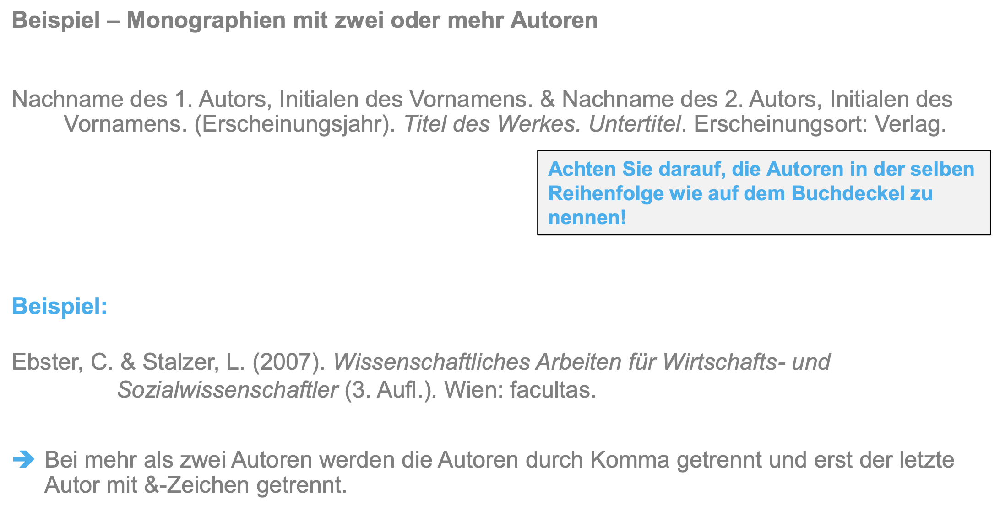
```
]

---
class: top, left
### Quellen & Referenzen

#### Literaturverzeichnis

.center[
```{r eval = TRUE, echo = F, out.width = "900px"}
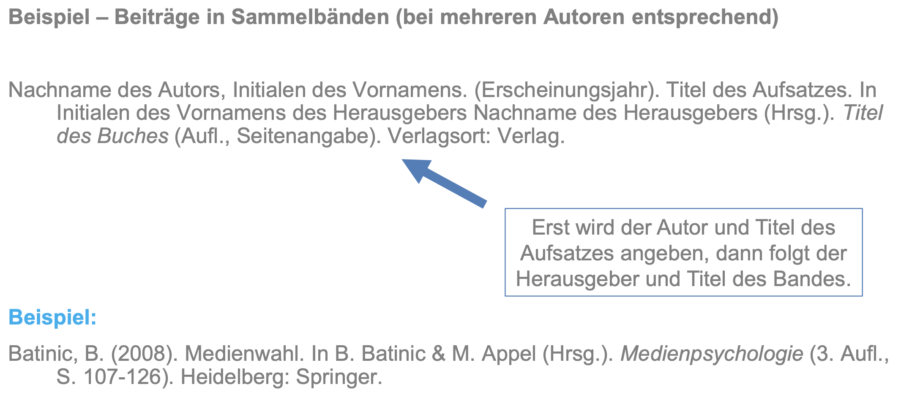
```
]

---
class: top, left
### Quellen & Referenzen

#### Literaturverzeichnis

.center[
```{r eval = TRUE, echo = F, out.width = "800px"}
knitr::include_graphics("bilder/lit4.png")
```
]

---
class: top, left
### Quellen & Referenzen

#### Bewertungsschema

.center[
```{r eval = TRUE, echo = F}
knitr::include_graphics("bilder/bewertung_zitate.png")
```
]

`\(\rightarrow\)` wird 2x bewertet: bei Gruppenarbeit und bei Einzelleistung!

`\(\rightarrow\)` letztes Jahr nur sehr wenige Gruppen mit voller Punktzahl -- das ist schade, denn das sind klassische "Fleißpunkte", wo man nur nachschauen muss, wie es geht

`\(\rightarrow\)` daher unbedingt den Abschnitt "Quellen & Referenzen" im Zusatzmaterial  auf studynet anschauen!!
