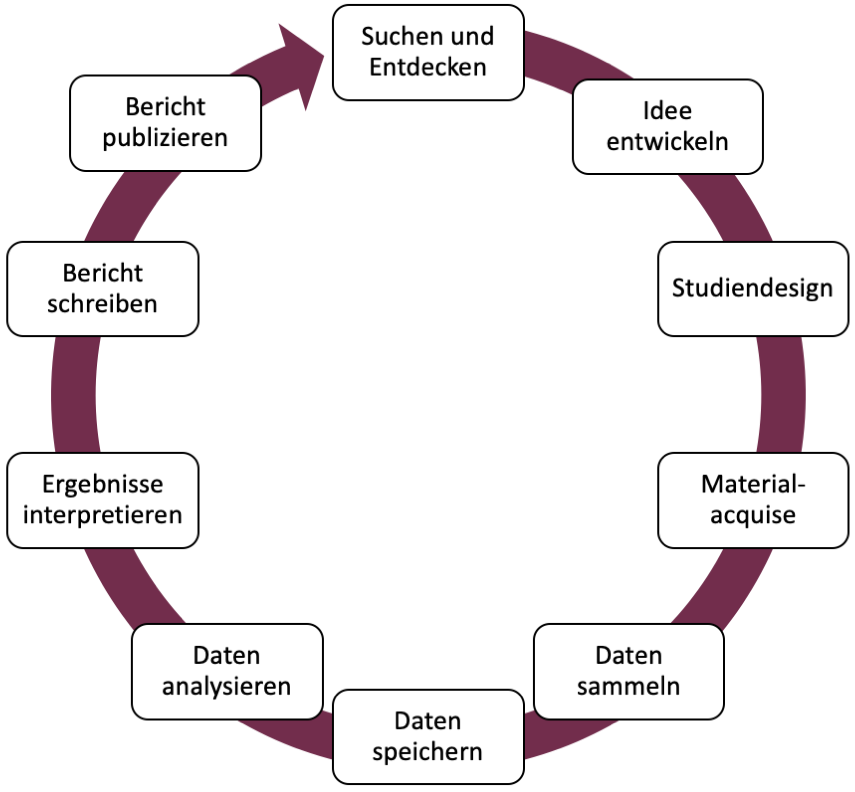
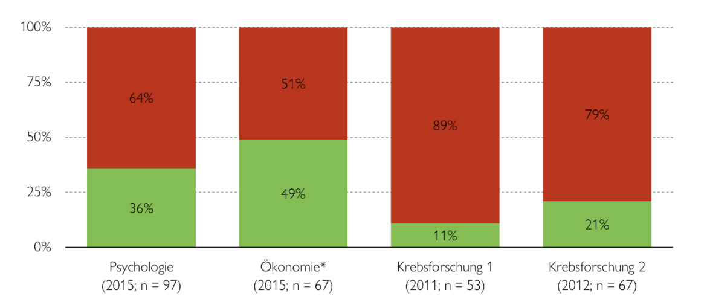
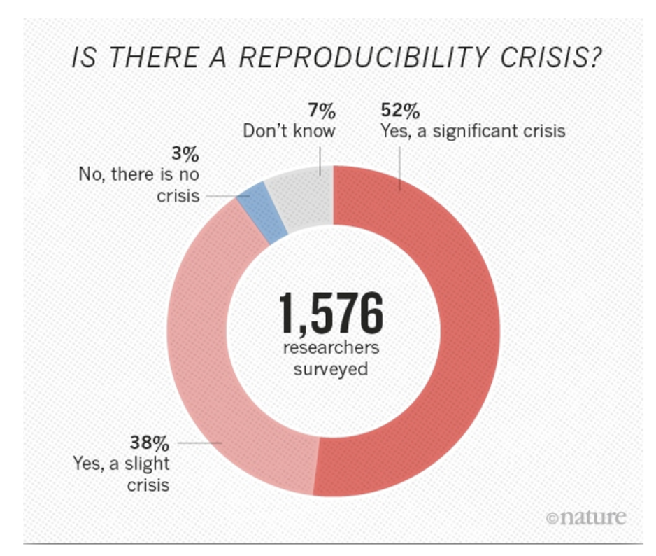
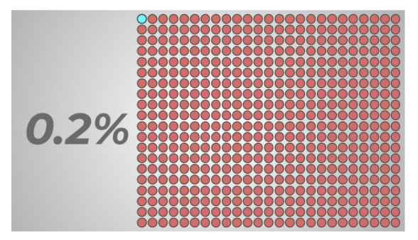
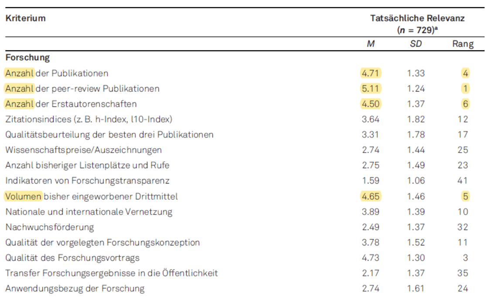
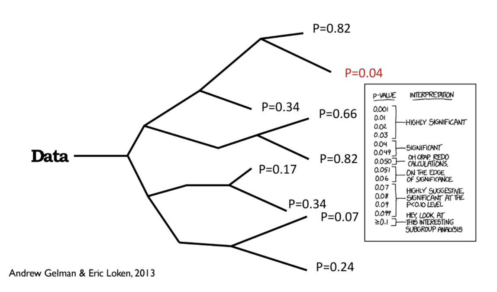
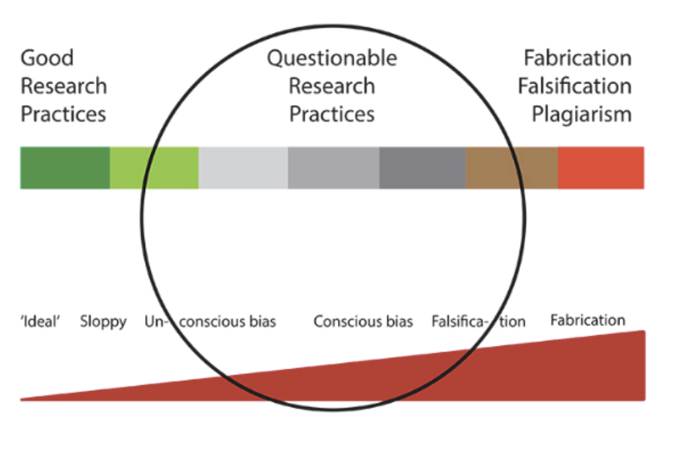
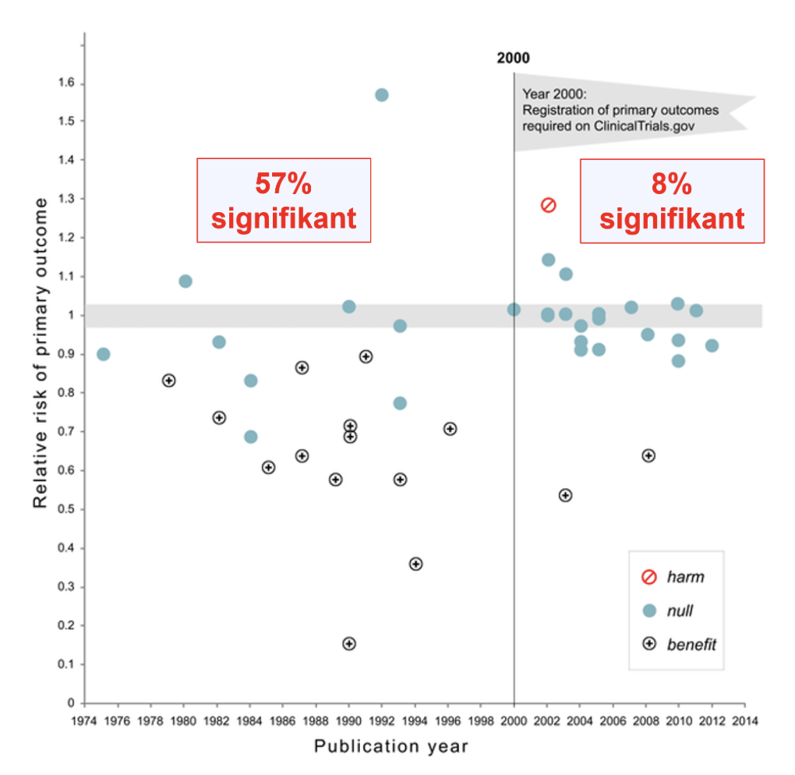
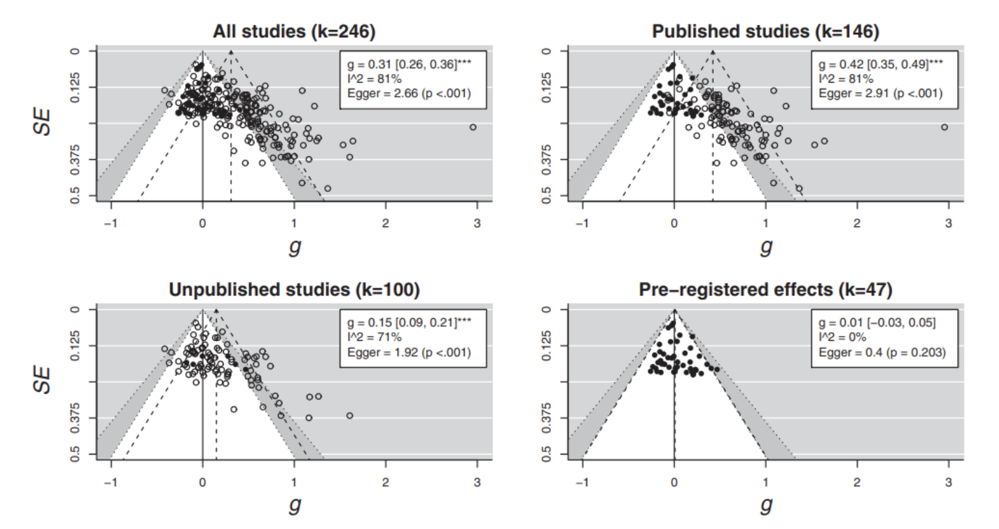

```{r setup, include=FALSE}
options(htmltools.dir.version = FALSE)

library(tidyverse)
library(kableExtra)
library(ggplot2)
library(plotly)
library(htmlwidgets)
library(MASS)
library(ggpubr)
library(xaringanthemer)
library(xaringanExtra)

style_duo_accent(
  primary_color = "#621C37",
  secondary_color = "#EE0071",
  background_image = "blank.png"
)

xaringanExtra::use_xaringan_extra(c("tile_view"))

use_scribble(
  pen_color = "#EE0071",
  pen_size = 4
  )

knitr::opts_chunk$set(
  fig.retina = TRUE,
  warning = FALSE,
  message = FALSE
)
```

name: Title slide
class: middle, left
<br><br><br><br><br><br><br>
# Wissenschaftliches Arbeiten und Forschungsmethoden
***
### Einheit 1: Grundlagen und Präregistrierung
##### `r format(as.Date(data.frame(readxl::read_excel("Modul Quantitative Methoden II_Termine.xlsx"))$Datum), "%d.%m.%Y")[1]` | Prof. Dr. Stephan Goerigk

---
class: top, left
name: Contact Slide

### Kontakt

.pull-left[
Prof. Dr. phil. Stephan Goerigk 

Psychologische Methodenlehre

Infanteriestraße 11a · 80797 München · 

[stephan.goerigk@charlotte-fresenius-uni.de](mailto:stephan.goerigk@charlotte-fresenius-uni.de)

***

Zoom Sprechstunde (bitte per Email anmelden): 

Meeting-ID: 284 567 8838

Kenncode: 807174

***

[Publikationen](https://scholar.google.at/citations?user=nlvO-e4AAAAJ&hl=de)

[Commitment to Research Transparency](http://www.researchtransparency.org)
]

.pull-right[
.center[
<br><br><br>
.bottom[]
]
]

---
class: top, left
### Übersicht Lehrveranstaltung 

Termine:
* 13 Termine
* Mittwoch 09:10 - 10:45

Begleitendes Seminar:

* Übung zur computergestützten Datenanalyse

Materialien:
* werden auf [**studynet**](https://studynet.hs-fresenius.de/ilias.php?baseClass=ilrepositorygui&cmdNode=zx:pa&cmdClass=ilObjGroupGUI&cmd=view&ref_id=26224) bereitgestellt

Prüfungsleistung:
* Projektbericht (Präregistrierung + empirischer Forschungsbericht) in Englisch oder Deutsch als Gruppenarbeit (5 Studierende)
* Umfang: ab 7 Seiten pro Person
* Anmeldezeitraum: ?; Abgabe: 16.08.2024

---
class: top, left
### Termine

```{r echo = F}
df = readxl::read_xlsx("Modul Quantitative Methoden II_Termine.xlsx", sheet = "Tabellenblatt1")[1:13, 1:3]
df$Datum = format(as.Date(df$Datum), "%d.%m.%Y")
df %>%
  kbl() %>%
  kable_classic(full_width = T, 
                font_size = 16,
                position = "left")
```

---
class: top, left
### Ziele der Veranstaltung

#### Vermittelte Inhalte
*	Methoden und wissenschaftliche Konzepte für die Erforschung menschlichen Verhaltens und Erlebens
*	Planung und Durchführung wissenschaftlicher Studien 
*	Gütekriterien zur Bewertung von Forschungsdesigns
*	Sicherstellung guter wissenschaftlicher Praxis und Open Science
*	Datenerhebung und Datenanalyse unter Nutzung digitaler Technologien

#### Vermittelte Kompetenzen
*	Anwendung von Begriffen, Methoden und Ergebnissen der qualitativen und quantitativen Forschung in der psychologischen Grundlagen- und Anwendungsforschung
*	Beurteilung von Auswirkungen von Forschungsmethoden auf Untersuchungspopulationen und Anwendung deskriptiver und inferenzstatistischer Methoden sowie weitere statistischer Verfahren zur Auswertung von Ergebnissen
* Planung, Durchführung und Auswertung wissenschaftlicher Untersuchungen
* Einfluss von Projekterfahrungen in die Planung und Durchführung von wissenschaftlichen Studien sowie in die Auswertung und Darstellung von eigenen Forschungsergebnissen

---
class: top, left
<div class="footer"><span>https://www.robertoferraro.net/illustrations</span></div>

### Übergeordnetes Konzept

#### Ziel

Sie sollen...
* ...Erfahrungen mit Ihrer ersten Mini-Forschungsarbeit sammeln, indem Sie von sich gegenseitig Daten erheben
* ...mit jeder Sitzung ein Schritt des Forschungsprozesses bearbeiten
* ...im Begleitseminar mit eigenen Daten arbeiten können
* ...bewusst "Learning by Doing" praktizieren - Fehler im Prozess helfen zu lernen


Ihre Note hängt am Ende nicht davon ab, wie komplex Ihre Ideen und/oder Analysen waren, oder wie viele Fehler Sie *auf dem Weg* gemacht haben, sondern von der transparenten und nachvollziehbaren Beschreibung Ihres Forschungsprozesses in der Präregistrierung und im empirischen Bericht, sowie der wissenschaftlichen Argumentation darin `\(\rightarrow\)` Bewertungsschema auf studynet

---
class: top, left
### Prüfungsleistung

#### Bewertung

* Projektbericht (Präregistrierung + empirischer Forschungsbericht) in Englisch oder Deutsch als Gruppenarbeit (5 Studierende) `\(\rightarrow\)` [siehe Beispiele auf studynet](TODO)

.pull-left[
* **Präregistrierung**
  - Heute: Präregistrierung - Was und Warum?
  - Kommende Sitzungen: Präregistrierung - Wie?
  - Präregistrierung wird nicht inhaltlich bewertet, muss aber mit abgegeben werden
  - Mitte des Semesters: Datenerhebung auf Basis von Präregistrierung
]

.pull-right[
* **Empirischer Forschungsbericht**
  - **Gruppenanteil**: Formulierung von Einleitung und Methodenteil ( `\(\rightarrow\)` Vorarbeit in der Präregistrierung) + Open Data und Codebook
  - **Einzelanteil**: Formulierung von Ergebnisteil, Diskussion, und Abstract + R-Skripte
]

* Note setzt sich zusammen aus der Bewertung des Gruppenanteils (einfach gewichtet) und Bewertung des Einzelanteils (doppelt gewichtet) `\(\rightarrow\)` Bewertungsschema auf studynet

---
class: top, left
### Aufbau jeder Sitzung und wichtige Zwischentermine

#### Häufiger Aufbau der Sitzungen

* **Teil 1: Hintergrundwissen, Theoretischer Input**
* **Teil 2: Praxisarbeit in Gruppen (welche in Eigenregie nach der Vorlesung abgeschlossen werden muss!)**

#### Wichtige Zwischentermine

* **Bis zum 26.04.**: Abgabe Gruppenname & Thema 

* 08.05., 15.05. oder (spätestens) 22.05.: Möglichkeit für kurzes persönliches Feedback von mir während der Sitzung

* **Bis zum 24.05.**: Finalisierung Präregistrierung

---
class: top, left

### Forschungsthemen

#### Eigenes Thema - Vorgaben

Auswahl von Thema, die mit folgenden Variablen/Variablenkategorien untersuchbar sind:

* **Stimmung, Wohlbefinden, Lebenszufriedenheit, Beziehungszufriedenheit** ([zis.gesis.org](zis.gesis.org) -> Individuum & Persönlichkeit -> Stimmung & Emotionen)
* **Persönlichkeit**, z.B. Big 5, Neugier, Leistungsmotivation, Risikobereitschaft, Selbstwirksamkeit, Selbstbewusstsein ([zis.gesis.org](zis.gesis.org) -> Individuum & Persönlichkeit -> Bedürfnisse, Motive & Interessen / Kontrollüberzeugungen / Persönlichkeitsinventare / Selbstwahrnehmen & -erleben)
* **Werte** ([zis.gesis.org](zis.gesis.org) -> Individuum & Persönlichkeit -> Werte & Ziele)
* **Prokrastination** ([zis.gesis.org](zis.gesis.org) -> Bildung -> Erleben & Verhalten)
* **Ungerechtigkeitssensibilität** ([zis.gesis.org](zis.gesis.org) -> Gesellschaft & Soziales -> Soziale Gerechtigkeit)
* **Freizeitinteresse** ([zis.gesis.org](zis.gesis.org) -> Gesellschaft & Soziales -> Wohnen & Leben)
* **Umweltbewusstsein/verhalten** ([zis.gesis.org](zis.gesis.org) -> Umwelt)
* **Gesundes Essverhalten**
* **Bindungsstile**
* **Social Media Nutzung**

---
class: top, left

### Forschungsthemen

#### Eigenes Thema - Vorgaben

**Beispiele für gut untersuchbare Themen**: 
* Unterschiede zwischen Münchnern und Nicht-Münchnern hinsichtlich Musikpräferenzen
* Zusammenhang zwischen Interessen für Themen und Persönlichkeitseigenschaften
* Effekt der Darbietung einer Information auf Einstellungen oder Zufriedenheit in einem bestimmten Bereich

**Beispiele für ungünstige Themen**:
* Abfrage sensibler Inhalte nötig, z.B. zur Krankheitsgeschichte, Sexualität, Intelligenz, Untreue,...
* Untersuchung seltener Merkmale, z.B. besondere Lebenserfahrungen oder -umstände

`\(\rightarrow\)` **Es darf kein Ethikantrag nötig sein!**

`\(\rightarrow\)` **siehe Zusatzmaterial ["Ethik Checkliste" auf studynet](https://studynet.hs-fresenius.de/ilias.php?baseClass=ilrepositorygui&cmd=sendfile&ref_id=26580).**

---
class: top, left

### Forschungsthemen

#### Angemessen komplexe Analysen wählen


* t-test für unabhängige Stichproben für einen Mittelwertsvergleich zwischen zwei Gruppen

* Korrelationsanalyse für den Zusammenhang zwischen zwei Variablen

* Lineare Regression ausschließlich mit Haupteffekten oder maximal einem Interaktionseffekt für die Vorhersage einer stetigen/numerischen abhängigen Variable (z.B. Skala aus Likert-Items)

* t-test für abhängige Stichproben für Mittelwertsunterschiede auf einer Variable in einem Pre-Post-Design

* 2-faktorielle ANOVA für ein Pre-Post-Design mit Experimental- und Kontrollgruppe (generell bei UV: nicht zuviele Stufen!) für eine stetige/numerischen abhängige Variable

`\(\rightarrow\)` auch für Gruppen relevant, die sich für das Interventionsthema entscheiden, da die selbst gewählte angeknüpfte Forschungsfrage mit einer bestimmten Analyse einhergeht (aber es gibt eine eingeschränktere Auswahl basierend auf dem vorgegebenen Studiendesign)

---
class: top, left

### Forschungsthemen

#### Rahmenbedingungen für unser Praxisprojekt

**1. Wir untersuchen uns gegenseitig (auf freiwilliger Basis)**

`\(\rightarrow\)` Anonymität während der Erhebung wahren (auch durch Auswahl der Forschungsfragen)!

`\(\rightarrow\)` Stichprobengröße ist begrenzt, wenn Effekt nicht riesig, dann vmtl. nicht signifikant (was ok ist! Man kann sich trotzdem die Richtung des geschätzten Effekts ansehen)

**2. Wir üben**

`\(\rightarrow\)` Auswahl simpler Fragestellung, simpler Hypothesen, simples Design auf Basis einer Fragebogenstudie (für eigenes Thema), simple Analysen

`\(\rightarrow\)` Für komplexere Fragestellungen, Designs und Analysen haben Sie im Forschungspraktikum und Ihrer Abschlussarbeit Gelegenheit

---
class: top, left
name: praxis

### Praxisaufgaben (nach der Vorlesung): Suchen und Entdecken

#### Aufgabe: Mit welchem Thema möchte ich mich (mit welchen Gruppenmitgliedern) beschäftigen? 

<small>

**Schritt 1: Themenwahl**
* Lesen Sie sich das [Zusatzmaterial "Themensuche" auf dem studynet](https://studynet.hs-fresenius.de/ilias.php?baseClass=ilrepositorygui&cmd=sendfile&ref_id=26582) durch.

* Gehen Sie die Variablen auf Folie 13 durch, und folgen Sie den Links für weitere mögliche untersuchbare Variablen.

* Sammeln Sie Ideen und Themenvorschläge mit dem Bezug zur Psychologie, die Sie interessieren.

**Schritt 2: Finden Sie Gruppenmitglieder**
  * Bitte von mir an die Semestersprecher die Kommiliton:innen bei der Gruppenfindung zu unterstützen. Im Zweifelsfall möglichst gleichmäßige Aufteilung auf die beiden Optionen (eigenes Thema / Interventionsthema).
  
  * Weniger als 5 Personen sind nur möglich, wenn es am Ende nicht aufgeht. Das heißt: Ihre Gruppe ist zunächst nicht vollständig, wenn Sie nicht zu 5. sind.
  
---
class: top, left
### Präregistierung im empirischen Forschungsprozess

#### Was bedeutet „empirisch“?

* empirisch (griech.) = auf Erfahrung beruhend

* **Empirische Daten** sind gezielt im Hinblick auf das Forschungsproblem ausgewählte und dokumentierte Informationen über die Erfahrungswirklichkeit (Döring & Bortz, 2016) `\(\rightarrow\)` gewonnen aus z.B. Experiment, Beobachtung oder Befragung 

* **Empirische Forschung** sucht nach Erkenntnissen durch **systematische Sammlung, Aufbereitung und Analyse von empirischen Daten** (Döring & Bortz, 2016)

* Fokus einer empirischen Wissenschaft ist, menschliche Erfahrung zu systematisieren und **methodisch vor Irrtum zu sichern** (Walach, 2009)

* Erkenntnisgewinn entsteht durch **Hypothesenprüfung**

---
class: top, left
### Präregistierung im empirischen Forschungsprozess

#### Schritte im empirischen Forschungsprozess

.center[
```{r eval = TRUE, echo = F, out.width = "460px"}

```
]

---
class: top, left

### Präregistierung im empirischen Forschungsprozess

#### Präregistrierung: Definition

<br>

.center[

"*Präregistrierung bezeichnet die* ***Darstellung des forschungsmethodischen Vorgehens*** *(Hypothesen, Forschungsdesign, Stichprobe, Ein- und Ausschlusskriterien, Untersuchungsdurchführung, Auswertungsplan, statistische Datenauswertung) bei der Durchführung und Auswertung einer* ***zukünftig erfolgenden*** *wissenschaftlichen Studie.*"
]

---
class: top, left

### Präregistierung im empirischen Forschungsprozess

#### Präregistrierung: Hintergrund

<small>

**Glaubwürdigkeitsprobleme der psychologischen Forschung aufgrund von...**
* ...Betrugsfällen in der Psychologie
* ...Nichtreplizierbarkeit des sogenannten "Psi-Phänomens" (Bem, 2011)
* ...niederschmetternden Ergebnissen von systematischen Replikationsstudien

<br>

.center[
*"Is there currently a crisis of confidence in psychological science reflecting an unprecedented level of doubt among practitioners about the reliability of research findings in the field? It would certainly appear that there is."*

Pashler & Wagenmakers (2012)

<br>

*"According to many psychologists, their field has a credibility problem at the moment, and it affects thousands of studies.*" 

Carpenter (2012)
]

---
class: top, left

### Präregistierung im empirischen Forschungsprozess

#### Präregistrierung: Hintergrund

##### Nichtreplizierbarkeit des sogenannten "Psi-Phänomens" (Bem, 2011)

.pull-left[
9 publizierte Experimente, die angeblich "psi" nachweisen (Ereignisse in der Zukunft beeinflussen Verhalten in der Gegenwart) führten zu
* Unmut
* Zweifel an der Fehlerfreiheit von statistischen Methoden
* Infragestellung der Reliabilität der Psychologie
]

.pull-right[

]

**Reaktionen**:

* Andere Ergebnisse bei alternativer Methode der Hypothesentestung (Wagenmakers et al., 2011)
* Gescheiterte Replikationsversuche (Galak et al., 2012; Ritchie et al., 2012)


---
class: top, left
### Präregistierung im empirischen Forschungsprozess

#### Präregistrierung: Hintergrund

##### Niederschmetterndes Replikationsprojekt: Reproducibility Project: Psychology (Open Science Collaboration, 2015)

* Weltweit 97 Replikationsstudien unter Beteiligung von 270 Forscher:innen

* nur 36% aller Effekte signifikant (in den Originalpublikationen 97%)

* 83% aller Effektstärken kleiner als die original Effektstärken


* Viele bekannte Effekte nicht replizierbar:

  * EgoDepletion (Baumeister et al., 1998)
  * FacialFeedback (Strack et al., 1988)
  * PowerPosing (Carney et al., 2010)

* Weitere Replikationsprojekte mit gemischten Ergebnissen, wie "ManyLabs", "ManyBabies", ... 

---
class: top, left
### Präregistierung im empirischen Forschungsprozess

#### Präregistrierung: Hintergrund

Nur die Psychologie? Nein:

.pull-left[
*Welcher Teil der publizierten Forschungsergebnisse kann in verschiedenen Disziplinen repliziert werden?*

.center[
```{r eval = TRUE, echo = F, out.width = "560px"}

```
]
]

.pull-right[
.center[
```{r eval = TRUE, echo = F, out.width = "360px"}

```
]
]

---
class: top, left

### Präregistierung im empirischen Forschungsprozess

#### Präregistrierung: Hintergrund


**Ursachen von Nicht-Replizierbarkeit im Speziellen**
* **False-Positives** (α-Fehler) in den Originalstudien 

`\(\rightarrow\)` der Effekt existiert wirklich nicht

* **False-Negatives** (β-Fehler) in den Replikationsstudien 

`\(\rightarrow\)` der Effekt existiert, es liegt an der Methodik der Replikation, dass er nicht gefunden wurde

* **"Hidden-Moderators"** 

`\(\rightarrow\)` der Effekt existiert, aber die Bedingungen, unter denen er in der Originalstudie gefunden wurde, unterscheiden sich von den Bedingungen in der Replikationsstudie 

---
class: top, left

### Präregistierung im empirischen Forschungsprozess

#### Präregistrierung: Hintergrund

**Ursachen von diesen Problemen im Generellen**
* Das System an sich
* Die Wissenschaftler
* Journals

`\(\rightarrow\)` Anreize für "False-Positives"

`\(\rightarrow\)` keine Anreize für Replikationen

<br>

.center[
"*Much of the scientific literature, perhaps half, may simple be untrue. <br>Part of the problem is that no one is incentivised to be* ***right.***"

Horton, Editor von "The Lancet"
]

---
class: top, left
### Präregistierung im empirischen Forschungsprozess

#### Präregistrierung: Hintergrund

##### Ursache "Das System an sich"

* Enorme Konkurrenz zwischen Wissenschaftlern: Um in der Wissenschaft erfolgreich zu sein, muss viel publiziert werden ("**publish or perish**")

.pull-left[
* Keine Anreize für Replikationen, denn Replikationsstudien...
    * ...werden oft nicht beachtet
    * ...werden oft nicht publiziert
    * ...bekommen oft negative Reaktionen von Originalautoren
    * ...haben oft keinen Wert für die Karriere
]

.pull-right[
.center[
```{r eval = TRUE, echo = F, out.width = "360px"}

```
]
]

.center[
*"The current system does not reward replication - it often even penalizes people who want to rigorously replicate previous work, and it pushes investigators to claim that their work is highly novel and significant."*
Ionnidis (2014)
]

---
class: top, left
### Präregistierung im empirischen Forschungsprozess

#### Präregistrierung: Hintergrund

##### Ursache "Wissenschaftler"

.pull-left[
Wissenschaftler:innen sind keine Roboter, auch sie haben menschliche Bedürfnisse
* Sicherer Job
* Bekanntheit
* Förderung
* Wirkung auf die Gesellschaft
`\(\rightarrow\)` All dies erfordert viele Publikationen

*"I failed as a scientist, … I did not withstand the pressure to score, to publish, the pressure to get better in time. I wanted too much, too fast. In a system where there are few checks and balances, where people work alone, I took the wrong turn."* - Stapel (2014)
]

.pull-right[
.center[
```{r eval = TRUE, echo = F, out.width = "460px"}

```
]
]

---
class: top, left

### Präregistierung im empirischen Forschungsprozess

#### Präregistrierung: Hintergrund

##### Ursache "Journals"

<small>

Viele Journals...
* ...akzeptierten (bisher) Replikationsstudien nicht
* ...publizieren nur neue und interessante Effekte
* ...publizieren nur positive Ergebnisse

**File-Drawer Problem** führt zu **Publication Bias**: Nur positive Ergebnisse werden publiziert, während alle negativen Ergebnisse in der Schublade des Wissenschaftlers bleiben

##### Fazit

* Es herrscht ein enormer Druck für Publikationen
* Wissenschaftler müssen viel und schnell publizieren, um überhaupt "überleben" zu können 

`\(\rightarrow\)` das führt meistens zu falsch-positiven Ergebnissen<br>
`\(\rightarrow\)` Meta-Analysen (Zusammenfassungen von Studien) "to the rescue"? Nein: "*Garbage in -> Garbage out*"

---
class: top, left
### Präregistierung im empirischen Forschungsprozess

#### Präregistrierung: Wirkung

**Einschränkung der Freiheitsgrade der Wissenschaftler ("Researcher degrees of freedom")**

.pull-left[
Simmons, Nelson & Simonsohn (2011): <br>
Forscherinnen und Forscher haben zu viele Möglichkeiten, ihre Daten so zu analysieren, dass sie hinterher ein interpretierbares (und publizierbares) Ergebnis finden

.center[
*"Cases of clear scientific misconduct have received significant media attention recently, but less flagrantly questionable research practices may be more prevalent and, ultimately, more damaging to the academic enterprise."* 

Leslie et al. (2012)
]
]

.pull-right[
.center[
```{r eval = TRUE, echo = F, out.width = "460px"}

```
]
]

---
class: top, left
### Präregistierung im empirischen Forschungsprozess

#### Präregistrierung: Wirkung

**Verhinderung von sogenannten Questionable-Research-Practices (QRP)**

.pull-left[

<br>
*"QRPs are the steroids of scientific competition, artificially enhancing performance and producing a kind of race in which researchers who strictly play by the rules are at a competitive disadvantage."*

Leslie et al. (2012)
]

.pull-right[
.center[
```{r eval = TRUE, echo = F, out.width = "460px"}

```
]
]

---
class: top, left

### Präregistierung im empirischen Forschungsprozess

#### Präregistrierung: Wirkung

**Verhinderung von sogenannten Questionable-Research-Practices (QRP)**

Zu QRPs gehören:
* ***Selective reporting***:
  * Nur ein Teil des Versuchsplans berichten
  * Nur ein Teil der Analysen berichten, z.B. negative (hypothesenkonträre) Ergebnisse ignorieren 
* ***p-hacking***: 
  * jegliche Art von Statistik versuchen, bis p < 0.5
  * Extremwerte selektiv weglassen
  * Subgruppenanalysen
* ***Outcome switching***: 
  * Man erhebt so viele Outcomes wie möglich und berichtet nur diejenigen, die signifikant sind
* ***Optional stopping***: 
  * Daten solange erheben, bis der Effekt signifikant wird\*

<br>
<font size="1">* Es gibt zwar sequentielle Methoden, die das erlauben (vgl. https://lakens.github.io/statistical_inferences/10-sequential.html#sample-size-for-sequential-designs); mit dem typischerweise angewendeten einmaligen Nullhypothesentesten mit *p*-Werten ist ein optionales Erhöhen oder frühzeitiges Abbrechen der Datenerhebung aber nicht erlaubt.</font>

---
class: top, left


### Präregistierung im empirischen Forschungsprozess

#### Präregistrierung: Wirkung

**Verhinderung von sogenannten Questionable-Research-Practices (QRP)**


Zu QRPs gehört auch HARKing:

* Kerr (1988): HARKing = "Hypothesizing After the Results are Known": Eine post-hoc Hypothese so darstellen, als wäre es eine a-priori Hypothese gewesen

* Dieses Vorgehen ist mit dem deduktiv-nomologischem Modell (aka "Hempel Oppenheim Schema") unvereinbar

* Es bringt viele Probleme mit sich, insbesondere werden "falsch-positive" Forschungsergebnisse als substanzielle Befunde missverstanden


`\(\rightarrow\)` Durch Präregistrierung werden **konfirmatorische** von **explorativen** Analysen klar getrennt.

---
class: top, left

### Präregistierung im empirischen Forschungsprozess

#### Präregistrierung: Wirkung

**Im Idealfall sorgt eine Präregistrierung dafür, dass unabhängig von den Ergebnissen die Studie publiziert wird**:
* Anreiz für Replikationsversuche
* Lösung des "File Drawer" Problems

**Präregistrierung ist nur eine von vielen Lösungen:**
* Höhere statistische Power
* Offene Daten
* Offene Materialien
* Registered Reports
* Multiverse Analysen
* Evaluierungskriterien und Anreize verändern
* ...

---
### Präregistierung im empirischen Forschungsprozess

#### Präregistrierung: Wirkung

.pull-left[
<br>
<br>
<br>
<br>
Nach Einführung einer "Präregistrierungspflicht" in den USA (2000) für pharmakologische und Nahrungsergänzungsmittel-Interventionen bei Herz-Kreislauf-Erkrankungen gibt es mehr "Null-Befunde" als vorher
]

.pull-right[
.center[
```{r eval = TRUE, echo = F, out.width = "360px"}

```
]
]

---
### Präregistierung im empirischen Forschungsprozess

#### Präregistrierung: Wirkung

.center[
.center[
```{r eval = TRUE, echo = F, out.width = "560px"}

```
]
]

`\(\rightarrow\)` während publizierte Studien auf einen Priming Effekt von Geld hinweisen (mittlerer Effekt g = 0.42), ist das bei präregistrierten Studien nicht so (mittlerer Effekt g = 0.01)

---
class: top, left
name: prereg-vorgehen

### Präregistierung im empirischen Forschungsprozess

#### Präregistrierung: Vorgehen

.pull-left[
Notwendige Schritte:

**1. Ausfüllen eines Templates**

z.B. https://tinyurl.com/4vbf4w3b

<br>

**2. "Einfrieren" der Präregistrierung**

zu einem Zeitpunkt vor der Datenerhebung auf einer öffentlichen Plattform, z.B. https://osf.io oder https://pasa.psycharchives.org/
]

---
class: top, left

### Präregistierung im empirischen Forschungsprozess

#### Präregistrierung: Vorgehen

**Elemente einer Präregistrierung**:

|Abschnitt           |Inhalt                                                                                         |Template-Felder |
|--------------------|---------------------------------------------------------------------------------------    |----------------|
|Meta-Informationen  |z.B. Titel, Autor, Datum                                                                            | T              |
|Einleitung          |Forschungsfrage, Hypothesen, theoretischer Hintergrund                                              | I              |
|Stichprobe          |Sampling Plan, Poweranalyse, Umgang mit drop-out und fehlenden Werten, Qualitätskontrolle der Daten | M3-M9           |
|Methoden/Material   |Studiendesign, Operationalisierung                                                                  | M1-M2, M10-M15 |
|Analyseplan         |Datenvorverarbeitung, Ausschluss- und Inferenzkriterien                                             | AP             |
|Sonstiges           |z.B. Zusammenfassung, Hinweis auf Ethikantrag, Pilotstudien                                         | variiert       |


---
class: top, left

### Präregistierung im empirischen Forschungsprozess

#### Präregistrierung: FAQs

<small>

* **Darf ich trotzdem explorative (nicht geplante) Analysen machen?** Unbedingt!

* **Kostet das nicht zu viel Zeit?** Es ist Zeit, die man später spart!

* **Macht dann nicht jemand meine Studie?** Präregistrierung ist persönlich, d.h. zuordnbar zu einer Person.

* **Was ist, wenn ich Unsinn präregistriere?** Dann kann nachträglich erklärt werden, warum es Unsinn war. Außerdem machen wir alle Fehler, und andere können uns so frühzeitiger auf Fehler hinweisen (vgl. auch Willroth & Atherton, 2024).

* **Könnte ich nicht einfach ganz viele parallele Präregistrierungen anlegen, und die "rausziehen", die passt?** Theoretisch, ja. Betrug ist immer möglich.

* **Passt das auch für qualitative Forschung?** Ja! Auch dort hat man Freiheitsgrade, es geht darum, diese zu identifizieren und zu reduzieren (vgl. auch Karhulahti, 2024).

* **Wenn man auch von der Präregistrierung abweichen kann, was bringt sie dann?** Sie macht post-hoc Abweichungen transparent und lenkt die Aufmerksamkeit auf die inhaltliche Sinnhaftigkeit von Alternativen.

---
class: top, left

### Präregistierung im empirischen Forschungsprozess

#### Ausblick: Darstellung von Untersuchungsideen im Exposé 

<small>

Häufig von Betreuer:innen der Abschlussarbeiten gefordert:

.pull-left[
* Studienthema

* Hintergrund (Relevanz, Problemstellung)
  
* Wissenschaftlicher Hintergrund
  * Definitionen
  * Modelle/Theorien
  * Kernliteratur
  
* Forschungsfrage

* Abgeleitete Hypothesen

* Studientyp (Experiment/Beobachtungsstudie/...)
]

.pull-right[

* Studiendesign 
  * u.a. Randomisierung
  * u.a. Verblindung
  
* Stichprobe
  * Population
  * Ein-/Ausschlusskriterien
  
* Variablen 
  * Messung/Operationalisierung
  * Rollen (UV, AV, Drittvariablen)
  
* Auswertungsstrategien
]


---
class: top, left

### Praxisaufgaben (nach der Vorlesung): Suchen und Entdecken

#### Aufgabe: Mit welchem Thema möchte ich mich (mit welchen Gruppenmitgliedern) beschäftigen? 

**Schritt 1: Themenwahl**
  * Überlegen Sie sich welche Option (eigenes Thema/Interventionsthema) Sie anspricht.
    - Lesen Sie sich das [Zusatzmaterial "Themensuche" auf dem studynet](https://studynet.hs-fresenius.de/ilias.php?baseClass=ilrepositorygui&cmd=sendfile&ref_id=26582) durch.
    - Gehen Sie die Variablen auf Folie 13 durch, und folgen Sie den Links für weitere mögliche untersuchbare Variablen.
    - Sammeln Sie Ideen und Themenvorschläge mit dem Bezug zur Psychologie, die Sie interessieren.

**Schritt 2: Finden Sie Gruppenmitglieder**
  * Bitte von mir an die Semestersprecher die Kommiliton:innen bei der Gruppenfindung zu unterstützen. Im Zweifelsfall möglichst gleichmäßige Aufteilung auf die beiden Optionen (eigenes Thema / Interventionsthema).
  * Weniger als 5 Personen sind nur möglich, wenn es am Ende nicht aufgeht. Das heißt: Ihre Gruppe ist zunächst nicht vollständig, wenn Sie nicht zu 5. sind.

---
class: top, left

### Praxisaufgaben (nach der Vorlesung): Suchen und Entdecken

#### Aufgabe: Mit welchem Thema möchte ich mich (mit welchen Gruppenmitgliedern) beschäftigen? 

**Schritt 3: Legen Sie sich ein Google Doc als Open Lab Book an**
  * Geben Sie es für alle Gruppenmitglieder als Bearbeiter frei
  * Stellen Sie ein, dass diejenigen die über den Link verfügen das Dokument betrachten können
  
**Schritt 4: Einigen Sie sich nach der nächsten Vorlesung auf ein Thema und geben Sie Ihrer Gruppe einen Namen**
  * Idealerweise hat Ihr Gruppenname etwas mit Ihrem Thema zu tun
  * Teilen Sie mir Ihren Gruppennamen und Ihr Thema **bis spätestens (!) 26.04.** schriftlich mit (stephan.goerigk@charlotte-fresenius-uni.de)
  
<!-- library(renderthis)  -->
<!-- Vorsicht: html sollte nicht parallel offen sein -->
<!-- to_pdf("WissArb_01_Präreg_Forschungsprozess_Themensuche.Rmd", complex_slides = TRUE) -->
   
   