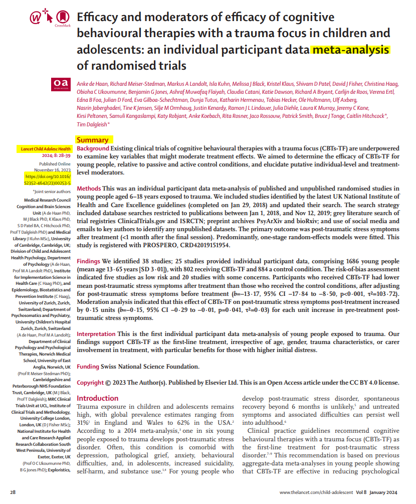
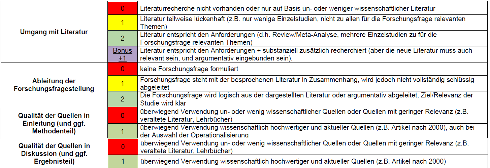
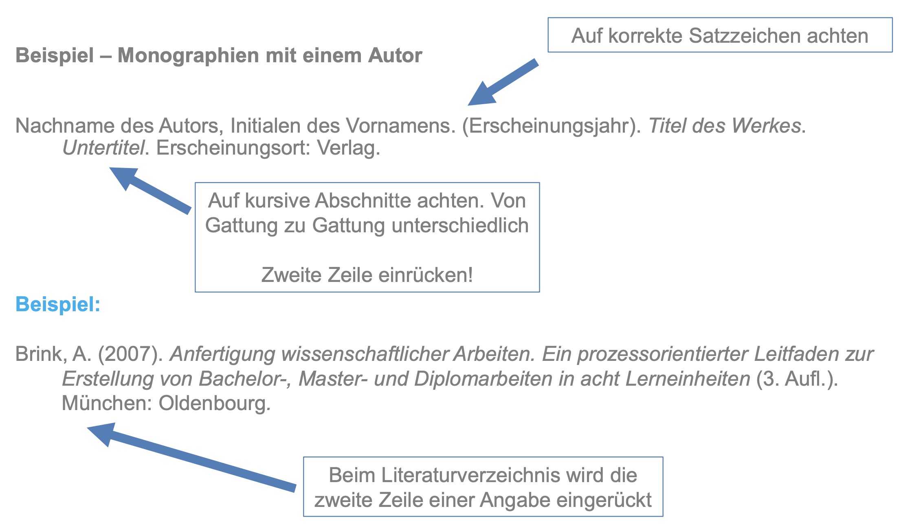
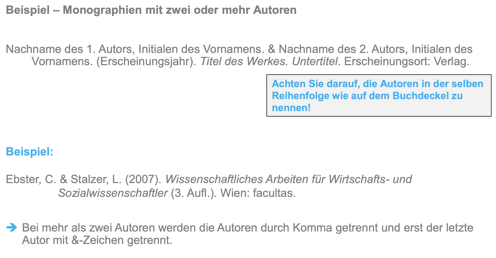
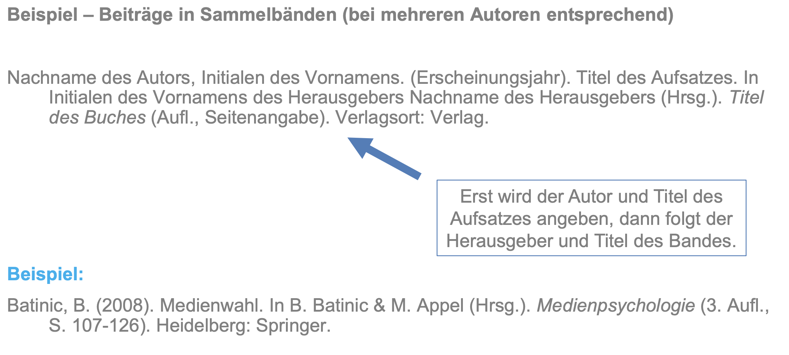

```{r setup, include=FALSE}
options(htmltools.dir.version = FALSE)

library(tidyverse)
library(kableExtra)
library(ggplot2)
library(plotly)
library(htmlwidgets)
library(MASS)
library(ggpubr)
library(xaringanthemer)
library(xaringanExtra)

style_duo_accent(
  primary_color = "#621C37",
  secondary_color = "#EE0071",
  background_image = "blank.png"
)

xaringanExtra::use_xaringan_extra(c("tile_view"))

use_scribble(
  pen_color = "#EE0071",
  pen_size = 4
  )

knitr::opts_chunk$set(
  fig.retina = TRUE,
  warning = FALSE,
  message = FALSE
)
```

name: Title slide
class: middle, left
<br><br><br><br><br><br><br>
# Wissenschaftliches Arbeiten und Forschungsmethoden
***
### Einheit 2: Literaturrecherche, Bewertung von Untersuchungsideen & Referenzen
##### `r format(as.Date(data.frame(readxl::read_excel("WAF_SS24_Termine.xlsx"))$Datum), "%d.%m.%Y")[2]` | Prof. Dr. Stephan Goerigk

---
class: top, left
name: content

### Heutige Themen

.pull-left[
#### [Entwicklung einer Fragestellung](#fragestellung)

#### Literaturrecherche
* [Gründe und erste Schritte](#lit-start)
* [Literaturarten und Umgang mit ihnen](#litarten)
* [Recherchesysteme und -methoden](#systeme)
* [Lesetechniken](#lesen)

#### Bewertung von Untersuchungsideen
* [Wissenschaftliche Kriterien](#wissKrit)
* [Ethische Kriterien](#ethischeKrit)
]

.pull-right[
#### Quellen & Referenzen
* [Funktion und Zitationssysteme](#zit-start)
* [Indrekte vs. direkte Zitate](#zitate)
* [Mehrere Quellen](#mehrere-quellen)
* [Literaturverzeichnis](#lit-verzeichnis)

#### [Take-Aways](#take-away)

#### [Praxis](#praxis)
]


---
class: top, left
### Literaturempfehlung für die heutige Sitzung

.center[
```{r, echo=FALSE,out.width="30%",fig.cap="Kapitel 1.2, 5 und 6 in Döring, N. & Bortz, J. (2016). Forschungsmethoden und Evaluation in den Sozial- und Humanwissenschaften. Pearson.",fig.show='hold',fig.align='center'}
knitr::include_graphics("bilder/doering.png")
``` 
]
---
class: top, left
name: fragestellung
<div class="footer"><span>Kapitel 5.1 in Döring, N. & Bortz, J. (2016). Forschungsmethoden und Evaluation in den Sozial- und Humanwissenschaften. Pearson. </span></div>

### Entwicklung einer Fragestellung

#### Recap von letzter Sitzung

Ihre Aufgabe war folgende Frage zu beantworten: 

*Mit welchem psychologischen Themenbereich möchten wir uns als Kleingruppe in dieser Vorlesung beschäftigen?*

**Und nun?**

.center[
"*Nach der Wahl des Themas ist es zwingend notwendig, das zu untersuchende Forschungsproblem zu formulieren bzw. – im Deutschen ist diese Bezeichnung geläufiger – die* ***zentrale Fragestellung der Studie*** *zuzuspitzen.*

*Dies sollte üblicherweise* ***theorie- und empiriegeleitet*** *geschehen, d. h., auf der Basis vorliegender Theorien und empirischer Befunde.*

*Doch auch erste Methodenentscheidungen tragen zur Transformation eines allgemeinen Forschungsthemas (z.B. "Computerspiele") in ein untersuchbares Forschungsproblem bei.*"

(Döring & Bortz, 2016)
]

---
class: top, left
name: forschungsprozess-prereg

### Entwicklung einer Fragestellung

#### Fragestellung im Forschungsprozess

.pull-left[
**Was gehört zur Studienplanung?**

1. Theoriearbeit und Literaturrecherche `\(\rightarrow\)` heutige und nächste Sitzung

2. Hypothesenformulierung `\(\rightarrow\)` nächste Sitzung

3. Design Plan `\(\rightarrow\)` nächste Sitzung

4. Variablen (Auswahl Messinstrumente und Variablenrollen)  `\(\rightarrow\)` übernächste Sitzung, Einheit 4

5. Statistischer Analyseplan  `\(\rightarrow\)` Einheit 5

6. Sampling plan (Rekrutierungsplan) `\(\rightarrow\)` Einheit 6

`\(\rightarrow\)` Studienplanung in **Präregistrierung** festhalten
]

.pull-right[
```{r eval = TRUE, echo = F, out.width="100%", fig.align='center'}
knitr::include_graphics("bilder/Forschungsprozess_Prereg.png")
```
] 


---
class: top, left
<div class="footer"><span>Kapitel 5.1 in Döring, N. & Bortz, J. (2016). Forschungsmethoden und Evaluation in den Sozial- und Humanwissenschaften. Pearson. </span></div>

### Entwicklung einer Fragestellung

#### Wichtige Aspekte

* **Inhaltliche Eingrenzung des Gegenstands**: Welche Aspekte des Themas sollen untersucht werden (Eingrenzung von Zielgruppen, Zeiträumen, Effekten etc.)?

* **Bezug zum empirischen Forschungsstand**: Blick auf frühere Studien und vorliegende oder fehlende Befunde zu Einzelaspekten $\rightarrow$ empirische Forschungslücke

* **Wahl der Theorie(n)**: Welches sind die zentralen Theorien des eigenen Faches (und ggf. auch von Nachbardisziplinen), die auf das Thema anwendbar sind? $\rightarrow$ Berücksichtigung oder Vernachlässigung bestimmter Teilaspekte des Themas

* **Wahl der Methode(n)**: Mit welchem Untersuchungsdesign und mit welchen Datenerhebungs- und Datenauswertungsmethoden soll das Thema untersucht werden?

**Vorsicht: Forschungsfrage nicht zu allgemein formulieren!**

`\(\rightarrow\)` siehe den Abschnitt "Bewertung von Forschungsfragen" im Materialordner auf studynet

---
class: top, left
<div class="footer"><span>Kapitel 5.1 in Döring, N. & Bortz, J. (2016). Forschungsmethoden und Evaluation in den Sozial- und Humanwissenschaften. Pearson. </span></div>

### Entwicklung einer Fragestellung

#### Beispiel (hier "Forschungsproblem" statt "Fragestellung"):

```{r eval = TRUE, echo = F, fig.align='center'}
knitr::include_graphics("bilder/forschungsfrage.png")
```


---
class: top, left
name: lit-start

### Literaturrecherche

#### Warum Literaturrecherche?

* Suche und Entwicklung eines geeigneten Themas und einer geeigneten Fragestellung (siehe Vorlesung 1)

* Erste Orientierung über aktuellen Forschungsstand

* Theoretische Einbettung der Fragestellung (also: Wie kommt diese Fragestellung zustande, z.B. welche Konstrukte hängen theoretisch wie zusammen? Warum ist sie relevant?)

* **Im Bericht**: Jede Behauptung muss mit einer entsprechenden Quelle belegt werden. 
  * Wichtig: Verschiedene Quellen und damit verschiedene Ansichten einbeziehen. 
  * Grober Richtwerk: Pro Absatz mindestens eine Quelle (je nachdem was Sie schreiben, kann das aber auch zu wenig sein)

* Formulierung konkreter Hypothesen anhand der Recherche (siehe Vorlesung 3)

* **Im Bericht**: Diskussion der Befunde (Stimmen meine Befunde mit der Theorie/ vorherige Befunde überein? Gab es Ergebnisse, mit denen ich nicht gerechnet habe? Warum könnte das so sein?)
 
---
class: top, left
<div class="footer"><span>Kapitel 1.2 und 16 in Döring, N. & Bortz, J. (2016). Forschungsmethoden und Evaluation in den Sozial- und Humanwissenschaften. Pearson. </span></div>

### Literaturrecherche

#### Informationssuche planen

**Wie/wo fange ich an?**

* Literaturhinweise des Dozenten/ des Betreuers

* Fachbücher und Paper/ Artikel/ Aufsätze (z.B. Review, Meta-Analysen), die viele Informationen bzw. Ergebnisse zu Ihrem Thema zusammenfassen (Stand der Forschung erarbeiten)

* **Review**: fasst den aktuellen Forschungsstand in einem Gebiet zusammen, indem die einschlägige Literatur recherchiert, strukturiert vorstellt und bewertet wird

* **Meta-Analyse**: aggregiert Ergebnisse mehrerer früherer quantitativer Studien statistisch zu einem Gesamteffekt

---
class: top, left
name: lit-arten

### Literaturrecherche

#### Literaturarten und Umgang mit ihnen 

**Warum muss ich Literaturarten unterscheiden können?**

* Bestimmte Literaturarten finden man an bestimmten Stellen

* Nicht jede Art von Literatur ist es „würdig“ in Ihrer Arbeit aufgenommen
zu werden

* Zudem wird manche Literaturgattung „lieber“ in Arbeiten gesehen als andere

**Gestaltungsmerkmale von wissenschaftlichen Texten**
* **Nachvollziehbarkeit:** die Vorgangsweise ist detailliert dokumentiert (Wiederholbarkeit, damit eine Überprüfung möglich ist)
* **Argumentation:** Es wird auf der Grundlage von Fakten/empirischen Daten argumentiert
* **Quellenangaben:** Für Theorien und Fakten sind deren (wissenschaftliche) Quellen aim Text und Literaturverzeichnis angegeben
* **Sprache:** Verwendung von Fachbegriffen, wissenschaftssprachliche Formulierung und „unpersönlicher“ Schreibstil

---
class: top, left
<div class="footer"><span>Kapitel 1.2 in Döring, N. & Bortz, J. (2016). Forschungsmethoden und Evaluation in den Sozial- und Humanwissenschaften. Pearson. </span></div>

### Literaturrecherche

#### Literaturarten und Umgang mit ihnen 

<small>

**Zitierwürdigkeit (aus wissenschaftlicher Sicht, d.h. zum Belegen von Aussagen; bitte beachten Sie unbedingt auch das Alter der Quellen!)**

.pull-left[
**Zitierwürdig:**
* **Primärliteratur**: begutachtete (*peer-reviewed*) Artikel in Fachzeitschriften (Journals; gedruckt oder digital)
* **Wissenschaftliche Fachbücher** (aber nicht ausschließlich)
  - Monographien: Ein Autor
  - Herausgeberwerker: Mehrere Autoren
  - Fachlexika
  
**Bedingt zitierwürdig (vereinzelt in Ordnung):** graue Literatur (Dissertationen, Abschlussarbeiten, Firmenschriften) und  Internetseiten (sparsam dosieren!)
  
]

.pull-right[

**Nicht zitierwürdig:**
  * Praktikerbücher
  * Allgemeine Lexika (Brockhaus)
  * Vorlesungsskripte (weder CFH, noch andere Unis), Schulbücher, PowerPoint-Präsentationen
  * Artikel in Boulevardzeitungen / nicht peer-reviewte Zeitschriften (auch falls zu wissenschaftlichen Themen, z.B. Psychologie Heute)
  * „Abendblatt“ o.ä. (nur in Ausnahmefällen, z.B. mal um die gesellschaftliche Relevanz eines Themas aufzuzeigen)
  * Wiki-Quellen (für einen Überblick völlig in Ordnung, aber bitte Primärquellen nachgehen)
]


---
class: top, left

.pull-left[
### Literaturrecherche

#### Literaturarten und Umgang mit ihnen 


**Woran erkenne ich einen wissenschaftlichen Artikel / eine Meta-Analyse / ein Review?**

* In einer Fachzeitschrift ("Journal") publiziert (ob die Zeitschrift peer-reviewed ist muss eigentlich separat geprüft werden)

* Fast immer: Summary / Zusammenfassung / Abstract

* In der Psychologie: Struktur folgt Einleitung, Methode, Ergebnisse, Diskussion

* Oft: doi (digital object identifier)

* Meta-Analysen und Reviews kennzeichnen dies fast immer im Titel

* Literaturverzeichnis
]

.pull-right[
```{r eval = TRUE, echo = F, fig.align='center'}

```
]


---
class: top, left
name: systeme

### Literaturrecherche

#### Recherchesysteme

<small>

Wissenschaftliche Suchmaschinen:
* sind speziell für den Bedarf in der Wissenschaft gedacht
* finden speziell Dokumente...
  * ...die wissenschaftlich aufgebaut sind
  * ...die bibliographische Angaben enthalten
  
.pull-left[
**Vorteile:**
* Suche nach brauchbaren Dokumenten für die Fachkommunikation wird vereinfacht
* Suche wird schneller und einfacher und relevante Dokumente werden mit größerer
Wahrscheinlichkeit aufgefunden
]

.pull-right[
**Nachteile:**
* Wissenschaftlichkeit wird nur an formalen Dokumenten und Erscheinungsort festgemacht, keine intellektuelle Überprüfung und manche wiss. Literatur wird nicht als solche erkannt 
* Aktualität und Vollständigkeit nicht gegeben, wie bei anderen Recherchesystemen
]

Nutzen Sie Fachdatenbanken/wissenschaftliche Suchmaschinen zum Auffinden von geeigneten Artikeln/ Aufsätze! (siehe [nützliche Links](#links))

---
class: top, left
### Literaturrecherche

#### Recherchesysteme

**Google Scholar**: https://scholar.google.de/

.center[
```{r, echo=FALSE,fig.show='hold',fig.align='center', out.width = "360px"}
knitr::include_graphics("bilder/scholar.png")
``` 
]

[**Sci-Hub**](https://sci-hub.hkvisa.net/): https://de.wikipedia.org/wiki/Sci-Hub

[**Anna's Archive**](https://annas-archive.org): https://annas-archive.org

Sie müssen für die Literaturrecherche kein Geld ausgeben!


---
class: top, left
### Literaturrecherche

#### Bewertungsschema

.center[
```{r eval = TRUE, echo = F}

```

]


---
class: top, left
### Literaturrecherche

#### Präregistrierung

.center[
```{r eval = TRUE, echo = F, out.width = "60%"}
knitr::include_graphics("bilder/prereg_template_forschungsfrage.png")
```
]


---
class: top, left
name: wissKrit
<div class="footer"><span>Kapitel 2.2 in Bortz, J. & Döring, N. (2006). Forschungsmethoden und Evaluation in den Sozial- und Humanwissenschaften (4.Auflage). Pearson. </span></div>

### Bewertung von Untersuchungsideen

#### Wissenschaftliche Kriterien

##### Präzision der Problemformulierung

**Wann sind vorläufige Untersuchungsideen unbrauchbar:**

* Forschungsgegenstand **zu allgemein** (z.B. nur Nennung eines Begriffs, wie "Motivation")

* Forschungsgegenstand **zu vielschichtig** (diverse Fragestellungen nicht trennbare Fragestellungen ableitbar)

* unklare, mehrdeutige oder schlecht definierte **Begriffe/Konstrukte**

**Kriterien:**

* Begrifflichen Klarheit: Kommunikationsfähigkeit (muss genau an Dritte vermittelt werden können)

* Präzision der Ideenformulierung (Prüfbare Hypothesen, Operationalisierbare Konstrukte, Eingrenzbare Kollektive)

---
class: top, left
<div class="footer"><span>Kapitel 2.2 in Bortz, J. & Döring, N. (2006). Forschungsmethoden und Evaluation in den Sozial- und Humanwissenschaften (4.Auflage). Pearson. </span></div>

### Bewertung von Untersuchungsideen

#### Wissenschaftliche Kriterien

##### Empirische Untersuchbarkeit

**Wann sind vorläufige Untersuchungsideen unbrauchbar:**

* Untersuchungsideen mit religiösen, metaphysischen oder philosophischen Inhalten (zumindest ohne angemessenen qualitativen Forschungsplan)

* Themen, die sich mit unklaren Begriffen befassen (z. B. Seele, Gemüt, Charakterstärke)

* Unangemessener Arbeitsaufwand (es sei denn explizit geplant oder Zugang organisiert)

  * z.B. Untersuchung seltener Personen (z.B. Williams-Beuren-Syndrom, Prävalenz 1:20.000)
  * z.B. Untersuchung seltener Situationen (z.B. Massenveranstaltungen)
  * z.B. sehr zeitaufwendige Untersuchungen (mehrlährige Längsschnittstudien)

---
class: top, left
<div class="footer"><span>Kapitel 2.2 in Bortz, J. & Döring, N. (2006). Forschungsmethoden und Evaluation in den Sozial- und Humanwissenschaften (4.Auflage). Pearson. </span></div>

### Bewertung von Untersuchungsideen

#### Wissenschaftliche Kriterien

##### Wissenschaftliche Tragweite

**Wann sind vorläufige Untersuchungsideen unbrauchbar:**

* Untersuchung hat weder praktische Bedeutung noch Wert für die Grundlagenforschung

* Verantwortung der Hochschulangehörigen ab, sich mit Themen zu beschäftigen, deren Nutzen zumindest prinzipiell erkennbar ist (Steuerfinazierung)

* "überforschte" Themen - reine Bestätigung sicherer Befunde (Reaktionszeiten verändern sich unter Alkohol)

**WICHTIG:** Umfassende Informationseinholung

---
class: top, left
name: ethKrit
<div class="footer"><span>Kapitel 2.2 in Bortz, J. & Döring, N. (2006). Forschungsmethoden und Evaluation in den Sozial- und Humanwissenschaften (4.Auflage). Pearson. </span></div>

### Bewertung von Untersuchungsideen

#### Ethische Kriterien

<small>

* ethische Sensibilität voraussetzen

* Potentiell abzuwegende Untersuchungsgegenstände (Auswahl)
  * Gewalt
  * Aggressivität
  * Liebe
  * Leistungsstreben
  * psychische Störungen
  * ästhetische Präferenzen
  * Schmerztoleranz 
  * Angst 

* Schutz durch das Grundgesetz (Würde des Menschen ist unantastbar)

* Berufsethische Verpflichtungen: *Ethische Richtlinien* herausgegeben durch Deutsche Gesellschaft für Psychologie (DGPs) und den Berufsverband Deutscher Psychologinnen und Psychologen (BDP)

---
class: top, left
<div class="footer"><span>Kapitel 2.2 in Bortz, J. & Döring, N. (2006). Forschungsmethoden und Evaluation in den Sozial- und Humanwissenschaften (4.Auflage). Pearson. </span></div>

### Bewertung von Untersuchungsideen

#### Ethische Kriterien

##### Güterabwägung: Wissenschaftlicher Fortschritt oder Menschenwürde

* Generelle ethische Kriterien: Menschenwürde, Schadensfreiheit, Datenschutz, Freiwilligkeit, Informationspflicht

* Humanwissenschaftliche Forschung benötigt Daten, deren Sammlung teils schwer mit  Menschenwürde vereinbar ist. 

* Wenn nicht vermeidbar $\rightarrow$  muss anderen Personen (z.B. Patienten) zugute kommen

* Prospektive Einschätzung auch für Profis schwer 

* Eigene Abwägung und Verantwortung + Einschätzung/Bewilligung von Ethikkommissionen

---
class: top, left
name: praxis

### Praxis: Idee entwickeln & Literaturrecherche

**Schritt 1: Führen Sie eine kurze Literaturrecherche durch.** 
* Gibt es Reviews oder Meta-Analysen zu Ihren Untersuchungsideen? Gibt es aktuelle empirische Studien (d.h. von 2020 oder neuer), die dazu passen?
  * Lesen Sie die Abstracts.
  * Schreiben Sie sich interessante Methoden und Ergebnisse raus.

* Strukturieren/Kommentieren Sie die gefundene Literatur, z.B. in einem Literaturverwaltungsprogramm

* **Leitfragen bei der Literaturrecherche:**
  * Welche Antworten gibt es zu diesem Thema bereits?
  * Welche Fragen sind noch ungeklärt? Und wie kann ich Antworten auf diese Fragen finden?

---
class: top, left

### Praxis: Idee entwickeln & Literaturrecherche

**Schritt 2: Einigen Sie sich auf ein Thema und geben Sie Ihrer Gruppe einen Namen**
  * Bewerten Sie dafür Ihre Ideen hinsichtlich der gefundenen Literatur und nach den Anforderungen aus Einheit 1 und einigen Sie sich auf ein Thema.
  * Idealerweise hat Ihr Gruppenname etwas mit Ihrem Thema zu tun
  * Teilen Sie mir Ihren Gruppennamen und Ihr Thema **bis spätestens (!) 26.04.** über die [Umfrage im studynet](https://studynet.hs-fresenius.de/ilias.php?baseClass=ilobjsurveygui&cmd=infoScreen&ref_id=26551) mit (eine Umfrage pro Gruppenmitglied).
  
**Schritt 3 (kann auch parallel mit Schritt 2 passieren): Strukturieren Sie Ihre Themenidee zu einer Forschungsfrage (kann auch eine Replikation sein).** 
  * Bewerten Sie  Ihre Forschungsfrage nach wissenschaftlichen und ethischen Kriterien (siehe "Bewertung von Forschungsfragen" im [Zusatzmaterial Z2 auf studynet](https://studynet.hs-fresenius.de/ilias.php?baseClass=ilrepositorygui&cmd=sendfile&ref_id=27540)).
  * Beginnen Sie damit, das [Präregistrierungstemplate auf studynet](https://studynet.hs-fresenius.de/goto_STUDYNETHSF_file_27541_download.html) (Abschnitt I1 und I2) mit den Inhalten zu füllen, die zu der Auswahl ihrer Forschungsfrage geführt haben.
  * Mittelfristig: Intensivieren Sie die Literaturrecherche, um die Forschungsfrage zu schärfen (vgl. auch nächste Sitzung)
  
---
class: top, left
name: zit-start

### Quellen & Referenzen

#### Zitieren

**Was ist Zitieren?**

* Sinngemäße oder wörtliche Wiedergabe von sachlicher Information oder Meinung eines anderen.

**Ziele und Funktionen vom Zitieren**
* Beweisfunktion (wissenschaftliche Belegung Ihrer Behauptungen)
* Abgrenzung von eigenen Gedankengängen, Überlegungen und Annahmen
* Gibt Ihren Aussagen mehr Gewicht
* Sicherung geistigen Eigentums

**Ziele und Funktionen von Quellenangaben**
* Eindeutige Identifikation der zitierten Werke gewährt Auffindbarkeit
* Lückenlose Auflistung aller verwendeten Quellen
* 1:1 Verhältnis zwischen zitierten Quellen und Literaturverzeichnis!

---
class: top, left

### Quellen & Referenzen

#### Plagiat

**Was ist ein Plagiat?**
* die bewusste Aneignung fremden Geistesgutes ohne dies kenntlich zu machen

**Arten von Plagiaten**

* Übernehmen von Informationen ohne Nennung der Quelle
* Ein direktes Zitat wird (leicht verändert) als indirektes ausgegeben
* Verschleierungstaktiken (z.B. Paraphrasieren ohne Quellenangabe)
* Übersetzung fremdsprachlicher Arbeiten, die als eigene ausgegeben werden

Wichtig!
Zitate (direkte und indirekte), die in einer Arbeit nicht oder falsch gekennzeichnet werden, gelten als Plagiat! Die Arbeit wird als „nicht bestanden“ (5,0) gewertet!

---
class: top, left

### Quellen & Referenzen

#### Zitationssysteme

In unserem Studium ist die in der Psychologie übliche Zitierweise der Deutschen Gesellschaft für Psychologie (DGPs) und der American Psychological Association (APA) verpflichtend:


.center[
```{r eval = TRUE, echo = F, out.width="20%"}
knitr::include_graphics("bilder/apa7.jpg")
```
]

[**Link zum vollständigen APA-Style guide**](https://apastyle.apa.org)

[**Link zum kostenfreien Nachlesen vom APA-Style guide der Purdue University**](https://owl.purdue.edu/owl/research_and_citation/apa_style/apa_formatting_and_style_guide/in_text_citations_author_authors.html)


---
class: top, left
name: lit-verzeichnis

### Quellen & Referenzen

#### Literaturverzeichnis

Das Literaturverzeichnis....
* Folgt in der Regel unmittelbar auf den Textteil einer Arbeit

* Alle im Fließtext verwendeten Quellen müssen hier lückenlos dokumentiert werden (und auch nur diese!)

* Reihenfolge: Alphabetisch nach Nachname des (Erst-) Autors, dann nach Jahreszahl (frühere Artikel desselben Autors vor späteren Artikeln, aber "nothing precedes something", d.h. Artikel mit weniger Co-Autoren vor Artikeln mit mehr Co-Autoren)

* Arten von Quellen werden im Literaturverzeichnis *nicht* anhand unterschiedlicher Abschnitte differenziert (also nicht alle Journalartikel aufführen, dann alle Internetquellen, dann alle Fachbücher)

* Akademische Grade und berufliche Titel der Autoren werden nicht angegeben

* Angabe der Auflage: Erst ab 2. Auflage in runden Klammern hinter dem Titel (nicht kursiv)

* "hängend" formatieren (Einrückung in der zweiten Zeile)


---
class: top, left
### Quellen & Referenzen

#### Literaturverzeichnis

.center[
```{r eval = TRUE, echo = F, out.width = "800px"}

```
]

---
class: top, left
### Quellen & Referenzen

#### Literaturverzeichnis

.center[
```{r eval = TRUE, echo = F, out.width = "900px"}

```
]

---
class: top, left
### Quellen & Referenzen

#### Literaturverzeichnis

.center[
```{r eval = TRUE, echo = F, out.width = "900px"}

```
]

---
class: top, left
### Quellen & Referenzen

#### Literaturverzeichnis

.center[
```{r eval = TRUE, echo = F, out.width = "800px"}
knitr::include_graphics("bilder/lit4.png")
```
]

---
class: top, left
### Quellen & Referenzen

#### Bewertungsschema

.center[
```{r eval = TRUE, echo = F}
knitr::include_graphics("bilder/bewertung_zitate.png")
```
]

`\(\rightarrow\)` wird 2x bewertet: bei Gruppenarbeit und bei Einzelleistung!

`\(\rightarrow\)` letztes Jahr nur sehr wenige Gruppen mit voller Punktzahl -- das ist schade, denn das sind klassische "Fleißpunkte", wo man nur nachschauen muss, wie es geht

`\(\rightarrow\)` daher unbedingt den Abschnitt "Quellen & Referenzen" im Zusatzmaterial  auf studynet anschauen!!

---
class: top, left
name: take-away

### Take-Aways

.full-width[.content-box-gray[

* Die Entwicklung einer Forschungsfrage ist ein wichtiger Schritt im Forschungsprozess

* wissenschaftlich relevante Literatur ist in der Regel *peer-reviewed*

* Gute Untersuchungsideen müssen **präzise** Problemformulierungen vorweisen

* Gute Untersuchungsideen müssen **empirisch untersuchbar** sein

* Gute Untersuchungsideen müssen **wissenschaftliche Tragweite** haben

* **Ethische Kriterien** (Menschenwürde, Schadensfreiheit, Datenschutz, Freiwilligkeit, Informationspflicht) müssen bei Forschungsideen mitgedacht werden.

* Konsequentes Zitieren ist essentiell und folgt bestimmten Formatierungsregeln

* Alle im Haupttext genannten Quellen müssen im Literaturverzeichnis vorkommen

]
]


