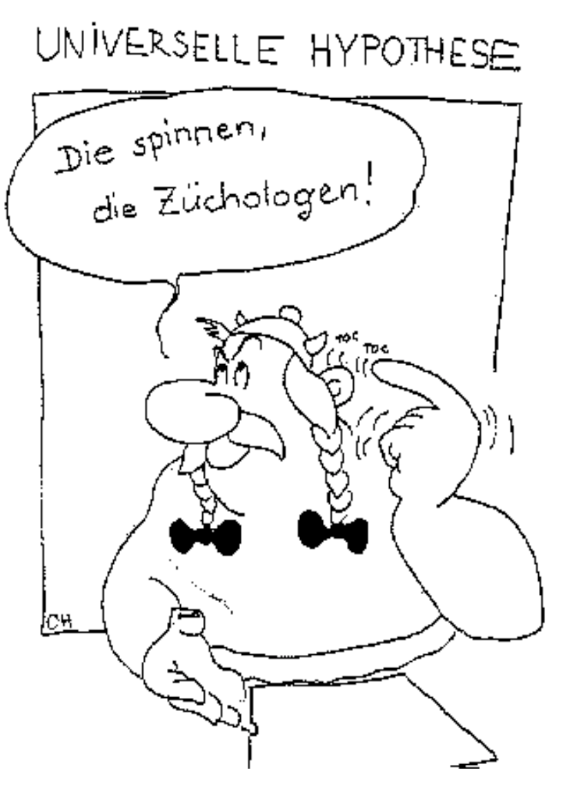
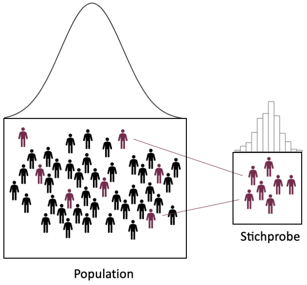
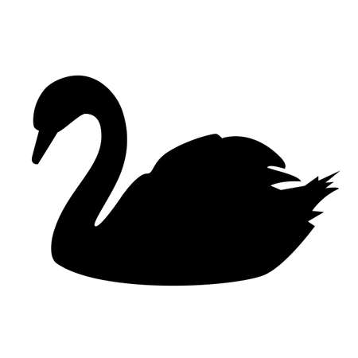
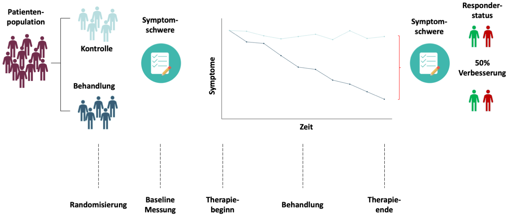
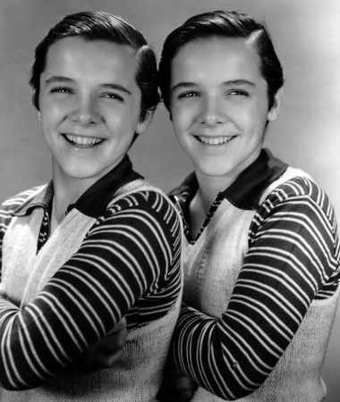
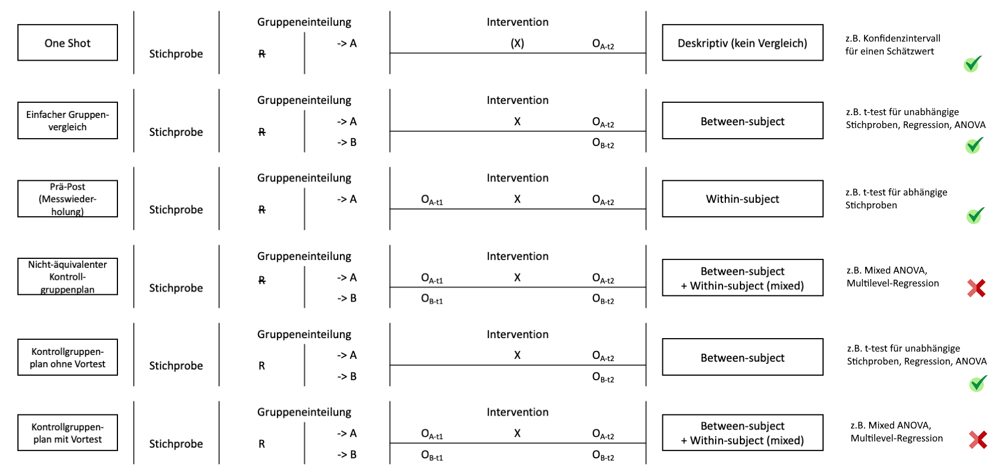

```{r setup, include=FALSE}
options(htmltools.dir.version = FALSE)

library(tidyverse)
library(kableExtra)
library(ggplot2)
library(plotly)
library(htmlwidgets)
library(MASS)
library(ggpubr)
library(xaringanthemer)
library(xaringanExtra)

style_duo_accent(
  primary_color = "#621C37",
  secondary_color = "#EE0071",
  background_image = "blank.png"
)

xaringanExtra::use_xaringan_extra(c("tile_view"))

use_scribble(
  pen_color = "#EE0071",
  pen_size = 4
  )

knitr::opts_chunk$set(
  fig.retina = TRUE,
  warning = FALSE,
  message = FALSE
)
```

name: Title slide
class: middle, left
<br><br><br><br><br><br><br>
# Wissenschaftliches Arbeiten und Forschungsmethoden
***
### Einheit 3: Theoriearbeit & Studiendesign
##### `r format(as.Date(data.frame(readxl::read_excel("WAF_SS24_Termine.xlsx"))$Datum), "%d.%m.%Y")[3]` | Prof. Dr. Stephan Goerigk


---
class: top, left
name: content

### Heutige Themen

#### [Planung von Studien](#planung)

#### [Alltagsvermutungen und wissenschaftliche Hypothesen](#hypothesen)

#### [Forschungsstrategien](#strategien)

#### [Design Plan (Versuchsplan / Studiendesign)](#studiendesign)

#### [Praxis](#praxis)

---
class: top, left
### Literaturempfehlung für die heutige Sitzung

.center[
```{r, echo=FALSE,out.width="30%",fig.cap="Kapitel 6 und 7 in Döring, N. & Bortz, J. (2016). Forschungsmethoden und Evaluation in den Sozial- und Humanwissenschaften. Pearson.",fig.show='hold',fig.align='center'}
knitr::include_graphics("bilder/doering.png")
``` 
]

---
class: top, left
name: planung

### Planung von Studien

####  Was gehört zur Studienplanung?

1. Theoriearbeit und Literaturrecherche $\rightarrow$ letzte und heutige Sitzung

2. Hypothesenformulierung $\rightarrow$ heutige Sitzung

3. Design Plan $\rightarrow$ heutige Sitzung

4. Statistischer Analyseplan  $\rightarrow$ nächste Sitzung

5. Sampling Plan (Rekrutierungsplanung) $\rightarrow$ nächste Sitzung

6. Variablen (Auswahl Messinstrumente und Variablenrollen)  $\rightarrow$ übernächste Sitzung

$\rightarrow$ Studienplanung in **Präregistrierung** festhalten

---
class: top, left
<div class="footer"><span>https://www.lornecampbell.org/?p=179</span></div>

### "Open Notebook Science"

.pull-left[
.center[
"*...the concept of open notebook also includes sharing the laboratory notebook, something that often contains communications between collaborators, as well as “dear diary” types of entries, that shed light on the decision making process throughout the research process.*" (Lorne Campbell)
]

**Dokumentieren Sie an einem zentralen Ort** (kann z.B. ein gemeinsames GoogleDoc sein), **welche Ideen Sie verworfen haben und warum, und welche Entscheidungen Sie aus welchem Grund getroffen haben** (müssen Sie nicht mit der Prüfungsleistung angeben, können Sie aber in Ihrer Präregistrierung verlinken, *wenn Sie möchten*; primär soll es Ihnen dienen!)
]

.pull-right[
```{r eval = TRUE, echo = F}
knitr::include_graphics("bilder/opennotebook.jpg")
```
]

---
class: top, left
### Planung von Studien

####  Theoriearbeit und Literaturrecherche

* Überblick verschaffen über derzeitigen Wissensstand im Feld

* Informationen über klinische/gesellschaftliche Relevanz der Fragestellung

* Relevante Theorien und Modelle recherchieren

* Kernaspekte eigener Fragestellung theoretisch unterfüttern (Warum liegt die Fragestellung nahe?)

Digitale Literaturrecherche:
  * Google Scholar
  * Datenbankrecherche: https://dbis.ur.de/dbinfo/dbliste.php?bib_id=eff&colors=7&ocolors=40&lett=f&gebiete=22
  * ...

---
class: top, left
### Planung von Studien

#### Hypothesenformulierung

* Führen Sie **spezifische, prägnante und überprüfbare** Hypothesen auf

* Benutzen Sie möglichst **eindeutige Begriffe** (aus der Literatur) für in der Hypothese vorkommende/relevante Variablen

* Überlegen Sie, ob es sich um **gerichtete oder ungerichtete** Hypothesen handelt und formulieren Sie Ihre Hypothesen entsprechend 

* Hypothesen können in **Primär- und Sekundärhypothesen** unterteilt werden (z.B. Primärhypothese: "Je mehr Bestätigung ein Kind von seinen Eltern erfährt, desto höher ist der spätere Selbstwert.", Sekundärhypothese: "Dieser Zusammenhang ist besonders stark für Einzelkinder im Vergleich zu Kindern mit einem oder mehr Geschwistern.")

* Konfirmatorische Hypothesen sind von explorativen Fragestellungen zu trennen (d.h. davon, was man sich sonst noch so anschauen möchte, ohne konkrete Annahme oder Spezifikation der konkreten Analyse)

* Achten Sie bereits in Ihren Hypothesen darauf kausale Sprache zu vermeiden ("X beeinflusst Y"), wenn Sie kein Studiendesign planen, welches kausale Schlüsse zulässt (stattdessen z.B. "X hängt zusammen mit Y" oder "Je mehr X, desto mehr Y")
---
class: top, left
name: hypothesen

### Alltagsvermutungen und wissenschaftliche Hypothesen

#### Was sind Hypothesen?

Hypothese (griech.) = Unterstellung, Vermutung

Eine Vermutung/Annahme ist dann als wissenschaftliche Hypothese zu verstehen wenn sie folgende 4 Kriterien erfüllt:

Wenn sie...
1. ...sich auf reale Sachverhalte bezieht, die empirisch untersuchbar sind (**Empirie**)

2. ...allgemein gültig ist und über den Einzelfall bzw. ein singuläres Ereignis hinausgeht (**All-Satz**)

3. ...zumindest implizit die Form eines Konditionalsatzes hat (**wenn-dann, je-desto**)

4. ...durch Erfahrungen potenziell widerlegbar ist (**Falsifizierbarkeit**)

5. ...(theoretisch begründbar ist)

---
class: top, left
### Alltagsvermutungen und wissenschaftliche Hypothesen

.pull-left[
#### Beispiele für Hypothesen:

* Frauen sind kreativer als Männer

* Mit zunehmender Müdigkeit sinkt die Konzentrationsfähigkeit

* Je schöner das Wetter, desto besser die Stimmung

* Jungen und Mädchen lesen unterschiedlich viel in ihrer Freizeit

Behauptungen erfüllen alle genannten Kriterien: sind daher Hypothesen
]

.pull-right[
```{r eval = TRUE, echo = F, out.width = "300px"}

```
]

---
class: top, left
### Alltagsvermutungen und wissenschaftliche Hypothesen

#### Hypothesen: JA oder NEIN?

* Bei starkem Zigarettenkonsum kann es zu Herzinfarkt kommen

* Wenn es regnet, kann die Sonne scheinen.

* Es gibt Kinder, die niemals weinen.

* SchülerInnen aus Gymnasien zeigen gute Leistungen

---
class: top, left
### Alltagsvermutungen und wissenschaftliche Hypothesen

#### Hypothesen: JA oder NEIN?

* Bei starkem Zigarettenkonsum kann es zu Herzinfarkt kommen.

$\rightarrow$ Kann-Sätze sind nicht falsifizierbar

* Wenn es regnet, kann die Sonne scheinen.

$\rightarrow$ Kann-Sätze sind nicht falsifizierbar

* Es gibt Kinder, die niemals weinen.

$\rightarrow$ kein All-Satz, nicht falsifizierbar (man müsste dafür bei allen Kindern zeigen, dass sie irgendwann mal weinen)

* SchülerInnen aus Gymnasien zeigen gute Leistungen.

$\rightarrow$ Wenn-dann Struktur nicht gegeben (z.B. im Vergleich zu wem? Oder Unter welchen Bedingungen?), daher nicht falsifizierbar (aber trotzdem schätzbar, d.h. anderes Ziel als Hypothesentesten möglich: Wie viele SchülerInnen aus Gymnasien zeigen gute Leistungen?)

---
class: top, left
### Alltagsvermutungen und wissenschaftliche Hypothesen

#### Hypothesen: JA oder NEIN?

* Die Konzentrationsfähigkeit hängt mit der Blutalkoholkonzentration zusammen.

* Positive Verstärkung durch Lehrer/innen kann zu guten Leistungen bei Schüler/innen führen.

* Positives Feedback beeinflusst die Arbeitsleistung.

* Viele Studierende mögen Methodenlehrveranstaltungen.

---
class: top, left
### Alltagsvermutungen und wissenschaftliche Hypothesen

#### Hypothesen: JA oder NEIN?

* Die Konzentrationsfähigkeit hängt mit der Blutalkoholkonzentration zusammen.

$\rightarrow$ JA

* Positive Verstärkung durch Lehrer/innen kann zu guten Leistungen bei Schüler/innen führen.

$\rightarrow$ NEIN

* Positives Feedback beeinflusst die Arbeitsleistung.

$\rightarrow$ JA

* Viele Studierende mögen Methodenlehrveranstaltungen.

$\rightarrow$ NEIN (aber trotzdem schätzbar, d.h. anderes Ziel als Hypothesentesten möglich)

---
class: top, left
### Alltagsvermutungen und wissenschaftliche Hypothesen

#### Richtung von Hypothesen

Je nach Erkenntnisstand kann eine ungerichtete oder eine gerichtete Hypothese formuliert werden.

**ungerichtete Hypothese:**

Die Konzentrationsfähigkeit hängt mit der Blutalkoholkonzentration zusammen.

$\rightarrow$ Eher wenig theoretisches Vorwissen.

**gerichtete Hypothese:**

Je höher die Blutalkoholkonzentration, desto niedriger die Konzentrationsfähigkeit.

$\rightarrow$ Mehr theoretisches Vorwissen notwendig.

---
class: top, left
### Alltagsvermutungen und wissenschaftliche Hypothesen

.pull-left[
#### Verifikation und Falsifikation

##### Verifikation

<small>

* Wissenschaftliche Hypothesen in der Psychologie können nicht vollständig geprüft (**verifiziert**) werden.

* Es ist in der Regel nicht möglich alle Fälle (**Population**) zu untersuchen, schon gar nicht für alle Zeiten.

**Workaround:**

* Untersuchungen erfolgen anhand **repräsentativer Stichprobe**, von der auf Population geschlossen wird.


$\rightarrow$ Wissenschaftliche Hypothesen sind **Wahrscheinlichkeitsaussagen**!
]

.pull-right[
```{r eval = TRUE, echo = F, out.width = "500px"}

```
]
---
class: top, left
### Alltagsvermutungen und wissenschaftliche Hypothesen

#### Verifikation und Falsifikation

##### Falsifikation

* Wissenschaftliche Hypothesen als Wahrscheinlichkeitsaussagen können durch Einzelfälle/Gegenbeispiele, die der Hypothese widersprechen, nicht widerlegt (**falsifiziert**) werden.

* Der auf dem Falsifikationsprinzip basierende Erkenntnisfortschritt besteht dann in der Eliminierung falscher bzw. schlecht bewährter Hypothesen (Theorien) durch statistische Analysen.

* Nicht falsifizierte Hypothesen (Theorien) sind nicht wahr, sondern gelten nur als vorläufig angenommen.

* Konträre Einzelfälle sind explizit zugelassen

.center[
```{r eval = TRUE, echo = F, out.width = "200px"}

```
]
---
class: top, left
### Alltagsvermutungen und wissenschaftliche Hypothesen

#### Theorien und Hypothesen

<br><br>

.center[
.content-box-gray[**Satzsysteme:** Theorien, Modelle, Gesetze]

$\downarrow$ $\uparrow$

.content-box-gray[**Einzelsätze:** Hypothesen = prüfbare Behauptungen über empirisch beobachtbare Sachverhalte]

$\downarrow$ $\uparrow$

.content-box-gray[**Realität:** Bereich der empirisch beobachtbaren Phänomene]
]

<br><br>
Grundkonzeption empirischer Wissenschaften: Empirische Prüfbarkeit ihrer Sätze (Dörner & Selg, 1984)

---
class: top, left
### Alltagsvermutungen und wissenschaftliche Hypothesen

#### Bewertungsschema und Präregistrierung

.center[
```{r eval = TRUE, echo = F, out.width = "80%"}
knitr::include_graphics("bilder/bewertung_hypothesen.png")
```

```{r eval = TRUE, echo = F, out.width = "80%"}
knitr::include_graphics("bilder/bewertung_trennunghypothesen.png")
```
]

---
class: top, left
### Alltagsvermutungen und wissenschaftliche Hypothesen

#### Bewertungsschema und Präregistrierung

.center[
```{r eval = TRUE, echo = F, out.width = "60%"}
knitr::include_graphics("bilder/prereg_template_hypothesen.png")
```
]
---
class: top, left
name: forschungsstrategien

### Forschungsstrategien

#### Forschungsstrategien: Wie untersucht man eine Hypothese?

* Qualitative vs. quantitative Herangehensweise

* Laborstudie vs. Feldstudie

* Experimenteller vs. Assoziativer Ansatz 

* Quasi-experimenteller Ansatz

* Längsschnittlicher vs. Querschnittlicher Ansatz

* Korrelativer Ansatz

* Sekundär- und Metaanalysen

$\rightarrow$ **Für unser Praxisprojekt kommen rein qualitative Studien und Sekundär- und Metaanalysen nicht in Frage**

---
class: top, left
### Forschungsstrategien

#### Qualitative vs. quantitative Herangehensweise

.pull-left[
**Quantitativ:**

* **Vorrangiges Ziel:** soziale Phänomene messbar machen und statistisch auswerten
* **Voraussetzungen:** Vorliegen von Hypothesen und Theorien, die statistisch/mathematisch überprüft werden können
* **Methode:** eher standardisiert
* **Typische Fragestellungen: **
  * A mehr als B?
  * Wenn viel X, dann viel/wenig Y?
* **Typische Verfahren der Datenerhebung: **
  * standardisierter Fragebogen 
  * Experiment
]
.pull-right[
**Qualitativ:**

* **Vorrangiges Ziel:**  soziale Phänomene rekonstruieren; Hypothesen und Theorien generieren
* **Voraussetzungen:** offener, explorativer Zugriff auf das soziale Phänomen
* **Methode:** keine Standardisierung
* **Typische Fragestellungen: **
  * Welche Einstellungen liegen bei ... vor? 
  * Gibt es Gemeinsamkeiten zwischen..  
  * Was heißt es, ... zu sein?
* **Typische Verfahren der Datenerhebung: **
  * narratives Interview
  * Gruppendiskussion
  * Beobachtung
]

---
class: top, left
### Forschungsstrategien

#### Labor vs. Feld (Untersuchungs-Setting)

.pull-left[
**Laborstudie:**

* **Künstliche Situation**

* Bedingungen/Störvariablen gut kontrollierbar

* Bedingungen können gut variiert, repliziert und manipuliert werden.

* gezielten Variation einer einzigen Variable (UV)

* Unterschiede in AV auf diese Veränderungen zurückführbar

**Beispiel:** Lernprozesse am Computer mit Eye-Tracker untersuchen
]
.pull-right[
**Feldstudie:**

* Datenerhebung im **natürlichen Kontext** 

* Bedingungen/ Störvariablen kaum kontrollierbar

* Weniger systematische Variation möglich 

* **externe Validität:** mehr Nähe zum Verhalten in Alltagssituationen

**Beispiel:** Spielverhalten von Kindern am Spielplatz beobachten

]

---
class: top, left
### Forschungsstrategien

<small>
#### Experimenteller vs. Assoziativer Ansatz

* Größter Forschungserfolg: **Kausale Zusammenhänge** identifizieren

* empirischer Zusammenhang ist kein ausreichender Beleg für kausalen Zusammenhang

* z.B. Die Sonne geht nicht auf, weil der Hahn kräht.

* **Korrelation $\neq$ Kausalität**

Voraussetzungen für kausale Schlussfolgerungen:

1. Kovariation von AV und UV 
2. Zeitliche Vorgeordnetheit der UV 
3. Ausschluss von Alternativerklärungen (alle Störvariablen müssen kontrolliert sein)

---
class: top, left
### Forschungsstrategien

#### Experimenteller vs. Assoziativer Ansatz

.pull-left[
**Experimenteller Ansatz:**

* „Königsweg“, um kausale Zusammenhänge zu prüfen

* Vergleich von Bedingungen (z.B. Experimentalgruppe vs. Kontrollgruppe)

* Kontrollierter Aufbau: 

  * Kovariation von AV und UV systematisch herbeiführen

  * Sicherstellung zeitliche Vorgeordnetheit der UV 

* Randomisierung: Störeinflüsse durch zufälliges Zuteilen zu Gruppen ausschließen
]
.pull-right[
**Assoziativer Ansatz**

* pragmatischer/retrospektiver Weg zu Prüfung von Zusammenhängen

* Prüfen gemeinsamen variierens (Korrelation)

* Störeinflüsse: Hoffen auf Wegmittelung durch Gruppengröße

* Möglichkeit: Matching Verfahren (z.B. Propensity Score Matching)
]

---
class: top, left
### Forschungsstrategien

#### Experimenteller vs. Assoziativer Ansatz

Beispiel: Koffein und Intelligenz

.pull-left[
**Experimenteller Ansatz:**

1. Intelligenzmessung (AV = Leistung)

2. Zufällige Gruppenzuweisung

3. Intervention (UV = Gruppe)

  * Experimentalgruppe: Kaffee 
  * Kontrollgruppe: Placebo koffeinfreier Kaffee 

4. Intelligenzmessung

]
.pull-right[
**Assoziativer Ansatz**

* Erfragen des täglichen Koffeeinkonsums (UV)

* Intelligenztest durchführen (AV = Leistung)

* Prüfen gemeinsamen variierens (Korrelation)

* Störeinflüsse: Hoffen auf Wegmittelung durch Gruppengröße

* Gefahr von Scheinzusammenhängen
]

---
class: top, left
### Forschungsstrategien

#### Experimenteller Ansatz

#### Das randomisiert-kontrollierte Trial (RCT)

Standardparadigma der klinischen Wirksamkeitsforschung

.center[
```{r eval = TRUE, echo = F, out.width = "800px"}

```
]

---
class: top, left
### Forschungsstrategien

#### Experimenteller Ansatz

##### Validität

* **Interne Validität** 

  * eindeutige Schlussfolgerung bezüglich der Wirkbeziehung zwischen AV und UV
  
  * alle relevanten Störvariablen ausgeschlossen
  
  * (+) Experiment
  
* **Externe Validität** 

  * Erkenntnisse können auf Wirklichkeit generalisiert werden
  
  * Problem zu starker Kontrollbedingungen
  
  * (-) Experiment

---
class: top, left
### Forschungsstrategien

#### Quasi-Experimenteller Ansatz

* Zentraler Unterschied zum Experiment: keine zufällige Zuteilung zu den Untersuchungsbedingungen

* Auch hier Manipulation der UV und Beobachtung der Folgen für AV

* Zuteilung erfolgt nach anderem Prinzip (z.B. Wunsch der TN, natürliche Gruppen)

* Reduziert die interne Validität einer Untersuchung, ist aber in manchen Forschungskontexten nicht zu ändern

* Wichtige Folge: Maximale Erfassung von möglichen Störvariablen und explizites Berücksichtigen von Alternativerklärungen

---
class: top, left
### Forschungsstrategien

#### Quasi-Experimenteller Ansatz

##### Beispiel

Evaluation eines zusätzlichen Therapiemoduls in einer Rehaklinik 

* **Hypothese:** Das neue Therapiemodul steigert den Therapieerfolg.

* Man kann nicht zur Therapie gezwungen werden 

* **Selbstselektion** $\rightarrow$ „Verweigerer“ sind Kontrollgruppe

* **Alternativerklärung** für mehr Erfolg in Experimentalgruppe: Therapiemotivation 

 Wichtig: Ausgangsunterschiede **statistisch kontrollieren**

* **Problem:** kausale Effekte nicht belegbar

---
class: top, left
### Forschungsstrategien

#### Quasi-Experimenteller Ansatz

##### Möglichkeiten der Kontrolle von Störvariablen:

* Einbezug eines Vortests – Messwiederholung

* Aggregation über mehrere Beobachtungseinheiten 

* Statistische Kontrolle (Auspartialisieren)

* Parallelisierung/ Matching
  
---
class: top, left
### Forschungsstrategien

#### Längsschnittlicher vs. querschnittlicher Ansatz

.pull-left[
**Längsschnittstudien**

* aka longitudinal; Messwiederholung
* Personen werden **mehrfach/zu unterschiedlichen Zeitpunkten** gemessen
* **Panelstudien** (dieselbe Stichprobe wird über längere Zeit hinweg beobachtet)
* **Veränderungen** können abgebildet werden
* **"Pre-Post" Vergleich** nach Intervention (z.B. Therapie) / Ereignis (z.B. Pandemie) möglich 
* Meist sehr aufwändig (**Nachverfolgung**)
* Bei Leistungstests: Vorsicht **Trainingseffekte!**
* Häufiges Problem: **Dropout**
* **Zeitreihen:** gut bei Variablen mit Schwankungen (z.B. Stimmung)
]


.pull-right[
**Querschnittstudien:**

* aka cross-sectional

* Eine oder mehrere Stichproben werden **zum gleichen Zeitpunkt** untersucht

* Oft geringere **interne Validität** (z.B.Kohorteneffekte konfundieren u.U. Alterseffekte)

* gut um große Stichproben zu realisieren (z.B. Umfragen)
]

---
class: top, left
### Forschungsstrategien

#### Beispiel Längsschnittstudie:

.pull-left[

##### Minnesota Twin Study (Thomas J. Bouchard)

* Untersuchung getrennt aufgewachsener eineiiger Zwillinge (EZ) 

* Nature vs. Nurture Debatte

* unterschiedliche Biographien, oft verblüffende Ähnlichkeiten

  * gleichen Wertvorstellungen
  * gleicher Beruf
  * ähnliche Hobbies

* Derzeit in Deutschland: „TwinLife“-Studie (2013 - 2025)
]

.pull-right[
.center[
```{r eval = TRUE, echo = F, out.width = "300px"}

```
]
]

---
class: top, left
name: studiendesign

### Design Plan (Versuchsplan / Studiendesign)

#### Studienart

1.	Experiment 
  * Ein Forscher weist den Studienteilnehmern nach dem Zufallsprinzip Bedingungen zu.
  * Dazu gehören Feld- oder Laborexperimente. 
  * Dies wird auch als Interventionsexperiment bezeichnet und umfasst randomisierte kontrollierte Studien.
  
2.	Beobachtungsstudie 
  * Es werden Daten von Versuchspersonen gesammelt, die nicht zufällig einer Behandlung zugewiesen werden. 
  * Dazu gehören Umfragen, natürliche Experimente (Quasiexperimente) und Regressionsdiskontinuitätsstudien.

3.	Meta-Analyse 
  * Eine systematische Zusammenfassung von bereits veröffentlichten Studien.

4.	Andere 

---
class: top, left
<div class="footer"><span>Icons designed by Freepik: https://de.freepik.com/icon/haekchen_5290058 and https://de.freepik.com/icon/stornieren_5290141</span></div>

### Design Plan (Versuchsplan / Studiendesign)

#### Übersicht über verschiedene Möglichkeiten

.center[
```{r eval = TRUE, echo = F, out.width = "650px"}

```
]

.pull-left[
```{r eval = TRUE, echo = F, out.width = "5%"}

```
= haben Sie bereits gelernt / lernen Sie gerade / angemessen komplex für unser Praxisprojekt
]

.pull-right[
```{r eval = TRUE, echo = F, out.width = "5%"}

```
= haben Sie noch nicht gelernt / zu komplex für unser Praxisprojekt
]

---
class: top, left
<div class="footer"><span>Icons designed by Freepik: https://de.freepik.com/icon/haekchen_5290058 and https://de.freepik.com/icon/stornieren_5290141</span></div>

### Design Plan (Versuchsplan / Studiendesign)

#### Übersicht über verschiedene Möglichkeiten

**Was fehlt auf vorheriger Folie (unter anderem)?** reine Korrelations- und Regressionsanalysen ohne Gruppenzuteilung (auch in Ordnung für unser Praxisprojekt!)

---
class: top, left
### Design Plan (Versuchsplan / Studiendesign)

#### Übersicht über verschiedene Möglichkeiten

<small>

Verbalisierte Beispiele: Koffeinkonsum und Wachheit

**One-Shot: **Wie wach sind die Kaffetrinker in der Stichprobe?

**Einfacher Gruppenvergleich: **Wie wach sind die weiblichen vs. männlichen Kaffetrinker in der Stichprobe?

**Prä-Post Vergleich: **Wie hoch ist der Unterschied in der Wachheit bevor und nach dem Konsum von Kaffee?

**Nicht-äquivalenter Kontrollgruppenplan (Quasi-Experiment):** Wie hoch ist der Unterschied in der Prä-Post Messung von Leuten die morgens Kaffee trinken im Vergleich zu denen, die morgens entkaffenierten Kaffee trinken.

**Kontrollgruppenplan ohne Vortest: **Wie hoch ist der Unterschied in der Wachheit zwischen denen die zufällig einer Kaffee Bedingung zugeteilt wurden vs. denen die zufällig einer entkaffenierten Kaffee Bedingung zugeteilt wurden.

**Kontrollgruppenplan mit Vortest: **Wie hoch ist der Prä-Post Unterschied in der Wachheit zwischen denen die zufällig einer Kaffee Bedingung zugeteilt wurden vs. denen die zufällig einer entkaffenierten Kaffee Bedingung zugeteilt wurden.

---
class: top, left

### Praxis: Idee & Studiendesign entwickeln

#### Angemessen komplexe Analysen im Rahmen dieser Vorlesung

* t-test für unabhängige Stichproben für einen Mittelwertsvergleich zwischen zwei Gruppen

* Korrelationsanalyse für den Zusammenhang zwischen zwei Variablen

* Lineare Regression ausschließlich mit Haupteffekten oder maximal einem Interaktionseffekt für die Vorhersage einer numerischen Variable

* t-test für abhängige Stichproben für Mittelwertsunterschiede auf einer Variable in einem Pre-Post-Design

* 2-faktorielle ANOVA ~~für ein Pre-Post-Design~~ mit Experimental- und Kontrollgruppe (generell bei UV: nicht zuviele Stufen!) für eine numerische abhängige Variable

(Korrektur bei der ANOVA, weil Sie die Analyse inklusive Messwiederholung für ein Pre-Post-Design noch nicht kennen)

---
class: top, left
name: praxis

### Praxis: Idee & Studiendesign entwickeln

**Schritt 1: Erweiterte Literaturrecherche, Hypothesenformulierung und Schärfung der Forschungsfrage**
* Was sind Ihre Hypothesen? (**maximal 2 Primärhypothesen mit maximal einer Sekundärhypothese!** Explorieren können Sie immer.)
  * Sagen Sie eine numerische Variable vorher (keine dichotome ja/nein-Variable und keine kategoriale Variable)?
  * Können Sie diese Hypothese mit den vorgegebenen statistischen Analysen untersuchen?
* Wie sieht ein Studiendesign aus, das sich gut eignet um Ihre Hypothesen zu prüfen?
  * Hinweis: Bleiben Sie im Rahmen dieses Praxisprojekts bei einfachen Designs; siehe z.B. auch Seminar bei Birgit Probst für ausgefallenere/kreativere Designs!
* Konkretisieren Sie Ihre Forschungsfrage, falls nötig

**Schritt 2: Dokumentieren Sie Ihre Entscheidungen**
* Beginnen Sie ein "Open Lab Notebook" in Ihrer Gruppe
* Holen Sie Feedback zu Ihrer Forschungsfrage und Hypothese bei mir ein
* Erweitern Sie das [Präregistrierungstemplate auf studynet](https://studynet.hs-fresenius.de/goto_STUDYNETHSF_file_22808_download.html) mit Ihrer neuen Literatur/geschärften Forschungsfrage/den Hypothesen (Abschnitte I1 bis I4)


