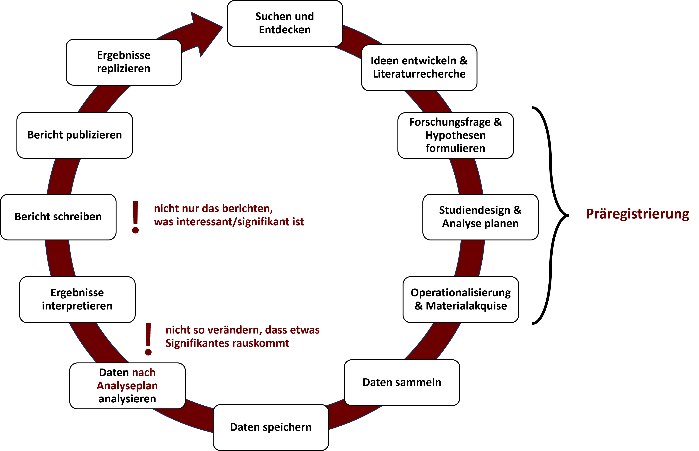
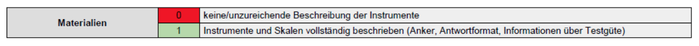
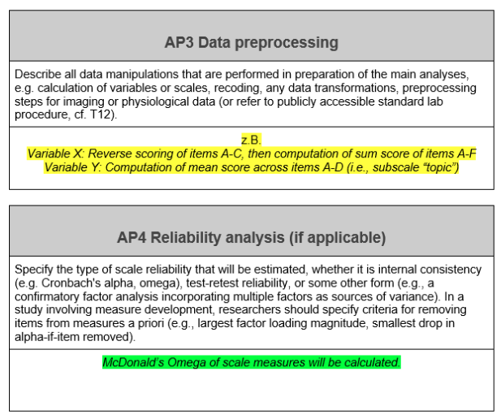
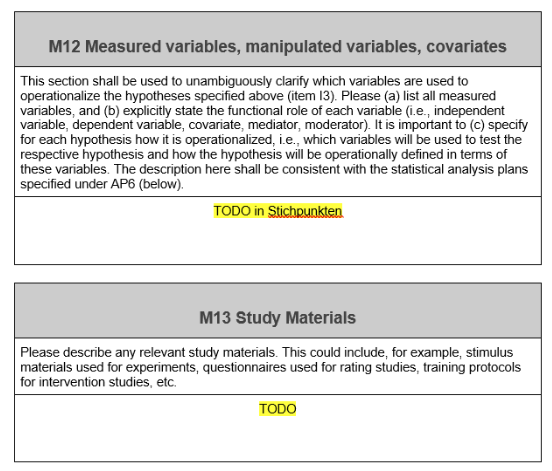
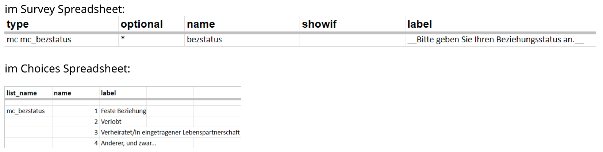

```{r setup, include=FALSE}
options(htmltools.dir.version = FALSE)

library(tidyverse)
library(kableExtra)
library(ggplot2)
library(plotly)
library(htmlwidgets)
library(MASS)
library(ggpubr)
library(xaringanthemer)
library(xaringanExtra)

style_duo_accent(
  primary_color = "#621C37",
  secondary_color = "#EE0071",
  background_image = "blank.png"
)

xaringanExtra::use_xaringan_extra(c("tile_view"))

use_scribble(
  pen_color = "#EE0071",
  pen_size = 4
  )

knitr::opts_chunk$set(
  fig.retina = TRUE,
  warning = FALSE,
  message = FALSE
)
```

name: Title slide
class: middle, left
<br><br><br><br><br><br><br>
# Wissenschaftliches Arbeiten und Forschungsmethoden
***
### Einheit 4: Operationalisierung
##### `r format(as.Date(data.frame(readxl::read_excel("WAF_SS24_Termine.xlsx"))$Datum), "%d.%m.%Y")[4]` | Prof. Dr. Stephan Goerigk


---
class: top, left
name: hypothesen

### Operationalisierung

#### Operationalisierung im Forschungsprozess

.pull-left[
**Was gehört zur Studienplanung?**

1. Theoriearbeit und Literaturrecherche `\(\rightarrow\)` vorletzte und letzte Sitzung

2. Hypothesenformulierung `\(\rightarrow\)` letzte Sitzung

3. Design Plan `\(\rightarrow\)` letzte Sitzung

4. Variablen (Auswahl Messinstrumente und Variablenrollen)  `\(\rightarrow\)` heutige Sitzung

5. Statistischer Analyseplan  `\(\rightarrow\)` nächste Sitzung

6. Sampling plan (Rekrutierungsplan) `\(\rightarrow\)` Einheit 6

`\(\rightarrow\)` Studienplanung in **Präregistrierung** festhalten
]

.pull-right[
```{r eval = TRUE, echo = F, out.width="100%", fig.align='center'}

```
] 

---
class: top, left
name: quellen

### Operationalisierung

#### Quellen und Beurteilung

* Im Rahmen der Vorlesung primär auf [zis.gesis.org](zis.gesis.org) zurückgreifen 

* **Grundsätzliches Vorgehen:** Literaturrecherche (in Google Scholar) mit den Schlagwörtern "questionnaire", "scale", "inventory" oder "test" `\(\rightarrow\)` Veröffentlichung finden, welche die Entwicklung des Messinstruments beschreibt `\(\rightarrow\)` Wortlaut von Items oft im Anhang, sonst Google-Suche nach dem Namen des Messinstruments

* **Weitere systematische Sammlungen von Messinstrumenten:**
 - https://www.testarchiv.eu/
 - https://www.fdz-bildung.de/zugang-instrumente

* **Auch bestehende Literatur prüfen:** Welche Fragebögen haben andere Studien verwendet? (z.B. bei Replikationen besonders relevant, aber auch abgesehen davon wertvolle Informationsquelle)       

---
class: top, left
name: quellen

### Operationalisierung

#### Quellen und Beurteilung

* Zur Beurteilung welches Messinstrument Sie wählen: Gütekriterien beachten! Halten Sie z.b. Ausschau nach Angaben zur **Reliabilität** und nach Hinweisen zur **Validität**, und lesen Sie sich auf jeden Fall auch selbst einmal alle Items durch (die Reliabilität müssen Sie dann später für den Bericht auch auf Ihren eigenen Daten ausrechnen)

* **Übersetzungen sind möglich, aber bitte zuerst recherchieren, ob es nicht schon eine Übersezung gibt und darauf hinweisen, falls Sie selbst eine Übersetzung anfertigen!** Im Bericht sowohl das Original als auch die Übersetzung (falls es eine gibt) zitieren.

* Für die Vorlesung: Kein Geld für Messinstrumente ausgeben (z.B. kommerzielle Tests)

---
class: top, left
### Operationalisierung

#### Bewertungsschema


```{r eval = TRUE, echo = F, out.width="100%", fig.align='center'}

```


---
class: top, left
name: vorgehen

### Operationalisierung

#### Verarbeitung von Fragebogendaten (= Data preprocessing)

Nachdem Items beantworten wurden, müssen ggf. folgende Schritte passieren:

1) Items umpolen

```{r eval=FALSE}
library(dplyr)
recode(variable, "1" = 7, "2" = 6,  ...)
```

2) Skalenwerte für Subskalen und Gesamtwerte bilden

```{r eval=FALSE}
summenwert = rowSums(daten[,c("Item1", "Item2", ...)])
```


... für Einzelfalldiagnostik würde man zusätzlich Normwerte und Konfidenzintervalle bilden und eine inhaltliche Interpretation vornehmen (siehe Rückmeldung für Teilnehmer, vmtl. in Einheit 10)

---
class: top, left

### Operationalisierung

#### Verarbeitung von Fragebogendaten (= Data preprocessing)

**Umpolen von Items:**

<small>

.pull-left[
* Manchmal werden Items entgegengesetzt des Konstrukts formuliert

* Führt ggf. zu treffenderen Aussagen und aufmerksamerer Ausfüllung (automatisches Maximalkreuzen funktioniert nicht)

* Müssen vor der Aggregierung zu einem Summenwert/Durchschnittswert "umgedreht" werden
]

.pull-right[

Umpolen bei 7-stufiger Antwortskala:

* 1 `\(\rightarrow\)` 7
* 2 `\(\rightarrow\)` 6
* 3 `\(\rightarrow\)` 5
* 4 = 4
* 5 `\(\rightarrow\)` 3
* 6 `\(\rightarrow\)` 2
* 7 `\(\rightarrow\)` 1

```{r eval=FALSE}
library(dplyr)
recode(variable, "1" = 7, "2" = 6,  ...)
```

]

Beispiel Extraversion: 

*Aussage: Ich bleibe am Wochenende lieber Zuhause* `\(\rightarrow\)` Misst Ausprägung von Extraversion (nur umgekehrt)

---
class: top, left

### Operationalisierung

#### Verarbeitung von Fragebogendaten (= Data preprocessing)

**Skalenbildung:**

* Items geben uns genaue Informationen/Beobachtungen, aber wir wollen aber Aussagen über das dahinterliegende **Konstrukt** machen

* Zu der selben Kategorie gehörige Items werden ggf. zu **Subskalen** zusammengerechnet (z.B. verschiedene Facetten von Extraversion)

* Subskalen könnten zu einem **Gesamtskalenwert** eines übergeordneten Konstrukts zusammengeführt werden (z.B. Extraversion)

* meist gewichtete oder ungewichtete Summenwerte oder Mittelwerte (aber eigentlich eine Frage der **Skalierung**, vgl. Gütekriterien), z.b. ungewichtete Summenbildung: Skalenwert = Item 1 + Item 2 + Item 3

* Nur die von den Autoren untersuchten **Subskalen** und **Gesamtskalenwerte** sind psychometrisch überprüft `\(\rightarrow\)` Nutzen einzelner Items bestehender Fragebögen ist möglich, wenn es sich um Subskalen oder von den Autor:innen des Fragebogens definierte **Kurzskalen** handelt; einfach nur einzelne Items "herauspicken" ist keine gute Praxis (würde eine eigene psychometrische Evaluation benötigen)

---
class: top, left

### Operationalisierung

#### Material für (Experimental-)bedingungen (= Study materials)

* je nach Studiendesign müssen Sie sich ggf. auch die genaue Umsetzung von Bedingungen (z.B. Instruktionen) oder Gestaltung von Stimulusmaterial (z.B. Videos) überlegen

* **Instruktion für Interventionsthema** (falls nicht in der zusätzlichen Forschungsfrage eine Variante untersucht werden soll): 

*Ihre jetzige Aufgabe umfasst das Hören eines Liedes. Wir bitten Sie, auf den Inhalt des Liedes zu achten. Den Text des Liedes können Sie auf Ihrem Bildschirm verfolgen.*

*Bitte klicken Sie auf das Video, um es zu starten. Schauen Sie es sich bitte komplett an.*

---
class: top, left

### Operationalisierung

#### Präregistrierung


```{r eval = TRUE, echo = F, out.width="50%", fig.align='center'}

```


---
class: top, left

### Operationalisierung

#### Präregistrierung

.pull-left[

```{r eval = TRUE, echo = F, out.width="100%", fig.align='center'}

```
]

.pull-right[
**M12:** z.B."ängstlicher Bindungsstil = UV = Subskala X des ECR-R Fragebogens" 

oder "Studienbedingung = UV = entweder Video X oder Video Y"

**M13:** z.B. "Quelle ECR-R: Sibley, C. G., Fischer, R., & Liu, J. H. (2005). Reliability and validity of the revised experiences in close relationships (ECR-R) self-report measure of adult romantic attachment. <i>Personality and Social Psychology Bulletin, 31</i>(11), 1524-1536. https://doi.org/10.1177/0146167205276865"

oder "Video X: z.B. https://www.youtube.com/watch?v=14ECoSx1UGQ"
]

---
class: top, left
name: infopflicht

### Informationspflicht

#### Informierte Einwilligung

* **Informed Consent**: Einwilligung zur Teilnahme nach Kenntnisnahme aller relevanten Informationen 

* d.h. es müssen vor der Teilnahme an einer Studie alle Informationen geteilt werden, welche die Entscheidung, an der Untersuchung teilzunehmen, potenziell beeinflussen könnte

* Bei geäußertem Interesse an Untersuchungsergebnissen sind diese mitzuteilen
  
* Täuschung (gelegentlich ist es für das Gelingen einer Untersuchung unvermeidlich)
  * Pflicht zur Aufklärung über die wahren Zusammenhänge (**Debriefing**)
  * nach Debriefing: Möglichkeit Auswertung der Daten zu verwähren
  * Wichtig: Vermeidung der Täuschung prüfen
  
---
class: top, left

### Informationspflicht

#### Freiwillige Untersuchungsteilnahme

* Niemand darf zu einer Untersuchung gezwungen werden

* Abbruch auch während der Teilnahme immer möglich

* Untersuchung so anlegen, dass die freiwillige Teilnahme nicht zu einem Problem wird

* Untersuchungsteilnehmer `\(\neq\)` austauschbare Versuchspersonen sondern Individuen

* Thema Honorierung (zweischneidig)
  * finanziell schlechter gestellte Personen könnten auf Entlohnung angewiesen sein 
  * "erkaufen" der Freiwilligkeit
  * Darstellung bezahlter Teilnehmer als "gute Versuchsperson" `\(\rightarrow\)` Verfälschung
  * gerechtfertigt bei sehr aufwenigen Untersuchungen (sonst nur schwer Teilnehmer zu finden)  
  
---
class: top, left

### Informationspflicht

#### Anonymität der Ergebnisse

* Daten nur zu wissenschaftlichen Zwecken verwenden

* (hinreichende) Anonymität der persönlichen Angaben muss gewährleistet werden (Datenschutz), wirkt auch gegen sozial erwünschtes Antworten
  - **Bitte sprechen Sie die Erhebung demographischer Daten (wie z.B. Alter, Berufstätigkeit) mit mir ab (nur erheben, wenn für Forschungsfrage unbedingt nötig!)**
  - **keine Erhebung sensibler Daten** (wie z.B. Gesundheitsdaten, Medikamentenkonsum, sexuelle Orientierung)

* Ggf. Pseudonymisierung nutzen (Verwendung eines arbiträren Studiencodes) `\(\rightarrow\)` **werden wir für die Rückmeldungen nutzen! Dran denken!**

* **Sie sind als Verantwortliche der Studien auch für die Einhaltung des Datenschutzes verantwortlich!**

* Bei Zusammenarbeit mit Softwareanbietern ist oftmal ein Datenverarbeitungsvertrag nötig 

* Im Zweifelsfall Beratung durch Datenschutzbeauftragten


---
class: top, left

### Informationspflicht

#### Anonymität der Ergebnisse

* Das nachfolgende Template stellt eine gute Grundlage dar für künftige Studien von Ihnen, z.B. für Abschlussarbeiten - **sollte aber in jedem Fall angepasst, ggf. spezifiziert und mit einer fachkundigen Person abgesprochen werden!**

---
class: top, left

### Informationspflicht

#### Aufklärung

Vorlage:

**Erklärung zur Studie:** 

Es freut uns sehr, dass Sie sich bereit erklärt haben, an der Studie "**[Studienname einfügen]**" unter der Leitung von **[Namen der Kleingruppenmitglieder einfügen]** von der Charlotte-Fresenius-Hochschule München teilzunehmen. 

Ziel dieser Studie ist **[Ziel einfügen]**. Wir interessieren uns dafür, **[Forschungsfrage(n) in einfacher Sprache]**.

Von der Studie sind keine besonderen Belastungen oder gar Schäden zu erwarten.


---
class: top, left

### Informationspflicht

#### Aufklärung

<small>

.pull-left[
Vorlage:

**Inhalt und Zweck der Studie:**

Die jeweilige Aufgabe wird Ihnen zuvor genau beschrieben und erklärt. Sie werden während der Studie einen Fragebogen ausfüllen (Dauer etwa **[Dauer einfügen]** Minuten). 

Dies dient der Erfassung von **[Variablen einfügen]**, die für das oben genannte Forschungsvorhaben relevant sind.

**[ggf. weitere  Aufgaben einfügen welche die Versuchsperson machen muss, inkl. Zweck]**
]

.pull-right[
Beispiel:

**Inhalt und Zweck der Studie:**
.small[Die jeweilige Aufgabe wird Ihnen zuvor genau beschrieben und erklärt. 

a) Sie werden während der Studie einen Fragebogen ausfüllen (Dauer etwa 10 Minuten). Dies dient einerseits der Erfassung von demographischen Variablen (z.B. Geschlecht, sozioökonomischer Status) und psychologischen Variablen (z.B. Beziehungszufriedenheit), die für das oben genannte Forschungsvorhaben in Frage kommen. Andererseits dient es der Erfassung Ihrer Erfahrungen mit der Studie und den Studienmaterialien, um diese zukünftig zu verbessern.   

b) Sie werden während der Studie aufgefordert sich ein Lied anzuhören. Sie können dieser Aufforderung nach Ihrem eigenem Ermessen nachgehen. Dies dient der Untersuchung der Kausalität: Welche Effekte hat z.B. ...
]
]

---
class: top, left

### Informationspflicht

#### Aufklärung

<small>

.pull-left[
Vorlage:

**Betroffener Personenkreis:**
Rekrutiert werden **[Einschlusskriterien einfügen]**.
Es werden ausschließlich Daten der teilnehmenden Person erhoben, und keine Daten weiterer Personen. 
]

.pull-right[
Beispiel:

**Betroffener Personenkreis:**
Rekrutiert werden freiwillige, deutschsprechende Personen ab 18 Jahren, die sich in einer monogamen Partnerschaft befinden.
Es werden ausschließlich Daten der teilnehmenden Person und ihrer Wahrnehmung über ihre:n Partner:in erhoben, und keine Daten weiterer Personen. 
]

---
class: top, left

### Informationspflicht

#### Datenschutz

<small>

.pull-left[
Vorlage: 

**Zu erhebende Daten:**

.small[
Demographische Variablen: **[ggf. zu erhebende demographische Variablen einfügen, wie Geschlecht; falls keine demographischen Variablen erhoben werden, diesen Punkt rausnehmen]**

Psychologische Variablen: **[zu erhebende psychologische Variablen einfügen, wie Bindungsstile, ggf. mit einem Beispielitem]**

Zusätzlich können Sie freiwillig eine Rückmeldung zu Ihren eigenen Antworten erhalten, in dem Sie ein freigewähltes Pseudonym während der Befragung angeben (von dem nur Sie wissen, dass es Ihres ist), welches Sie im Nachgang nutzen können, um eigenständig an Ihre Rückmeldung zu gelangen.
]
]

.pull-left[
Beispiel:

**Zu erhebende Daten:**

.small[
Demographische Variablen: Alter, Geschlecht, sozioökonomische Statusvariablen, Partnerschaftsstatus und -eigenschaften

Psychologische Variablen: Verhaltensweisen, Befindlichkeitsvariablen, z.B.: "Wie fühlen Sie sich gerade?  1=gar nicht verärgert... bis 5 = äußerst verärgert", Partnerschaftsvariablen, z.B.: "Wie emotional nahe wären Sie Ihrem Partner jetzt gerade gerne?"

Zusätzlich können Sie freiwillig eine Rückmeldung ...
]
]

---
class: top, left

### Informationspflicht

#### Datenschutz

<small>

**Analyseergebnisse der Daten:**
Die in der Studie entstandenen Daten werden an der Charlotte-Fresenius-Hochschule München ausschließlich zu wissenschaftlichen Forschungszwecken erhoben und verarbeitet. Die auf Basis der Daten erzielten Ergebnisse werden in zusammengefasster Form als wissenschaftliche Publikation veröffentlicht.

**Lagerung und Weitergabe von Daten:**
Zunächst werden Ihre Daten auf zugangsbeschränkten Servern der Uni Göttingen gespeichert. Die Daten werden dann auf Rechnern der am Projekt beteiligten Personen (siehe Punkt 7) verarbeitet.
Das Pseudonym wird zur Erstellung einer Rückmeldung zu den eigenen Antworten verwendet, und anschließend gelöscht.

Unter Beachtung von Art. 25 Abs. 3 BayDSG wird eine zum aktuellem Zeitpunkt nur mit unverhältnismäßigen Aufwand zu deanonymisierende Variante der Daten (siehe Punkt 9, ohne Pseudonym) in Form eines „scientific use file“ (https://de.wikipedia.org/wiki/Scientific-Use-File) der wissenschaftlichen Gemeinschaft zur Verfügung gestellt. Das bedeutet, dass ausschließlich Mitarbeiter wissenschaftlicher Einrichtungen die Daten zu wissenschaftlichen Zwecken nutzen können. Art und Umfang potentieller Nachnutzungen können zum jetzigen Zeitpunkt noch nicht abgesehen werden. Damit folgt diese Studie den Empfehlungen der Deutschen Forschungsgemeinschaft (DFG) zur Qualitätssicherung in Bezug auf Nachprüfbarkeit und Reproduzierbarkeit wissenschaftlicher Ergebnisse, sowie der optimalen Datennachnutzung.

---
class: top, left

### Informationspflicht

#### Datenschutz

<small>

**Beteiligte, Datenflüsse und speichernde Stellen:**
Die Verarbeitung der Umfragedaten erfolgt mit Hilfe der Onlineumfragesoftware „formr“ und mit Hilfe der von der Uni Göttingen zur Verfügung gestellten Infrastruktur. 
Die Daten, die im Rahmen dieser Projekte von Studienteilnehmern/innen erhoben werden, werden, wie unter Punkt 6 beschrieben, verarbeitet. Die Datenverarbeitung erfolgt ausschließlich durch einen beschränkten Personenkreis der Charlotte-Fresenius-Hochschule München (Projektleitung wie unter Punkt 1 beschrieben). 

**Konkrete Dauer der Speicherung:**
Die Studiendaten werden aus wissenschaftlichen Gründen ohne festgesetzten Termin zur Löschung lokal gespeichert.

**Hinreichende Anonymisierung der Daten:**
Nach Abschluss der Datenerhebung wird ein zweiter Datensatz erstellt, in dem möglicherweise personenbeziehbare demographische Angaben anonymisiert werden, so dass es weder dem Teilnehmer noch den Projektmitarbeitern unter verhältnismäßigem Aufwand möglich ist diese Daten einer bestimmten Person zuzuordnen („hinreichend anonymisierte Daten“). Der nicht weiter anonymisierte Primärdatensatz verbleibt bei der Projektleitung.

---
class: top, left

### Informationspflicht

#### Datenschutz

<small>

**Risiken und sonstige Informationen:**
.small[
Es kann durch das Eingreifen Dritter (z.B. durch einen Angriff auf unsere Server) zu einem (Teil-)Verlust der Daten kommen. In diesem Fall kann das Ziel des Forschungsprojekts gefährdet sein. 

Außerdem möchten wir Sie darüber informieren, welche Konsequenzen sich hieraus für Sie individuell ergeben könnten. Im Falle eines gelungenen Angriffs könnten Dritte Zugriff auf die unter Punkt 4 beschriebenen Daten erhalten und diese aggregieren, sodass sie z.B. folgende Auskünfte über Sie haben: **[Beispiele einfügen, z.B. Ihre demografischen Daten oder Ihre Stimmung, Motivation und Beziehungszufriedenheit zum Zeitpunkt des Ausfüllens des Fragebogens.]** Unserer Einschätzung nach könnten die Daten von Dritten aggregiert werden, sodass schlimmstenfalls Auskunft über Ihre Identität (durch Kombination der Daten) gewonnen wird. Ob und in welchem Ausmaß sich Dritte durch Zuhilfenahme weiterer Datenquellen (abgesehen von dieser Studie) weitere Kenntnisse verschaffen, können wir nicht beeinflussen und abschätzen.   

Um jedoch die Kenntnisnahme der in dieser Studie erhobenen Daten durch Dritte zu vermeiden bzw. das Risiko dafür zu minimieren, treffen wir sehr viele Vorkehrungen, die im Sinne der DSGVO vorgesehen sind, z.B. dass nur ein begrenzter ausgewählter Personenkreis Zugriff auf die Primärdaten hat. 

Außerdem möchten wir Sie darauf hinweisen, dass unser System unter der Beachtung technisch organisatorischer Maßnahmen gemäß Art.32 DSGVO und des aktuellen Stands der Technik programmiert wurde und entsprechend kontinuierlich überwacht wird. So können wir selbst im Falle eines Angriffs sehr schnell handeln und das Ausmaß potentieller Schäden minimieren.
]

---
class: top, left

### Informationspflicht

#### Datenschutz

**Rechtsgrundlagen:**
Die Rechtsgrundlage zur Verarbeitung der genannten personenbezogenen Daten bildet die Einwilligung im zweiten Teil dieses Dokumentes. Ihre Daten werden auf folgender Grundlage verarbeitet: Art. 6 Abs. 1 Buchst. a), Art. 7, Art. 9 Abs. 2 Buchst. a), Art. 9 Abs. 2 Buchst. j), Art. 25 BayDSG i.V.m. Art. 89 DSGVO, Erwägungsgründe 33, 156, 159 DSGVO. 

**Widerruf seitens des Betroffenen:**
Die Teilnahme an der Studie ist freiwillig. Sie haben das Recht jederzeit die datenschutzrechtliche Einwilligung rückgängig zu machen (zu widerrufen). Durch den Widerruf der Einwilligung wird die Rechtmäßigkeit der aufgrund der Einwilligung bis zum Widerruf erfolgten Verarbeitung nicht berührt (Widerruf mit Wirkung für die Zukunft). Richten Sie den Widerruf bitte an die Projektleitung. Ihnen entstehen durch den Widerruf keine Nachteile. Eine Widerruf ist nur dann wirksam und kann zu einer Löschung Ihrer Daten aus dem Datensatz führen, wenn Sie sich eindeutig im Datensatz identifizieren können (z.B. anhand demographischer Angaben). Die Löschung erfolgt unverzüglich und kann nicht rückgängig gemacht werden. 

**Namen, Kontaktdaten des Verantwortlichen:**
Die Verantwortung für die Verarbeitung der personenbezogenen Daten haben: **[Namen und Emailadressen der Kleingruppe einfügen]**

---
class: top, left

### Informationspflicht

#### Datenschutz

**Hinweis auf Rechte der Betroffenen:**
Gemäß Art. 13 II b DSGVO haben Sie bei Vorliegen der entsprechenden gesetzlichen Voraussetzungen das Recht auf 
Auskunft (Art 15 DSGVO)
Widerspruch (Art. 21 DSGVO)
Datenübertragbarkeit (Art 20 DSGVO)
Löschung (Art 17 DSGVO)
Einschränkung der Verarbeitung (Art 18 DSGVO)
Berichtigung (Art 16 DSGVO).
Möchten Sie eines dieser Rechte in Anspruch nehmen, wenden Sie sich bitte an die Projektleitung.

---
class: top, left

### Informationspflicht

#### Einverständnis

<small>

**Einwilligungserklärung:**

* Hiermit willige ich freiwillig in die Teilnahme an der Studie "**[Name einfügen]**" ein. Ich kann die Teilnahme jederzeit ohne Angabe von Gründen beenden.

* Hiermit willige ich freiwillig in die Verarbeitung meiner Studiendaten durch die Umfragesoftware *formr* und die am Projekt beteiligten Personen zum Zweck der Durchführung des Studie "**[Name einfügen]**" ein. Sofern bzw. soweit die erhobenen Daten unter die besondere Kategorie personenbezogener Daten fallen, erstreckt sich meine Einwilligung auch ausdrücklich hierauf.  Über die Folgen eines Widerrufs der datenschutzrechtlichen Einwilligung (Widerruf mit Wirkung für die Zukunft) bin ich aufgeklärt worden. Die schriftliche Aufklärung, Datenschutzinformation und Einwilligungserklärung habe ich zur Kenntnis genommen und erhalten.

* Ich willige ein, dass eine zum aktuellem Zeitpunkt nur mit unverhältnismäßigen Aufwand zu deanonymisierende Variante meiner Daten in Form eines „scientific use file“ der wissenschaftlichen Gemeinschaft zur Verfügung gestellt wird.

.small[
Hinweis: Die Teilnahme ist nur möglich, wenn Sie in alle o.g. Punkte einwilligen.

Hinweis: Speichern Sie sich diese Seite ab, damit Sie bei Bedarf später darauf zugreifen können (per Screenshot oder indem Sie sie auf Papier oder in ein PDF drucken).
]

---
class: top, left
name: formr 

### formr als Umfragetool

* Warum benutzen wir es? Mächtig, flexibel und kostenlos

* Grundidee: Studie ist ein "Run", der aus verschiedenen Teilen, z.B. "Surveys" (=Fragebögenteilen) besteht

* Beispiel für einen Run:
  * Survey 1: Einleitende Fragen
  * Survey 2: Pro Bedingung ein anderes Video
  * Survey 3: Abschließende Fragebögen

`\(\rightarrow\)` **Es ist ok, wenn der Run auch nur aus einem Survey besteht! Je nach Komplexität Ihrer Studie völlig ausreichend. Es braucht aber immer einen Run.**

* Anlegen von Surveys in Excel-Dokumenten mit zwei "Mappen":
  * Fragen ("Survey Spreadsheet")
  * Antwortskalen ("Choices Spreadsheet")

* Vorlage auf Studynet (inkl. Einwilligungserklärung)

---
class: top, left

### formr als Umfragetool

#### Spalten im "Survey Spreadsheet" des Surveys

<small>

* Spalte *note*: für eigene Notizen, wird nicht ausgewertet

* Spalte *class*: zum Formatieren des Items, damit es schön aussieht `\(\rightarrow\)` siehe  https://formr.org/documentation#sample_survey_sheet "Optional classes for visual styling"

* Spalte *type*: legt fest was angezeigt werden soll, z.B. *note* (einfach nur Text), *mc* (Multiple-Choice-Frage), *submit* ("Weiter"-Button -> trennt zwei Umfrageseiten) `\(\rightarrow\)` siehe Dokumentation der Itemtypen unter https://formr.org/documentation#available_items

* Spalte *optional*: Legt fest, ob Frage beantwortet werden muss (mit einem "!") oder nicht (mit einem "*")

* Spalte *name*: eindeutige Variablennamen vergeben (so heißen Ihre Variablen später im Datensatz!) `\(\rightarrow\)` **wichtig!**

* Spalte *showif*: nur relevant falls etwas nur dann angezeigt werden soll, wenn bei einer vorherigen Frage etwas bestimmtes angegeben wurde

* Spalte *label*: Text der angezeigt werden soll, in markdown-Syntax (oder mit html) formatiert

* Spalte *choice1*/*choice2*/*choice3* usw.: schnelle Möglichkeit Antwortmöglichkeiten einzugeben `\(\rightarrow\)` teilweise eine Alternative zum "Choices Spreadsheet"

---
class: top, left

### formr als Umfragetool

#### Spalten im "Choices Spreadsheet" des Surveys

* Spalte *list_name*: so heißt Ihre Antwortskala (kann im Survey Spreadsheet in der *type*-Spalte referenziert werden)

* Spalte *name*: Zahlen, die gespeichert werden, wenn man eine bestimmte Antwortoption auswählt

* Spalte *label*: Text der Antwortoptionen

**Beispiel:**

```{r eval = TRUE, echo = F, out.width="90%", fig.align='center'}

```
---
class: top, left
name: ressourcen

### formr als Umfragetool

#### formr Ressourcen

* **Vorlagen auf studynet**: https://studynet.hs-fresenius.de/goto_STUDYNETHSF_file_28654_download.html 

* **Dokumentation der Itemtypen**: https://formr.org/documentation#available_items

* **Beispiel-Implementierung der Itemtypen**: https://widgets.formr.org/ mit dazugehörigem Excel-Sheet https://docs.google.com/spreadsheets/d/1vXJ8sbkh0p4pM5xNqOelRUmslcq2IHnY9o52RmQLKFw/edit#gid=1611481919

* **Markdown syntax**: https://www.markdownguide.org/basic-syntax/

* **Tutorial**: https://zpid.cloud.panopto.eu/Panopto/Pages/Viewer.aspx?id=7ef6d4d4-1659-481a-8bc1-af4200947aef

---
class: top, left

### formr als Umfragetool

#### Studie bei formr anlegen

<small>

**Was muss ich in formr in welcher Reihenfolge wie anklicken, nachdem ich meine Exceldatei mit meinen Fragen erstellt habe**

1. Runs (oben) -> Create run 
2. Surveys (oben) -> Create new survey -> links: Upload an item table -> Choose file (Excel-Datei) -> Upload -> jetzt können Sie mit "Test survey" (links) schonmal das Survey testen.
3. Runs -> den in Punkt 1 erstellten Run anklicken -> Add survey (Button mit Bleistift-Symbol) -> im Dropdown-Menü das in Punkt 2 erstellte Survey auswählen
4. Add Stop Point (Button mit Quadrat) = letzte Seite der Befragung
5. Test Run (links im Menü)

**Was wenn ich was an meinem Survey ändern will (z.B. weil es beim Upload eine Fehlermeldung gab oder irgendwas nicht so aussieht wie gewünscht)?**

1. Surveys (oben) -> das zuvor erstellte Survey auswählen (! beim reinen Überarbeiten kein neues survey anlegen! Nur wenn irgendwas kaputt gegangen ist/gar nicht erst eins erstellt wurde)
2. Import items (links) -> Upload an item table (Excel-Datei muss genauso benannt sein wie vorher) `\(\rightarrow\)` ersetzt den vorherigen Stand des surveys!


---
class: top, left
name: praxis

### Praxis

**Schritt 1: Operationalisierung festlegen**
* Suchen Sie nach Fragebögen und Tests für Ihre zentralen Variablen (auf [zis.gesis.org](zis.gesis.org) oder Variable + "questionnaire", "scale" oder "test").

* Überlegen Sie sich ggf. genaue Formulierungen/Instruktionen und konkretes Material (z.B. Videos).

* Ergänzen Sie ggf. weitere Operationalisierungen für interessante Variablen im Rahmen möglicher explorativer Fragestellungen.

**Schritt 2: Präregistrierung erweitern**
* Erweitern Sie das [Präregistrierungstemplate auf studynet](https://studynet.hs-fresenius.de/goto_STUDYNETHSF_file_22808_download.html) (AP3, AP4, M12, M13)

---
class: top, left

### Praxis

**Schritt 3: Studie in formr implementieren**
* Nutzen Sie das formr-Template auf studynet.

* Ihre gruppenspezifische Exceldatei finden Sie in der Gruppenzuteilungstabelle [https://docs.google.com/spreadsheets/d/1I96liznmV6nmCzfuVnq5MFE9WKUICG77JKvjBWRe8Ho/edit#gid=0]

* Testen Sie Ihr Survey/Ihren Run gründlich (auch auf Smartphones)!

* Sobald Sie der Meinung sind, die Studie ist fertig implementiert, schicken Sie mir bitte einen Export des Runs zu (Run -> Export -> "include survey details" anklicken -> Export)


---
class: top, left

### Praxis

**Login bei der formr Testumgebung:**

* https://workshops.formr.org/

* Email: cfh.formr@gmail.com

* PW: cfh_formr24*

**Alle Kleingruppen arbeiten parallel in der gleichen Umfrageumgebung! Achten Sie bitte auf Übersichtlichkeit (geben Sie Ihren Runs und Surveys (Name der Exceldatei) sprechende Namen die Ihrem Studienthema zuordenbar sind) und nehmen Sie ausschließlich in Ihren eigenen Studien Änderungen vor!**

