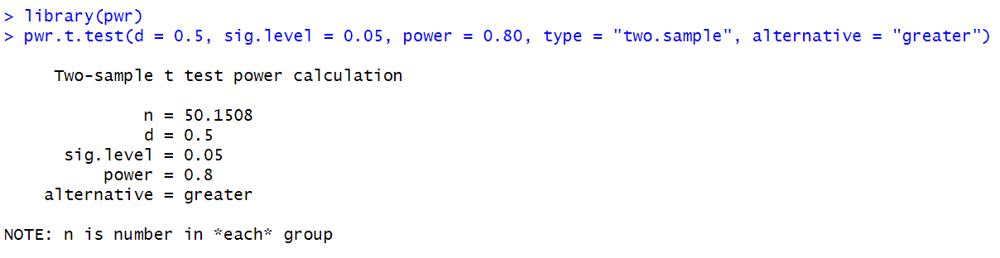
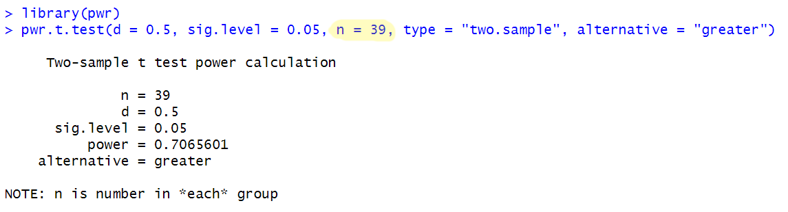
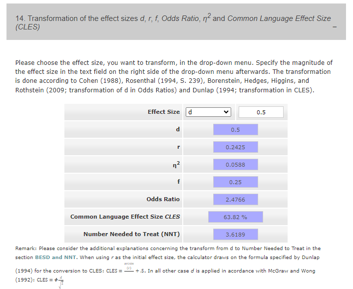
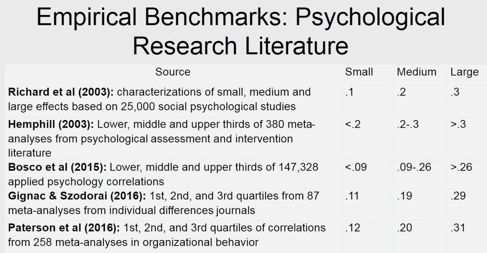
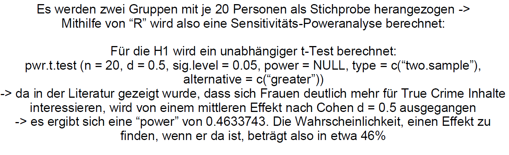
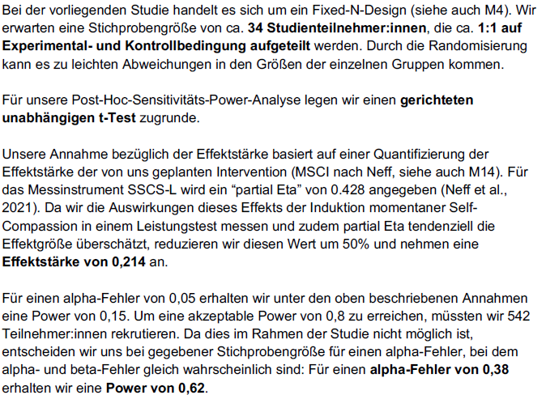

```{r setup, include=FALSE}
options(htmltools.dir.version = FALSE)

library(tidyverse)
library(kableExtra)
library(ggplot2)
library(plotly)
library(htmlwidgets)
library(MASS)
library(ggpubr)
library(xaringanthemer)
library(xaringanExtra)

style_duo_accent(
  primary_color = "#621C37",
  secondary_color = "#EE0071",
  background_image = "blank.png"
)

xaringanExtra::use_xaringan_extra(c("tile_view"))

use_scribble(
  pen_color = "#EE0071",
  pen_size = 4
  )

knitr::opts_chunk$set(
  fig.retina = TRUE,
  warning = FALSE,
  message = FALSE
)
```

name: Title slide
class: middle, left
<br><br><br><br><br><br><br>
# Wissenschaftliches Arbeiten und Forschungsmethoden
***
### Einheit 6: Samplingplan
##### `r format(as.Date(data.frame(readxl::read_excel("WAF_SS24_Termine.xlsx"))$Datum), "%d.%m.%Y")[6]` | Prof. Dr. Stephan Goerigk

---
class: top, left
name: sampling

### Sampling Plan (Rekrutierungsplanung)

#### Sampling Plan im Forschungsprozess

.pull-left[
**Was gehört zur Studienplanung?**

1. Theoriearbeit und Literaturrecherche `\(\rightarrow\)` Einheit 2 und 3

2. Hypothesenformulierung `\(\rightarrow\)` Einheit 3

3. Design Plan `\(\rightarrow\)` Einheit 3

4. Variablen (Auswahl Messinstrumente und Variablenrollen)  `\(\rightarrow\)` Einheit 4

5. Statistischer Analyseplan  `\(\rightarrow\)` letzte Sitzung

6. Sampling plan (Rekrutierungsplan) `\(\rightarrow\)` heutige Sitzung

`\(\rightarrow\)` Studienplanung in **Präregistrierung** festhalten
]

.pull-right[
```{r eval = TRUE, echo = F, out.width="100%", fig.align='center'}
knitr::include_graphics("bilder/Forschungsprozess_Prereg.png")
```
] 

---
class: top, left
<div class="footer"><span>Van't Veer, A. E., & Giner-Sorolla, R. (2016). Pre-registration in social psychology—A discussion and suggested template. Journal of experimental social psychology, 67, 2-12.</span></div>

### Sampling Plan (Rekrutierungsplanung)

#### Elemente

* Falls zutreffend: Beschreibung der Regeln zur Vorauswahl von Teilnehmer:innen

* Beschreibung der Datenerhebung (Wo? Von wem? Wie? Wann?)

* Rechtfertigung der geplanten Stichprobengröße ( `\(\rightarrow\)` Poweranalyse)

* Beschreibung der Regel zur Beendigung der Datenerhebung

* ggf. Umgang mit Personen, die die Studie abbrechen ("drop out")

* ggf. Wenn-dann-Regeln zum Umgang mit zu kleiner Stichprobe nach Ausschluss


---
class: top, left

### Sampling Plan (Rekrutierungsplanung)

#### Auswahl der Untersuchungsobjekte 

* Frage: an welchen bzw. an wie vielen Untersuchungsobjekten werden die Variablen erhoben? `\(\rightarrow\)` Untersuchungsteilnehmer, deren Beobachtung oder Beschreibung interessante Hypothesen versprechen

**Wichtigstes Kriterium: Repräsentativität der Stichprobe**

* Repräsentativität = Stichprobe muss in ihrer Zusammensetzung der Population möglichst stark ähneln

* Stichprobe ist (merkmals)spezifisch repräsentativ, wenn ihre Zusammensetzung hinsichtlich relevanter Merkmale der Populationszusammensetzung entspricht

* Stichprobe  ist global repräsentativ, wenn ihre Zusammensetzung in nahezu allen Merkmalen der Populationszusammensetzung entspricht

* große Stichprobe garantiert nicht Repräsentativität (gilt nur bei unverzerrter Auswahl)

* beste Gewähr für größtmögliche globale Repräsentativität bietet die Zufallsstichprobe

---
class: top, left
### Sampling Plan (Rekrutierungsplanung)

#### Auswahl der Untersuchungsobjekte 

**Einschlusskriterien:**

* globale Population aller Menschen ist nicht für jede Fragestellung geeignet

* Selektion zur Erhöhung der Auftretenswahrscheinlichkeit relevanter Merkmale (z.B. bestimmte Diagnose, bestimmte Altersklasse...)

**Ausschlusskriterien:**

* Manche Charakteristika machen Untersuchung einzelner Personen inhaltlich/ethisch unmöglich

* Ausschlusskriterien müssen gut überlegt und genau dokumentiert werden

`\(\rightarrow\)` **Für Gruppen mit eigenem Thema gibt es ein Einschlusskriterium, welches nicht inhaltlich begründet ist: Studierender dieser Vorlesung sein. Fehlende Repräsentativität ist dann Teil der Diskussion.**

`\(\rightarrow\)` **Für Gruppen mit Interventionsthema gibt es als Einschlusskriterium, dass die Versuchspersonen in einer festen, monogamen Partnerschaft sein sollen.**

---
class: top, left
### Sampling Plan (Rekrutierungsplanung)

#### Anwerbung von Untersuchungsteilnehmern:

* Wo soll rekrutiert werden?

* Mit welchen Mitteln?

* Wird es eine Vergütung geben?
  * Bei uns: Rückmeldung über eigene Antworten

* Ist die Teilnahme Teil eines erweiterten (Forschungs-/Behandlungs-)Programms?

---
class: top, left
### Sampling Plan (Rekrutierungsplanung)

####  Determinanten der freiwilligen Untersuchungsteilnahme (Bortz und Döring, 2012)

Freiwillige Untersuchungsteilnehmer ...
* ...verfügen über eine bessere schulische Ausbildung als Verweigerer (bessere Notendurchschnitte). 
* ...schätzen ihren eigenen sozialen Status höher ein als Verweigerer.
* ...benötigen mehr soziale Anerkennung als Verweigerer.
* ...sind geselliger als Verweigerer.
* ...sind weniger autoritär als Verweigerer.
* ...haben eine geringere Tendenz zu konformem Verhalten als Verweigerer.
* ...geben sich in Untersuchungen über geschlechtsspezifisches Verhalten unkonventioneller.
* ...verfügen auf Basis der meisten Untersuchungsergebnisse über eine höhere Intelligenz.

Im Allgemeinen sind weibliche Personen eher zur freiwilligen Untersuchungsteilnahme bereit als männliche Personen.

Siehe auch Rezeption einer aktuelleren Studie: https://twitter.com/rubenarslan/status/1700049223889101230: Freiwillige gehen eher wählen und antworten eher "Ja" auf Fragen


---
class: top, left
<div class="footer"><span>Van den Akker, O., Weston, S., Campbell, L., Chopik, B., Damian, R., Davis-Kean, P., ... & Bakker, M. (2021). Preregistration of secondary data analysis: A template and tutorial. Meta-psychology, 5, 2625.</span></div>

### Sampling Plan (Rekrutierungsplanung)

#### Zeitpunkt der Registrierung

<small>

In einer Präregistrierung wird der Zeitpunkt der Registrierung konkret dokumentiert:

* **Registrierung vor der Sammlung der Daten**: Daten noch nicht erhoben, erstellt oder realisiert worden
* **Registrierung vor jeglicher menschlicher Beobachtung der Daten**: Daten vorhanden, wurden aber noch von niemandem quantifiziert, erstellt, beobachtet oder gemeldet
* **Registrierung vor dem Zugriff auf die Daten**: Daten vorhanden, aber Sie oder Ihre Mitarbeiter haben noch keinen Zugriff darauf
* **Registrierung vor der Analyse der Daten**: Daten vorhanden und Sie haben darauf zugegriffen, aber es wurde noch keine Analyse im Zusammenhang mit dem Forschungsplan durchgeführt 
* **Registrierung nach der Analyse der Daten**: Sie haben auf einen Teil der für den Forschungsplan relevanten Daten zugegriffen und diese analysiert

Wenn für eine Studie auf einem bereits bestehenden Datensatz Berechnungen durchgeführt werden (Analysen auf vorab-existierenden Daten), muss dies auch durchdacht und dokumentiert werden `\(\rightarrow\)` 
siehe "Preregistration of secondary data analysis: A template and tutorial": https://research.tilburguniversity.edu/en/publications/preregistration-of-secondary-data-analysis-a-template-and-tutoria


---
class: top, left
### Sampling Plan (Rekrutierungsplanung)

#### Größe der Stichprobe

* Die Festlegung des Stichprobenumfanges sollte ebenfalls in der Planungsphase erfolgen

* Verbindliche Angaben zum nötigen Stichprobenumfang für eine bestimmte Analyse nur möglich, wenn eine hypothesenprüfende Untersuchung mit vorgegebener Effektgröße geplant wird `\(\rightarrow\)` **a priori Poweranalyse** 

* Durchführung z.B. in R oder freies Programm GPower ([Link zu Erklärvideo für G*Power](https://www.youtube.com/watch?v=7J7ZLp5Q2H8))

* Für die Größe von Stichproben, mit denen keine spezifischen Hypothesen geprüft werden oder keine Effektgröße schätzbar ist, gibt es keine genauen Richtlinien ("more is better, but be mindful of resources")

* Falls die Stichprobengröße aus anderen Gründen festgelegt ist (wie bei den Gruppen mit eigenem Thema), kann man eine "**(post hoc) Sensitivitäts-Poweranalyse**" machen, um abzuschätzen wie hoch die statistische Power für die Aufdeckung eines Effekts mit dieser Stichprobengröße ist (wichtig: eine post hoc Analyse auf dem *gefundenen* Effekt aus der eigenen Studie macht keinen Sinn, nur eine auf dem erwarteten Effekt)

---
class: top, left
### Sampling Plan (Rekrutierungsplanung)

#### Größe der Stichprobe

* Ziel der a priori Poweranalyse: Bestimmung einer Stichprobengröße, die bei angenommender Effektgröße eine statistisch-signifikantes Ergebnis ermöglicht 

* Zusammenspiel aus Signifikanzniveau (Wahrscheinlichkeit für Fehler 1. Art) und Power (1 - Wahrscheinlichkeit für Fehler 2. Art)

* Poweranalyse richtet sich nach der Hauptfragestellung (primärer zu überprüfender Hypothese); bei mehreren Primärhypothesen nach dem kleinsten erwarteten Effekt

Relevante Parameter:
  * **Effektstärke** (aus Vorstudien/Literatur oder basierend auf Plausibilitätsannahme) `\(\rightarrow\)` je größer, desto kleineres N benötigt
  * **Signifikanznivea**u (i.d.R. alpha = .05) `\(\rightarrow\)` je kleiner, desto kleineres N benötigt
  * **Power** (i.d.R. mindestens 0.8) `\(\rightarrow\)` je größer, desto kleineres N benötigt

---
class: top, left
### Sampling Plan (Rekrutierungsplanung)

#### Poweranalyse in R

Poweranalyse für einen unabhängigen t-Test (auch für andere Hypothesentests möglich):

.pull-left[
.center[
```{r eval = TRUE, echo = F, out.width="100%", fig.align='center'}

```
]
]
.pull-right[
* Bei a priori Annahme einer Effektstärke von Cohen's d = 0.5 für den Mittelwertsunterschied (mittlerer bis großer Effekt)

* und einem Signifikanzniveau von alpha = .05

* und einer Power von 0.8 (Chance auf positives Ergebnis)

benötigt man N = 102 Personen (51 pro Gruppe), um in einem einseitigen *(alternative = "greater")* unabhängigen t-Test *(type = "two.sample")* einen signifikanten Gruppenunterschied nachzuweisen
]

---
class: top, left
### Sampling Plan (Rekrutierungsplanung)

#### Sensitivitäts-Poweranalyse in R

Sensitivitäts-Poweranalyse für einen unabhängigen t-Test (auch für andere Hypothesentests möglich):

.pull-left[
.center[
```{r eval = TRUE, echo = F, out.width="100%", fig.align='center'}

```
]
]
.pull-right[
* Bei a priori Annahme einer Effektstärke von Cohen's d = 0.5 für den Mittelwertsunterschied (mittlerer Effekt)

* und einem Signifikanzniveau von alpha = .05

* und N = 78 Personen (39 Personen pro Gruppe) (*Hinweis: An der Vorlesung nehmen insgesamt 82 Studierende teil. Wenn die eigene Gruppe = 3-5 Personen nicht an der Studie teilnehmen, aber sonst alle, kommen Sie auf 77-79 Versuchspersonen.*)

erreicht man eine Power von 71% für einen einseitigen, unabhängigen t-Test; d.h. die Wahrscheinlichkeit einen Effekt zu finden, wenn er da ist, beträgt 71%. 
]

---
class: top, left
### Sampling Plan (Rekrutierungsplanung)

#### Poweranalyse in R: Befehle

* **pwr.t.test()** für Einstichproben-t-test, sowie unabhängige und abhängige Zweistichproben-t-tests mit gleicher Gruppengröße; Angabe von Effektstärke d (s.o.)

* **pwr.anova.test()** für einfaktorielle ANOVA; Angabe von Effektstärke f
  * f = `\(\sqrt{(\omega² / 1 - \omega²)}\)`
  * Angabe von k = Stufen des Faktors
  
* **pwr.f2.test()** für Regression und mehrfaktorielle ANOVA; Angabe von Effektstärke f²
  * f² = `\(R² / (1 – R²)\)` bzw. `\(\omega² / 1 - \omega²\)` für aufgeklärte Varianz des Gesamtmodells
  * f² = `\((R²_{AB} -  R²_A) / (1 – R²_{AB})\)` bzw. `\(\omega²_{partial_B} / 1 - \omega²_{partial_B}\)` für aufgeklärte Varianz des Prädiktors B
  * Angabe von u = Anzahl der Prädiktoren/Faktoren ohne Intercept
  * Rückgabewerte v + u + 1 ergibt Stichprobengröße n
  
* **pwr.r.test()** für Korrelation


---
class: top, left

### Sampling Plan (Rekrutierungsplanung)

#### Poweranalyse: Woher weiß ich die Effektstärke?

.pull-left[
* **Recherche in bestehender Literatur! Diese dann herunterkorrigieren** (wegen Publication Bias), d.h. erwarteten Effekt für die Poweranalyse kleiner angeben, als das was in der Literatur gefunden wurde.
* Falls nötig, **Transformation der Effektstärke** aus der Literatur in die Effektstärke, die für die Poweranalyse gebraucht wird (z.B. r in d): https://www.psychometrica.de/effect_size.html
* Alternativen: **Pilotstudien** (aber auch nicht zuverlässig) oder **praktisch bedeutsame Mindestgrößen**
* Bei unklarer zu erwartender Effektstärke: Mehrere Poweranalysen rechnen, visualisieren wie sich die nötige Stichprobenzahl abhängig von der Effektstärke verändert ("**Power curves**")
]

.pull-right[
```{r eval = TRUE, echo = F, out.width="100%", fig.align='center'}

```
]


---
class: top, left


### Sampling Plan (Rekrutierungsplanung)

#### Poweranalyse: Woher weiß ich die Effektstärke?

* Durchschnittlicher Effekt in der Psychologie: r ~ .20 (d ~ .40) mit einer Standardabweichung von r ~ .10-.15

* Das ist kleiner als die Einordnung, die Cohen vorgeschlagen hat

.pull-left[
```{r eval = TRUE, echo = F, out.width="100%", fig.align='center'}

```
]

.pull-right[
Cohen's Einordnung:
```{r eval = TRUE, echo = F, out.width="100%", fig.align='center'}
knitr::include_graphics("bilder/pwr5.png")
```
]

---
class: top, left


### Sampling Plan (Rekrutierungsplanung)

#### Poweranalyse: Woher weiß ich die Effektstärke?

Vergleich mit gut vorstellbaren Effekten, z.B. 
  
* mittlerer Größenunterschied zwischen Männern und Frauen: d = 1.72
  
* mittlerer Placebo-Effekt: d = 0.24
  
* mittlere Veränderung der Lebenszufriedenheit direkt nach Hochzeit: d = 0.26

* mittlere Veränderung der Lebenszufriedenheit direkt nach einem Trauerfall: d = -0.48
  
* mittlerer Effekt des Schulbesuchs in der ersten Klasse auf die Mathefähigkeit: d = 1.1


---
class: top, left

### Sampling Plan (Rekrutierungsplanung)

#### Poweranalyse: Wie wähle ich mein Alpha-Niveau?

* Standard in der Psychologie: `\(\alpha\)` = 0.05

* Benjamin et al. (2018): Vorschlag, das `\(\alpha\)`-Niveau weiter auf 0.005 zu senken, um Replizierbarkeit der Effekte zu erhöhen

* Lakens et al. (2018): Justify your `\(\alpha\)`!
  * Für Ihre Arbeit könnte das bedeuten mal in der Sensitivitätspower-Analyse verschiedene Werte von Alpha auszuprobieren, um zu sehen wie sich die Power dadurch erhöht
  * Meine Empfehlung: Für dieses Ausprobieren `\(\alpha\)` maximal so weit erhöhen wie es nicht den `\(\beta\)`-Fehler (1-Power) übersteigt
  * Begründung: Im Rahmen dieses Lehrprojekts ist es genauso "schlimm" zu behaupten es gäbe einen Effekt, wenn es keinen gibt, als zu behaupten es gäbe keinen Effekt, wenn es einen gibt.
  * In der Forschung wird der Fehler 1.Art ( `\(\alpha\)`-Fehler) zumindest formal konstant niedrig gehalten, während die Höhe des Fehlers 2.Art ( `\(\beta\)`-Fehler) maßgeblich von der Größe der Stichprobe abhängt (welche variabel ist)

---
class: top, left
### Sampling Plan (Rekrutierungsplanung)

#### Power - Beipiel

.center[
```{r eval = TRUE, echo = F, out.width="100%", fig.align='center'}

```
]

---
class: top, left
### Sampling Plan (Rekrutierungsplanung)

#### Power - Beipiel

Beispiel aus letztem Semester:

```{r eval = TRUE, echo = F, out.width="50%", fig.align='center'}

```


---
class: top, left
name: deadlines

### Zum Start der Datenerhebung:


* Alle Datenerhebungen sollten spätestens (!) am 19.06. starten 

`\(\rightarrow\)` **Damit das klappt, schicken Sie mir Ihren formr run bitte bis Freitag, 19.06. zu.**

Hinweis: Zum Verschicken müssen Sie folgendes in formr auswählen: Run -> Export -> "include survey details" anklicken -> Export. Die exportierte Datei dann an mich schicken.


---
class: top, left
### Literaturempfehlung für die heutige Sitzung

.center[
<div class="figure" style="text-align: center">
<p class="caption">Kapitel 14 und 15 in Döring, N. & Bortz, J. (2016). Forschungsmethoden und Evaluation in den Sozial- und Humanwissenschaften. Pearson.</p>
</div>
]

<!-- library(renderthis) -->
<!-- to_pdf("WissArb_06_Samplingplan.Rmd", complex_slides = TRUE) -->
   