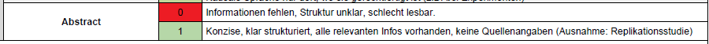
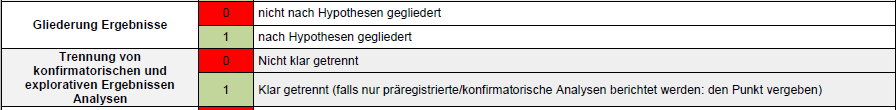
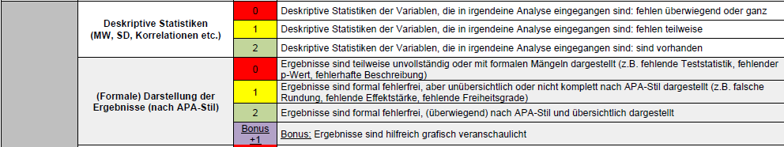
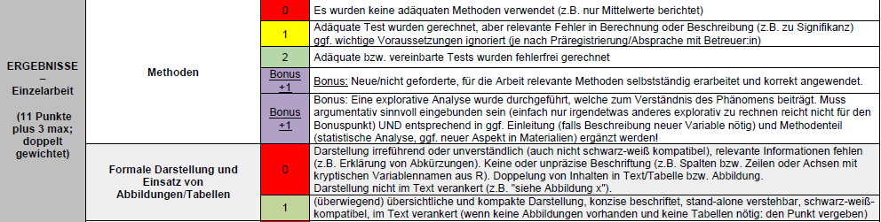
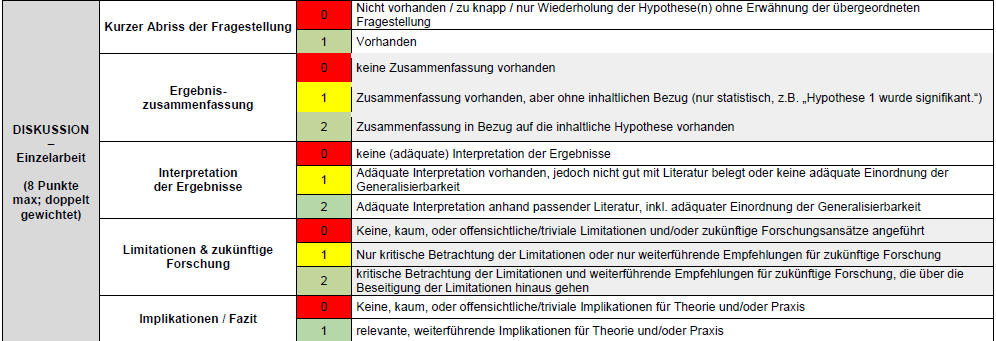
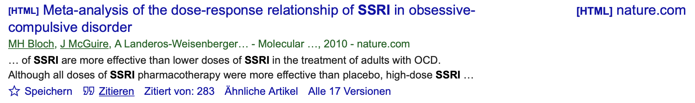
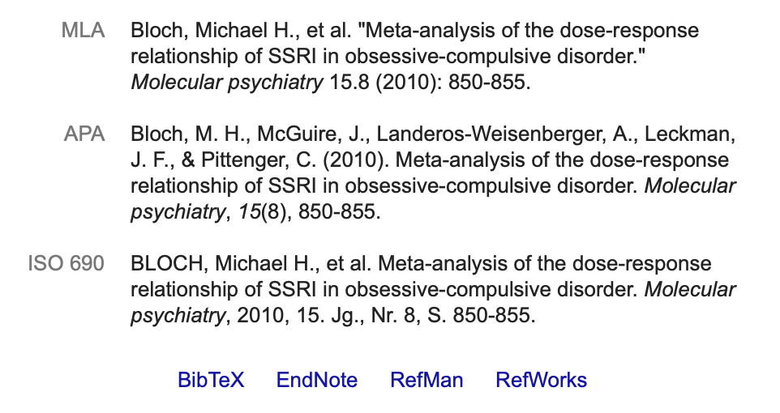
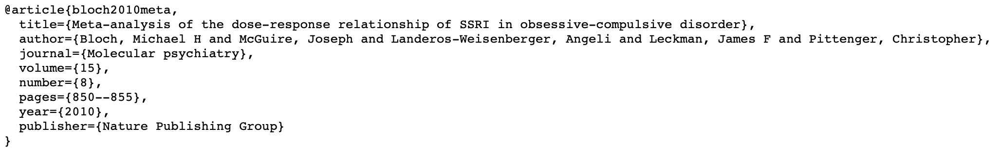

```{r setup, include=FALSE}
options(htmltools.dir.version = FALSE)

library(tidyverse)
library(kableExtra)
library(ggplot2)
library(plotly)
library(htmlwidgets)
library(MASS)
library(ggpubr)
library(xaringanthemer)
library(xaringanExtra)

style_duo_accent(
  primary_color = "#621C37",
  secondary_color = "#EE0071",
  background_image = "blank.png"
)

xaringanExtra::use_xaringan_extra(c("tile_view"))

use_scribble(
  pen_color = "#EE0071",
  pen_size = 4
  )

knitr::opts_chunk$set(
  fig.retina = TRUE,
  warning = FALSE,
  message = FALSE
)
```

name: Title slide
class: middle, left
<br><br><br><br><br><br><br>
# Wissenschaftliches Arbeiten und Forschungsmethoden
***
### Einheit 8: Publikation von Studien mit Fokus auf Ergebnisteil und Diskussion
##### `r format(as.Date(data.frame(readxl::read_excel("WAF_SS24_Termine.xlsx"))$Datum), "%d.%m.%Y")[10]` | Prof. Dr. Stephan Goerigk


---
class: top, left
name: content

### Heutige Themen

#### [Abstract](#abstract)

#### [Was gehört in den Ergebnisteil?](#ergebnis)

#### [Was gehört in den Diskussionsteil?](#diskussion)

#### [Zitation und Literaturverzeichnis](#references)

#### [Praxis](#praxis)

---
class: top, left
name: abstract

###  Abstract

####  Allgemeine Infos

* Kommt direkt nach der Titelseite auf einer eigenen Seite

* Kompakte Zusammenfassung der kompletten Studie (macht Sinn zuletzt zu schreiben) `\(\rightarrow\)` soll den Appetit des Lesers auf mehr wecken

* idR keine Zitationen notwendig (Ausnahme: direkte Replikationsstudien, dann kann das Paper das repliziert wird zitiert werden)

* idR keine statistischen Ergebnisse in Form von Zahlen

Optional unter Abstract: Keywords (kursiv, eingerückt): Erlauben Forschern Ihren Artikel in Datenbanken schneller und einfacher zu finden

---
class: top, left
###  Abstract

#### Aufbau

* Ein oder zwei Sätze, die eine **grundlegende Einführung** in das Fachgebiet geben, die für einen Wissenschaftler jeder Disziplin verständlich ist. 
* Zwei bis drei Sätze mit einem **ausführlicheren Hintergrund**, der auch für Wissenschaftler verwandter Disziplinen verständlich ist. 
* Ein Satz, der das **allgemeine Problem/die Forschungsfrage** klar benennt, womit sich diese spezielle Studie befasst. 
* Ein Satz, der das Hauptergebnis zusammenfasst (mit den Worten "**Hier zeigen wir**" oder einer entsprechenden Formulierung). 
* Zwei oder drei Sätze, in denen erklärt wird, was das **Hauptergebnis** im direkten Vergleich zu dem, was vorher angenommen wurde, offenbart oder wie das Hauptergebnis das bisherige Wissen ergänzt. 
* Ein oder zwei Sätze zur Einordnung der Ergebnisse in einen **allgemeinen Kontext**. 
* Zwei oder drei Sätze, um eine **breiter gefasste Perspektive** zu geben, die für einen Wissenschaftler jeder Disziplin leicht verständlich ist.


---
class: top, left
###  Abstract

#### Bewertungsschema

.center[
```{r eval = TRUE, echo = F}

```
]

---
class: top, left
name: ergebnis

### Was gehört in den Ergebnisteil?

* Allgemein: Unterüberschriften erlaubt und üblich

* Deskriptivstatistik und Befunde zu den einzelnen Fragestellungen und Hypothesen berichten. 

* **Konsistenz**: Strukturierung aus dem Theorieteil übernehmen und die einzelnen Fragestellungen in derselben Reihenfolge abarbeiten. 

* Deskriptivstatistische Ergebnisse für Fragestellungen und inferenzstatistische Ergebnisse für Hypothesen werden teils in den **Fließtext** integriert, teils durch **Tabellen und Grafiken** veranschaulicht. 

* Dieselbe Information sollte allerdings nicht sowohl in Fließtext als auch Tabelle wiederholt werden (entweder Fließtext oder Tabelle!)

* Grafiken: lockern den Fließtext auf und sind besonders aufmerksamkeitsträchtig `\(\rightarrow\)` für besonders wichtige Ergebnisse vorsehen

**Ziel:** Balance zwischen präziser Information durch zahlreiche statistische Befunde einerseits und flüssiger Lesbarkeit andererseits.

---
class: top, left

### Was gehört in den Ergebnisteil?

* Nach Hypothesen gegliedert: Mit zentralen Ergebnissen anfangen, danach vertiefen (beschreiben Sie zuerst den Wald, dann die Bäume)

* Hypothese nochmal kurz erwähnen

* Ggf. Voraussetzungsprüfungen für die statistischen Verfahren präsentieren

* Ergebnisse nur beschreiben, noch nicht interpretieren

* Die Annahme/Ablehnung der Hypothese unmittelbar berichten (Bottom line / Fazit! Klar und deutlich – Ergebnisse im Einklang mit der Hypothese oder nicht)

**Wichtig:** Ergebnisse von konfirmatorischen und explorativen Analysen klar trennen

---
class: top, left
###  Was gehört in den Ergebnisteil?

#### Bewertungsschema

.center[
```{r eval = TRUE, echo = F}

```
]

---
class: top, left

### Was gehört in den Ergebnisteil?

* Wenn Sie explorative Analysen berichten, müssen Sie diese **begründen**:
  - entweder im Ergebnisteil vor dem Bericht der explorativen Analyse: Macht Sinn wenn die explorative Analyse sich direkter aus den konfirmatorischen Analysen ergibt (z.B. gleiche Analyse ohne Ausreißer)
  - oder am Ende der Einleitung: Macht Sinn wenn man es stärker mit Literatur untermauert wird, und weniger aus den konfirmatorischen Analysen hervorgeht `\(\rightarrow\)` in diesem Fall ist es auch in Ordnung, wenn sich die Einleitung zwischen den Gruppenmitgliedern unterscheidet, im Sinne einer **Ergänzung in Hinsicht auf die explorative Analyse** (ansonsten muss die Einleitung aber gleich bleiben!)

* Explorative Analysen müssen zum Verständnis des untersuchten Phänomens beitragen

---
class: top, left
### Was gehört in den Ergebnisteil?

<small>

* Erst sagen, dann belegen: Ergebnis zuerst ankündigen, dann mit Statistiken begründen ("As predicted, the results show that the groups differ significantly, with group X having higher values on variable A ( `\(M = 1.2\)`, `\(SD = 0.2\)`) than group Y ( `\(M = 0.2\)`, `\(SD = 0.2\)`), `\(t(48) = 2.3\)`, `\(p = .026\)`.

* Angabe der relevanten Kennzahlen: z.B. Mittelwerte bei Gruppenvergleichen, Korrelation bei Zusammenhangshypothesen, etc.
* Angabe der statistischen Kennwerte (z.B. t-Werte: t(df)=...; `\(\chi^2\)`(df)=...; etc.)
  * Freiheitsgrade in Klammern
* Angabe der statistischen Signifikanz: z.B. `\(p = .021\)`
  * genauen p-Wert angeben (d.h. auf 3 Nachkommastellen)
  * wenn p-Wert den Wert .001 unterschreitet, dann `\(p < .001\)` (die Wahrscheinlichkeit kann nicht 0 betragen!) 
  * Angabe von Effektstärken (z.B. Cohens d)
* Allgemein: Angabe von Ergebnissen (Zahlen) und Variablen:
  * lateinische Variablenbezeichnungen werden kursiv gesetzt 
  * griechische Variablenbezeichnungen jedoch nicht
  * Zahlen nicht kursiv
  * Komma ist ein Punkt, kein Beistrich
  * Bei Zahlen, die nicht größer als 1 werden können, wird die führende Null weggelassen (z.B. `\(p = .032\)`; `\(r = .73\)`; aber: `\(t(84) = 0.23\)`)


---
class: top, left
### Was gehört in den Ergebnisteil?

**Ergebnisse von Hypothesentests**

<small>

Es gibt für die gängingen statistischen Tests APA Richtlinien, welche Kennwerte in Fließtext oder Tabellen enthalten sein sollten: 

* Korrelation

  * `\(r\)` = 0.13, 95% CI [-0.13, 0.38], `\(p\)` = 0.312, `\(R^2\)` = 0.02

* t-Test

  * `\(\Delta_{M}\)` = -51.46, 95% CI [-104.87, 1.95], `\(t(49.09)\)` = -1.94, `\(p\)` = 0.059; Cohen's d = -0.55, 95% CI [-1.12, 0.02]

* Regressionsparameter

  * `\(\beta\)` = 0.64, 95% CI [-0.62, 1.89], `\(t(57)\)` = 1.02, `\(p\)` = 0.312

* F-Tests (z.B. ANOVAs)

  * Regressionsmodell: `\(R^2\)` = 0.02, F(1, 57) = 1.04, `\(p\)` = 0.312
  * ANOVA: `\(F(3, 54)\)` = 683.77, `\(p\)` < .001, `\(\eta^2=0.97\)`, 95% CI [0.96, 1.00]

* `\(\chi^2\)`-Test

  * `\(r_{G1}=41\%\)`, `\(r_{G2}=70\%\)`, `\(\chi^2_{79}<.001\)`
</small>


---
class: top, left
### Was gehört in den Ergebnisteil?

**Zusammenfassung: Must-haves**

* zentrale Deskriptivstatistiken (z.B. Mittelwerte beim Mittelwertsvergleich)

* Größe des in der Untersuchung ermittelten Effekts (auch als standardisierte Effektstärken (r, Cohens d, `\(R^2\)`, `\(\eta^2\)`)

* Konfidenzintervall für diesen Effekt

* p-Werte

* Teststatistiken (ggf. mit Freiheitsgraden)

---
class: top, left
### Was gehört in den Ergebnisteil?

**Lesbarkeit**

* umfassende Tabellen, die für das Verständnis des Fließtextes nicht zwingend erforderlich sind, in den Anhang auslagern

* dem APA Style guide folgen: https://apastyle.apa.org/instructional-aids/numbers-statistics-guide.pdf
  - z.B. Prozentzahlen ganzzahlig runden (auch wenn dann in der Summe manchmal 99% oder 101% resultiert)
  - statistische Kennwerte (z. B. Mittelwerte, Standardabweichungen, Korrelationskoeffizienten etc.) mit zwei Nachkommastellen angegeben

* Jede Tabelle und jede Grafik im Fließtext muss fortlaufend nummeriert sein und zudem ohne Kenntnis des Fließtextes verständlich sein. 


---
class: top, left
### Was gehört in den Ergebnisteil?

**Allgemeine Verwendung von Abbildungen und Tabellen**

* Veranschaulichung schriftlicher Inhalte

* Exakte Darstellung größerer Datenmengen

* Allgemein zu beachten: Keine Abbildung/Tabelle ist besser als eine überflüssige Abbildung/Tabelle

* Jede Tabelle/Abbildung muss sequentiell nummeriert werden
  - Tabelle 1, Tabelle 2, …
  - Abbildung 1, Abbildung 2, …
  
* Integration in den Text unter Nennung der Abbildungs-/Tabellen-Nr.: „Wie aus Abbildung 5
ersichtlich wird...“; „Die Daten zur Fernsehnutzung in Tabelle 3 verdeutlichen...“

* Quellenangaben bei Abbildungen und Tabellen im Textteil: Wenn man nicht seine eigene Daten in einer Tabelle oder einer Abbildung veranschaulicht, muss auch hier gekennzeichnet werden, von wem die Daten/ Informationen stammen -> Quellenangabe!

---
class: top, left
### Was gehört in den Ergebnisteil?

**Allgemeine Verwendung von Abbildungen und Tabellen**

* Jede Tabelle/Abbildung muss alleinstehend verständlich sein.
  - Eigener Titel
  - Detaillierte Erklärung (Anmerkung unter Tabelle) schreiben, sodass der Leser ohne Text alles verstehen kann
  - Auf jede Tabelle/Abbildung im Text verweisen
  - Der Lesende soll wissen, worauf sich die Abbildung bezieht

* Abkürzungen und Fachbegriffe müssen für alle Tabellen/Abbildungen konsistent sein. Abkürzungen müssen erklärt werden, auch wenn sie im Text schon einmal erklärt wurden (siehe Regel 1)


---
class: top, left
### Was gehört in den Ergebnisteil?

**Formatierung von Tabellen**

* Jede Tabelle hat einen Titel
  - Der Titel muss kurz aber deutlich sein. `\(\rightarrow\)`  Muss muss den Inhalt der Tabelle aus dem Titel erschließen können
  - Beispiel für zu generell: "Zusammenhang zwischen Studenten und Leistung. (unklar, welche Daten präsentiert werden)
  - Beispiel für zu spezifisch: "Mittlere Leistungswerte von Test A, Test B und Test C für Studenten der Psychologie, Physik, Englisch und Maschinenbau
  - Gutes Beispiel: "Mittlere Leistungswerte von Studenten verschiedener Fachrichtungen."

* Formatierung durch APA festgelegt, z.b. gibt es keine vertikalen Linien: https://apastyle.apa.org/style-grammar-guidelines/tables-figures/tables

* Nur wesentliche Informationen sind enthalten (nicht nur Inhalte aus dem Fließtext wiederholen)


---
class: top, left
### Was gehört in den Ergebnisteil?

**Formatierung von Tabellen**

* Leere Zellen
  - Wenn Sie in einer Zelle keine Daten haben `\(\rightarrow\)` leer lassen
  - Wenn Sie die Daten nicht berichten können, schreiben Sie einen Strich und erklären Sie die Gründe in der Anmerkung
  - Schreiben Sie einen Strich auch dann, wenn ein Item mit sich selbst korreliert

* Konfidenzintervalle
  - Wenn möglich berichten Sie Konfidenzintervalle, wo angebracht
  - Am besten in Klammern schreiben

---
class: top, left
### Was gehört in den Ergebnisteil?

**Checkliste Tabellen**

* Ist diese Tabelle notwendig? Trägt Sie zum übersichtlicheren Verständnis bei?
* Muss diese Tabelle in den Paper-Körper oder reicht der Anhang? 
* Sind alle Tabellen im Paper stilistisch konsistent? 
* Ist der Tabellen-Titel kurz und prägnant? 
* Hat jede Spalte eine Überschrift? 
* Sind alle Abkürzungen und Sonder-Formatierungen (kursiv, fett, Symbole) erklärt? 
* Sind alle vertikalen Linien gelöscht? 
* Werden die Daten in angemessener Präzision angegeben (nicht zu wenige/viele Dezimalstellen)? 
* Werden die Konfidenz-Intervalle für die wichtigsten Punktschätzungen angegeben? 
* Sind diese immer gleich groß (z.B. 95%)? 
* Bei Signifikanz-Tests: Ist das Signifikanz-Niveau immer angegeben? 
* Sind alle Tabellen sequentiell durchnummeriert? 
* Wird auf die Tabelle im Paper verwiesen?

---
class: top, left
###  Was gehört in den Ergebnisteil?

#### Bewertungsschema

.center[
```{r eval = TRUE, echo = F}

```
```{r eval = TRUE, echo = F}

```
]

---
class: top, left
name: diskussion

### Was gehört in den Diskussionsteil?

* Allgemein: Unterüberschriften erlaubt

* Wird im Präsenz geschrieben

* Erster Absatz: **Kurze Zusammenfassung** (kürzer als der Abstract!)
  - Wiederholung der Forschungsfrage und was für eine Studie durchgeführt wurde
  - Zusammenfassung/Knapper Bericht zu den Hauptergebnissen (nur in Worten, üblicherweise werden hier keine Zahlen mehr genannt)
  - keine detaillierte Wiederholung des Ergebnisteils!

---
class: top, left

### Was gehört in den Diskussionsteil?

* Dann **Interpretation der Ergebnisse** (dieser Teil soll zusammen mit der Diskussion der Ergebnisse soll größeren Raum in der Diskussion einnehmen): 

  + **Nicht-signifikante Ergebnisse können nicht als Evidenz für die Nullhypothese interpretiert werden**, nur als **keine Evidenz für die Alternativhypothese**

  + Egal ob signifikant oder nicht, die gefundene Effektstärke sollte eingeordnet werden: Richtung des Effekts konsistent mit der Hypothese? Geschätzter Effekt größer/kleiner als erwartet? ggf. Übersetzung in "common language effect sizes" (siehe https://pubmed.ncbi.nlm.nih.gov/34881941/ und R package `compute.es`: https://cran.r-project.org/web/packages/compute.es/compute.es.pdf)
  
  + Achtung: Kausale Sprache nur bei experimentellen Designs angemessen und auch dort ist eine kritische Diskussion über Einschränkungen der Kausalität notwendig! Beispiele für kausale Interpretationen: "X beeinflusst Y", "X verursacht Y", "X verhindert Y", "X wirkt auf Y", "X verbessert/verschlechtert Y", "X erklärt Y" (im Vgl. zu nicht kausaler Interpretation, "X hängt zusammen mit Y", "X ist assoziiert mit Y", "X korreliert mit Y", "X geht mit mehr/weniger Y einher", "X sagt Y vorher")


---
class: top, left

### Was gehört in den Diskussionsteil?

<small>

* **Diskussion der Ergebnisse** (dieser Teil soll zusammen mit der Interpretation der Ergebnisse soll größeren Raum in der Diskussion einnehmen): 
  - Einbettung der Ergebnisse in relevante Literatur und bekannte Forschungsergebnisse (die meist schon in der Einleitung angesprochen wurden, aber hier kann durchaus auch neue Literatur auftauchen, z.B. um ein ggf. überraschendes Ergebnis einzuordnen).
  - Kritischer Vergleich mit Ergebnissen aus der Literatur - Übereinstimmung? Diskrepanz? Wenn ja, warum möglicherweise?
  
* **Limitationen**: 
  - Mögliche Einschränkungen Ihrer Studie
  - Methodische Anmerkungen, z.B. experimentelle Verbesserungspotenziale
  - Was könnte man besser oder anders machen?

* **Zukünftige Forschung**: Weiterführende Überlegungen, neue Fragestellungen und Hypothesen

* **Implikationen**: Schlussfolgerungen aus den Ergebnissen für Forschung (z.B. psychologische Theorienbildung) und Praxis (was könnten Ihre Ergebnisse für Praktiker bedeuten)

* Letzter Absatz ("Conclusion" in 2-3 Sätzen): **Fazit und Take-Home Message** Ihrer Arbeit („runder“ Abschluss)  

---
class: top, left
### Was gehört in den Diskussionsteil?

#### Bewertungsschema

.center[
```{r eval = TRUE, echo = F}

```
]

---
class: top, left
name: references

### Zitation und Literaturverzeichnis

* **Für Hinweise zum Aufbau/Inhalt/Was generell zu Beachten ist, siehe Vorlesungseinheit 2 und Zusatzmaterial zum Zitieren!**

* In einem Word-Dokument müssten Zitate und Literaturverzeichnis per Hand oder mit Literaturmanagementsystem (z.B. Zotero, Mendely) erstellt werden

* Dies gilt auch für die Formatierung des Dokuments nach APA Richtlinien

* Wenn Sie die R-Markdown Vorlage nutzen, die Ihnen zur Verfügung gestellt wurde, werden diese Schritte automatisch für Sie erledigt

* Dafür müssen Sie die Quellen nur in die r-references.bib Datei kopieren (BibTex-Format eines Artikels lässt sich bei GoogleScholar herunterladen)

* **ACHTUNG: Vertrauen Sie nicht blind, dass die bibtex-Datei vollständig und korrekt ist --> prüfen Sie am Ende Ihr Literaturverzeichnis auf Plausbilität und Vollständigkeit der Angaben!!**

---
class: top, left
### Zitation und Literaturverzeichnis

.center[
```{r eval = TRUE, echo = F}

```
]

* Beispiel für einen auf Google Scholar angezeigten Artikel

* Zum Zitieren auf **Zitieren** klicken

---
class: top, left
### Zitation und Literaturverzeichnis

.center[
```{r eval = TRUE, echo = F, out.width="60%"}

```
]

* Es werden direkt mehrere Vorschläge zum Zitieren des Artikels gemacht (u.a. auch APA)

* Wenn wir das Zitat in der R-Markdown-Vorlage benutzen wollen brauchen eine BibTeX Angabe

* Auf **BibTeX** klicken

---
class: top, left
### Zitation und Literaturverzeichnis

.center[
```{r eval = TRUE, echo = F}

```
]

* Die resultierende Angabe (den Text) kopieren und in die r-references.bib Datei kopieren.

* Nun kann das R Skript auf die Quelle zugreifen und sie direkt im Fließtext und Literaturverzeichnis verlinken

---
class: top, left
### Zitation und Literaturverzeichnis

.center[
```{r eval = TRUE, echo = F}
knitr::include_graphics("bilder/8_citation4.png")
```
]

* Elemente können direkt mit der Syntax **@key** zitiert werden, wobei key der Zitierschlüssel **in der ersten Zeile des Bibtex Eintrags** ist, z. B. @bloch2010meta 

* Um Zitate in Klammern zu setzen, verwenden Sie [@key]. 

* Um mehrere Einträge zu zitieren, trennen Sie die Schlüssel durch Semikolons, z. B. [@key-1; @key-2; @key-3]. 

* Um die Nennung des Autors zu unterdrücken, fügen Sie ein Minuszeichen vor dem @ ein, z. B. [-@R-base].

---
class: top, left
name: praxis

### Evaluation

**Feedback geben**
Haben Sie sich bei irgendeiner Teilnahme gedacht: Moment, diesen Aspekt am Studiendesign/der Frage fand ich seltsam? Ich glaube das führt in die Irre? Das wurde nicht berücksichtigt? Das könnte eine relevante Störvariable sein? Schreiben Sie der entsprechenden Gruppe (persönlich, z.B. per Email) Ihr Feedback.

**An Lehrevaluation teilnehmen**
hsf.click/Eval-CFH

<!-- library(renderthis) -->
<!-- to_pdf("WissArb_10_Publikation2.Rmd", complex_slides = TRUE) -->
   