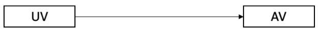
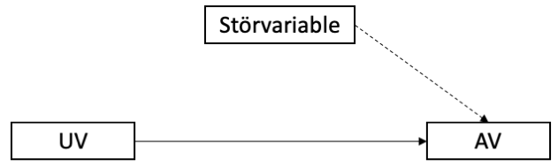
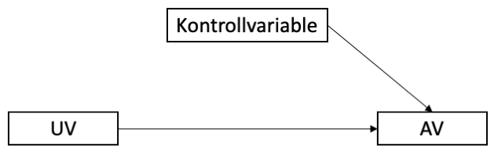
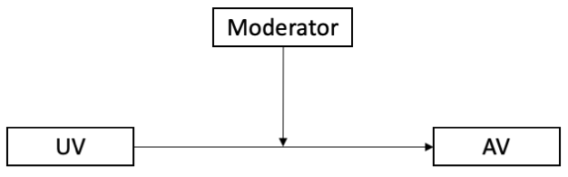
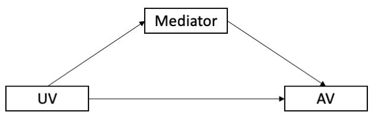

```{r setup, include=FALSE}
options(htmltools.dir.version = FALSE)

library(tidyverse)
library(kableExtra)
library(ggplot2)
library(plotly)
library(htmlwidgets)
library(MASS)
library(ggpubr)
library(xaringanthemer)
library(xaringanExtra)

style_duo_accent(
  primary_color = "#621C37",
  secondary_color = "#EE0071",
  background_image = "blank.png"
)

xaringanExtra::use_xaringan_extra(c("tile_view"))

use_scribble(
  pen_color = "#EE0071",
  pen_size = 4
  )

knitr::opts_chunk$set(
  fig.retina = TRUE,
  warning = FALSE,
  message = FALSE
)
```

name: Title slide
class: middle, left
<br><br><br><br><br><br><br>
# Wissenschaftliches Arbeiten und Forschungsmethoden
***
### Zusatzmaterial: Variablen
##### `r format(as.Date(data.frame(readxl::read_excel("WAF_SS24_Termine.xlsx"))$Datum), "%d.%m.%Y")[5]` | Prof. Dr. Stephan Goerigk


---
class: top, left
### Variablen

Arten von Variablen – nach Stellenwert in der Untersuchung

Variablen haben im empirischen Forschungskontext unterschiedliche funktionale Bedeutungen:

* abhängige Variable

* unabhängige Variable

* Störvariable

* Kontrollvariable

* Moderatorvariable

* Mediatorvariable

---
class: top, left
### Variablen

#### Abhängige & unabhängige Variable (AV & UV)

Die Veränderung einer AV soll durch den Einfluss der UV erklärt werden.

**Beispiel:**

.center[

Dosis des Schlafmittel (**UV**) $\rightarrow$ Schlafdauer (**AV**) 

$\downarrow$

**UV** gehört zum „Wenn-Teil“ bzw. dem „Je-Teil“ einer Hypothese

**AV** gehört zum „Dann-Teil“ bzw. „Desto-Teil“

$\downarrow$

Wenn man mehr Schlafmittel nimmt, schläft man länger.
]

.center[
```{r eval = TRUE, echo = F, out.width = "500px"}

```
]

---
class: top, left
### Variablen

#### Störvariable

* alle Einflussgrößen auf die AV, die in einer Untersuchung nicht erfasst werden 

* egal ob nicht bekannt oder vergessen

.center[
```{r eval = TRUE, echo = F, out.width = "500px"}

```
]
---
class: top, left
### Variablen

#### Kontrollvariable

* Störvariable deren Ausprägungen erhoben (gemessen) wurde 

* Einfluss kann kontrolliert wird (z.B. mittels statistischer Methoden)

.center[
```{r eval = TRUE, echo = F, out.width = "500px"}

```
]
---
class: top, left
### Variablen

#### Moderatorvariable

* **Moderator** verändert den Einfluss der UV auf die AV

* Moderationsanalyse prüft Interaktionen

* Frage: Variiert der Effekt von UV auf AV in Abhängigkeit einer weiteren Variable

**Beispiel:**

Schlafmitteldosis (**UV**) erhöht die Schlafdauer (**AV**); Straßenlärm (**Moderator**) wirkt zusätzlich auf die **AV**

.center[
```{r eval = TRUE, echo = F, out.width = "500px"}

```
]
---
class: top, left
### Variablen

#### Mediatorvariable

* **Mediator** vermittelt (**mediiert**) den Einfluss der **UV** auf die **AV**
* **Indirekter Effekt:**  **UV ** beeinflusst  **Mediator**, dies führt zur einem Effekt des  **Mediators ** auf  **AV **
* **Direkter Effekt:** Effekt von **UV** auf **AV** (in Anwesenheit des Mediators)
* **Keine Mediation:** indirekter Effekt nicht signifikant
* **Partielle Mediation:** indirekter Effekt signifikant und direkter Effekt auch signifikant
* **Totale Mediation:** indirekter Effekt signifikant und direkter Effekt nicht mehr signifikant.

**Beispiel:**

Schulnote (**UV**) beeinflusst Selbstwertgefühl (**Mediator**); Selbstwertgefühl (**Mediator**) beeinflusst Lebenszufriedenheit **AV**

.center[
```{r eval = TRUE, echo = F, out.width = "500px"}

```
]